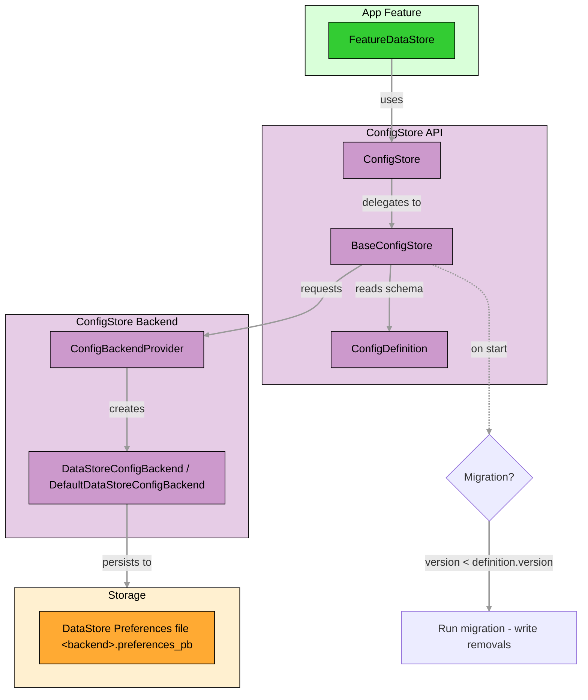

# Core - ConfigStore

A small, type-safe configuration store built on AndroidX DataStore Preferences. Use it to define a schema for your 
feature settings, observe them as a Flow, update atomically, and migrate between versions.

## How it works at a glance



### Key concepts

- Each feature declares a `ConfigDefinition` with:
  - a version number (for migrations)
  - an id (backend name and feature name)
  - keys (typed key definitions)
  - a mapper to convert between `Config` (key-value pairs) and your typed model
  - migration logic if needed
- `BaseConfigStore` runs migrations once per version and delegates persistence to a backend (default: DataStore Preferences).
- Files are grouped per backend: **one file per backend ID:** `<backend>.preferences_pb`.

## Quick start

### 1. Define your configuration

```kotlin
// Keys
object MyFeatureKeys {
    val ENABLED = ConfigKey.BooleanKey("myfeature_enabled")
    val USERNAME = ConfigKey.StringKey("myfeature_username")
}

// Model
data class MyFeatureConfig(
    val enabled: Boolean,
    val username: String,
)

// Mapper
object MyFeatureMapper : ConfigMapper<MyFeatureConfig> {
    override fun toConfig(obj: MyFeatureConfig): Config = Config().apply {
        this[MyFeatureKeys.ENABLED] = obj.enabled
        this[MyFeatureKeys.USERNAME] = obj.username
    }

    override fun fromConfig(config: Config): MyFeatureConfig? {
        val enabled = config[MyFeatureKeys.ENABLED] ?: return null
        val username = config[MyFeatureKeys.USERNAME] ?: return null
        return MyFeatureConfig(enabled, username)
    }
}

// Migration (no-op example)
object MyFeatureMigration : ConfigMigration {
    override suspend fun migrate(currentVersion: Int, newVersion: Int, current: Config): ConfigMigrationResult =
        ConfigMigrationResult.NoOp
}

// Definition
object MyFeatureDefinition : ConfigDefinition<MyFeatureConfig> {
    override val version = 1
    override val id = ConfigId(backend = "myfeature", feature = "settings")
    override val mapper = MyFeatureMapper
    override val defaultValue = MyFeatureConfig(false, "")
    override val keys = listOf(MyFeatureKeys.ENABLED, MyFeatureKeys.USERNAME)
    override val migration: ConfigMigration = MyFeatureMigration
}
```

### 2. Create a store

```kotlin
class MyFeatureConfigStore(
    provider: ConfigBackendProvider,
) : BaseConfigStore<MyFeatureConfig>(
    provider = provider,
    definition = MyFeatureDefinition,
)
```

### 3. Observe and update

```kotlin
// Observe
val job = coroutineScope.launch {
    myFeatureConfigStore.config.collect { cfg ->
        // react to changes
    }
}

// Update atomically
coroutineScope.launch {
    myFeatureConfigStore.update { current ->
        val cfg = current ?: MyFeatureDefinition.defaultValue
        cfg.copy(enabled = true)
    }
}

// Clear all stored values for this backend file
coroutineScope.launch { myFeatureConfigStore.clear() }
```

## Wiring

- **Android**: use `AndroidConfigBackendFileManager` to store under `Context.filesDir`.
- **JVM**: use `JvmConfigBackendFileManager` with a working directory.

Example with **Koin**:

```kotlin
val appCommonCoreConfigStoreModule = module {
    single<ConfigBackendFileManager> { AndroidConfigBackendFileManager(get()) }
    single<ConfigBackendFactory> { DataStoreConfigBackendFactory(fileManager = get()) }
    single<ConfigBackendProvider> { DefaultConfigBackendProvider(backendFactory = get()) }
}
```

## Custom backends

While the default implementation uses AndroidX DataStore Preferences, the API supports other backends.

- Implement ConfigBackend to provide:
  - read(keys): Flow<Config>
  - update(keys, transform)
  - clear(), readVersion(), writeVersion(), removeKeys()
- Provide your backend via ConfigBackendProvider. The default provider uses a ConfigBackendFactory to create a backend based on ConfigId (backend, feature).
- For DataStore, see DefaultDataStoreConfigBackend and DataStoreConfigBackendFactory for reference.

## Migration

- **Trigger**: On first subscription, `BaseConfigStore` compares stored vs. definition version.

- **Contract**: `ConfigMigration.migrate(currentVersion, newVersion, current: Config): ConfigMigrationResult` returns:
  - `Migrated`(updated: Config, keysToRemove: Set<ConfigKey<*>>)
  - `NoOp`
- **Behavior**:
  - `Migrated`: backend updates config, removes obsolete keys, writes new version.
  - `NoOp`: only writes new version.
- **Examples**:
  - _Rename key_: copy old value to new key, mark old key for removal in keysToRemove.
  - _Remove key_: omit from updated and include in keysToRemove.

## Limitations

- DataStore Preferences is a simple key-value store; there’s no schema enforcement beyond your key defintion.
- Avoid **large values** because of their performance impact, especially storing blobs.
- Keys are plain strings; renames require migrations to prevent orphaned values.
- File name is `<backend>.preferences_pb`; all features using the same backend id share one preferences file.
