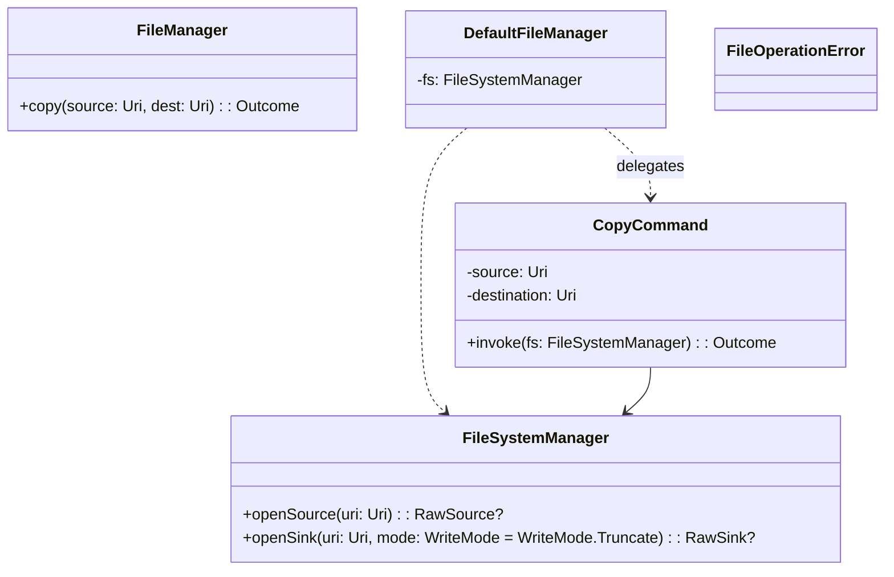

# Thunderbird Core File Module

This module provides a simple, consistent API for common file operations across Android and JVM platforms.

## Architecture

The file system layer is split into two levels:

- Public low-level I/O: `FileSystemManager` opens `RawSource`/`RawSink` for a given `Uri`.
  - Android actual: `AndroidFileSystemManager`
  - JVM actual: `JvmFileSystemManager`
- Public high-level facade: `FileManager` for common operations (currently: copy).
  - Default implementation: `DefaultFileManager` delegating to internal commands
- Internal commands: e.g., `CopyCommand(source, dest)` implement operations using `FileSystemManager`.
  - Hidden from public API; return `Outcome<Unit, FileOperationError>` internally to preserve error context.
- `RawSource`/`RawSink` come from `kotlinx-io` and are referenced in the public API.

### Core Components



## Getting Started

### Dependency setup

Add the module to your Gradle build. Then, depending on your platform, provide an actual `FileSystemManager` and wire a `FileManager`:

```kotlin
// Koin example (Android)
single<FileSystemManager> { AndroidFileSystemManager(androidContext().contentResolver) }
single<FileManager> { DefaultFileManager(get()) }
```

For JVM-only tools/tests:

```kotlin
val fs: FileSystemManager = JvmFileSystemManager()
val fileManager: FileManager = DefaultFileManager(fs)
```

## Public API

- FileManager
  - `suspend fun copy(sourceUri: Uri, destinationUri: Uri): Outcome<Unit, FileOperationError>`
- FileSystemManager
  - `fun openSource(uri: Uri): RawSource?`
  - `fun openSink(uri: Uri, mode: WriteMode = WriteMode.Truncate): RawSink?`
  - Behavior:
    - Sinks default to overwrite/truncate. Pass `WriteMode.Append` to append where supported.
    - Returns null when the URI cannot be opened (e.g., missing permissions, unsupported scheme).
  - Thread-safety: Implementations are stateless and safe to use from multiple threads, but the returned streams must be used/closed by the caller.
- `enum class WriteMode { Truncate, Append }`

## URI type

The API uses a KMP‑friendly `Uri` type (com.eygraber.uri.Uri). On Android, convert a platform URI using the provided extension:

```kotlin
val kmpUri = androidUri.toKmpUri()
```

To build URIs in tests or common code, you can parse a string:

```kotlin
val source = "file:///path/to/file.txt".toKmpUri()
```

## Supported URIs (by platform)

- Android (AndroidFileSystemManager):
  - `content://` via `ContentResolver`
  - `file://` via `ContentResolver`
- JVM (JvmFileSystemManager):
  - `file://` URIs only (non-`file:` schemes are not supported and will return null).
- iOS: No actual yet in this repository, but the API is compatible. An iOS actual can use `NSFileManager`/`NSURL`.

## Error handling best practices

- `openSource(uri)`/`openSink(uri)` return null on failure. Always check for null and handle gracefully (e.g., show a message, request permissions).
- On Android, failures are frequently due to missing URI permissions; prefer SAF pickers and persist permissions when needed.

## Performance and buffering

- Internal copy uses a buffered loop (`BUFFER_SIZE = 8_192L`).
- Streams are flushed and closed to avoid leaks.
- Public `openSource`/`openSink` are not suspending; perform I/O on an appropriate dispatcher/thread when needed.

## Limitations and notes

- Android: Ensure the app holds read/write permissions for the target URI (e.g., via SAF and optionally `takePersistableUriPermission`).
- JVM: Only `file:` URIs are supported by `JvmFileSystemManager`.
- iOS: No actual yet. The public API is prepared for an iOS actual using `NSFileManager`/`NSURL`.

