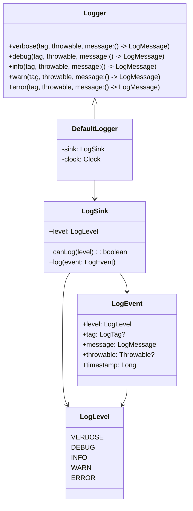
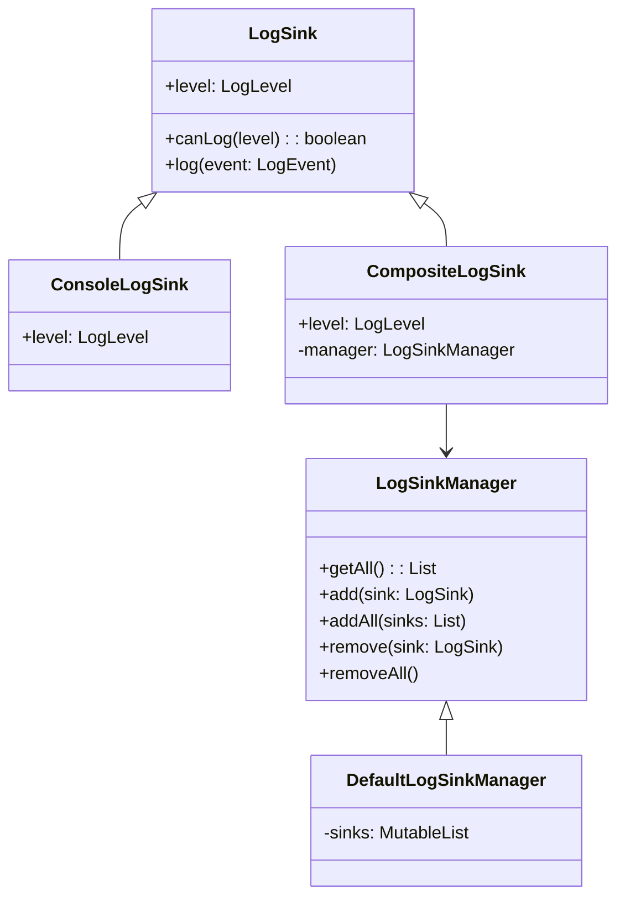

# Thunderbird Core Logging Module

This module provides a flexible and extensible logging system for Thunderbird for Android.

## Architecture

The logging system is organized into several modules:

- **api**: Core interfaces and classes
- **impl-console**: Console logging implementation
- **impl-composite**: Composite logging (multiple sinks)
- **impl-legacy**: Legacy logging system compatibility
- **testing**: Testing utilities

### Core Components



### Implementation Modules



## Getting Started

### Basic Setup

To start using the logging system, you need to:

1. Add the necessary dependencies to your module's build.gradle.kts file
2. Create a LogSink
3. Create a Logger
4. Start logging!

### Basic Logging

```kotlin
// Create a log sink
val sink = ConsoleLogSink(LogLevel.DEBUG)

// Create a logger
val logger = DefaultLogger(sink)

// Log messages
logger.debug(tag = "MyTag") { "Debug message" }
logger.info { "Info message" }
logger.warn { "Warning message" }
logger.error(throwable = exception) { "Error message with exception" }
```

Note that the message parameter is a lambda that returns a String. This allows for lazy evaluation of the message, which can improve performance when the log level is set to filter out certain messages.

### Composite Logging (Multiple Sinks)

If you want to send logs to multiple destinations, use the CompositeLogSink:

```kotlin
// Create log sinks
val consoleSink = ConsoleLogSink(LogLevel.INFO)
val otherSink = YourCustomLogSink(LogLevel.DEBUG)

// Create a composite sink
val compositeSink = CompositeLogSink(
    level = LogLevel.DEBUG,
    sinks = listOf(
        consoleSink,
        otherSink
    )
)

// Create a logger
val logger = DefaultLogger(compositeSink)

// Log messages (will go to both sinks if level is appropriate)
logger.debug { "This goes only to otherSink if its level is DEBUG or lower" }
logger.info { "This goes to both sinks if their levels are INFO or lower" }
```

## Creating Custom Log Sinks

You can create your own log sink by implementing the LogSink interface:

```kotlin
class MyCustomLogSink(
    override val level: LogLevel,
    // Add any other parameters you need
) : LogSink {
    override fun log(event: LogEvent) {
        // Implement your custom logging logic here
        // For example, send logs to a remote server, write to a database, etc.
        val formattedMessage = "${event.timestamp} [${event.level}] ${event.tag ?: ""}: ${event.message}"

        // Handle the throwable if present
        event.throwable?.let {
            // Process the throwable
        }

        // Send or store the log message
    }
}
```

## Best Practices

### Log Levels

Use appropriate log levels for different types of messages:

- **VERBOSE**: Detailed information, typically useful only for debugging
- **DEBUG**: Debugging information, useful during development
- **INFO**: General information about application operation
- **WARN**: Potential issues that aren't errors but might need attention
- **ERROR**: Errors and exceptions that should be investigated

## Troubleshooting

### Common Issues

1. **No logs appearing**:
   - Check that the log level of your sink is appropriate for the messages you're logging
   - Verify that your logger is properly initialized

### Debugging the Logging System

To debug issues with the logging system itself:

1. Create a simple ConsoleLogSink with VERBOSE level
2. Log test messages at different levels
3. Check if messages appear as expected
