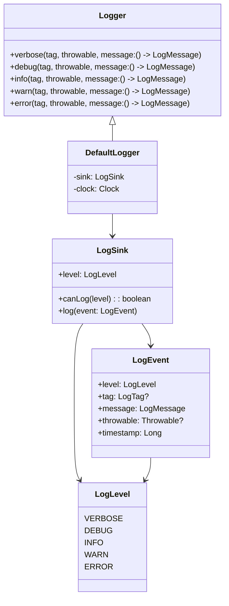
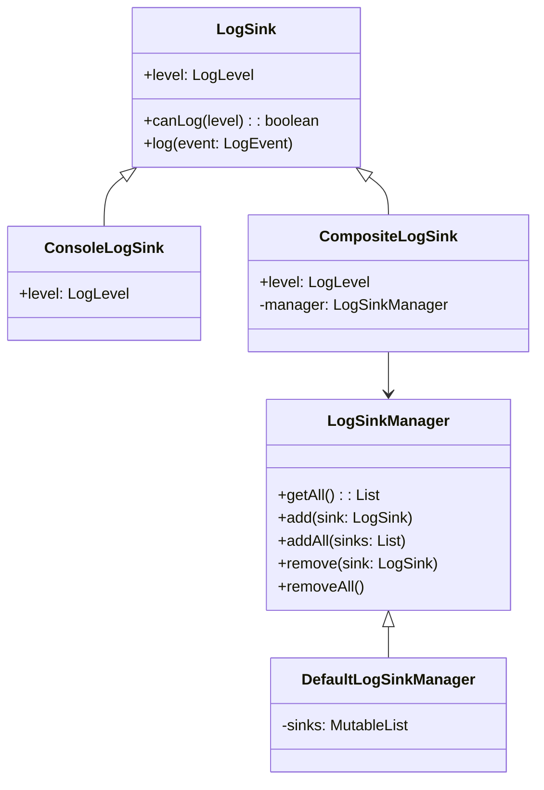

# Thunderbird Core Logging Module

This module provides a flexible and extensible logging system for Thunderbird for Android.

## Architecture

The logging system is organized into several modules:

- **api**: Core interfaces and classes
- **impl-console**: Console logging implementation
- **impl-composite**: Composite logging (multiple sinks)
- **impl-legacy**: Legacy logging system compatibility
- **pii:compiler-plugin:{api,internal}**: A compiler plugin to automatically hide any PII data
- **testing**: Testing utilities

### Core Components


```mermaid
classDiagram
    class Logger {
        +verbose(tag, throwable, message: () -> LogMessage)
        +debug(tag, throwable, message: () -> LogMessage)
        +info(tag, throwable, message: () -> LogMessage)
        +warn(tag, throwable, message: () -> LogMessage)
        +error(tag, throwable, message: () -> LogMessage)
    }

    class DefaultLogger {
        -sink: LogSink
        -clock: Clock
    }

    class LogSink {
        +level: LogLevel
        +canLog(level): boolean
        +log(event: LogEvent)
    }

    class LogEvent {
        +level: LogLevel
        +tag: LogTag?
        +message: LogMessage
        +throwable: Throwable?
        +timestamp: Long
    }

    class LogLevel {
        VERBOSE
        DEBUG
        INFO
        WARN
        ERROR
    }

    Logger <|-- DefaultLogger
    DefaultLogger --> LogSink
    LogSink --> LogEvent
    LogSink --> LogLevel
    LogEvent --> LogLevel
```

### Implementation Modules


```mermaid
classDiagram
    class LogSink {
        +level: LogLevel
        +canLog(level): boolean
        +log(event: LogEvent)
    }

    class ConsoleLogSink {
        +level: LogLevel
    }

    class CompositeLogSink {
        +level: LogLevel
        -manager: LogSinkManager
    }

    LogSink <|-- ConsoleLogSink
    LogSink <|-- CompositeLogSink
    CompositeLogSink --> LogSinkManager

    class LogSinkManager {
        +getAll(): List<LogSink>
        +add(sink: LogSink)
        +addAll(sinks: List<LogSink>)
        +remove(sink: LogSink)
        +removeAll()
    }

    class DefaultLogSinkManager {
        -sinks: MutableList<LogSink>
    }

    LogSinkManager <|-- DefaultLogSinkManager
```

## Getting Started

### Basic Setup

To start using the logging system, you need to:

1. Add the necessary dependencies to your module's build.gradle.kts file
2. Create a LogSink
3. Create a Logger
4. Start logging!

### Basic Logging

```kotlin
// Create a log sink
val sink = ConsoleLogSink(LogLevel.DEBUG)

// Create a logger
val logger = DefaultLogger(sink)

// Log messages
logger.debug(tag = "MyTag") { "Debug message" }
logger.info { "Info message" }
logger.warn { "Warning message" }
logger.error(throwable = exception) { "Error message with exception" }
```

Note that the message parameter is a lambda that returns a String. This allows for lazy evaluation of the message, which
can improve performance when the log level is set to filter out certain messages.

### Composite Logging (Multiple Sinks)

If you want to send logs to multiple destinations, use the CompositeLogSink:

```kotlin
// Create log sinks
val consoleSink = ConsoleLogSink(LogLevel.INFO)
val otherSink = YourCustomLogSink(LogLevel.DEBUG)

// Create a composite sink
val compositeSink = CompositeLogSink(
    level = LogLevel.DEBUG,
    sinks = listOf(
        consoleSink,
        otherSink
    )
)

// Create a logger
val logger = DefaultLogger(compositeSink)

// Log messages (will go to both sinks if level is appropriate)
logger.debug { "This goes only to otherSink if its level is DEBUG or lower" }
logger.info { "This goes to both sinks if their levels are INFO or lower" }
```

## Creating Custom Log Sinks

You can create your own log sink by implementing the LogSink interface:

```kotlin
class MyCustomLogSink(
    override val level: LogLevel,
    // Add any other parameters you need
) : LogSink {
    override fun log(event: LogEvent) {
        // Implement your custom logging logic here
        // For example, send logs to a remote server, write to a database, etc.
        val formattedMessage = "${event.timestamp} [${event.level}] ${event.tag ?: ""}: ${event.message}"

        // Handle the throwable if present
        event.throwable?.let {
            // Process the throwable
        }

        // Send or store the log message
    }
}
```

## PII Logging

Data classes that contain PII (Personal Identifiable Information) must be annotated with the `@LoggingPii.HasPii`.

This will allow our Kotlin compiler plugin (`net.thunderbird.logging.pii`) to automatically override the `toString()`
method of this class and automatically mask/hide any sensitive data that we should not log.

### Basic setup

1. If yet not applied, apply the K2 compiler plugin `net.thunderbird.logging.pii` into the module that contains the PII
   data
2. Annotated the data class which contains the PII data with `@LoggingPii.HasPii`; this will make the K2 compiler plugin
   to auto-generate a `toString()` masking or hiding the properties you want
3. Annotate any PII data with either `@get:LoggingPii.Mask` or `@get:LoggingPii.Hide`
    - When annotated with `@get:LoggingPii.Mask`, the property value will be replaced with `<sensitive>`
    - When annotated with `@get:LoggingPii.Hide`, the property name and value will be removed from the `toString`
      implementation and a `+x hidden properties` will appear at the end of the `toString`

### Enabling IDE support

When using a custom K2 compiler plugin, we can make our codebase generate compilation errors, via FIR checkers.

FIR checkers deliver the errors reported before the code is built, meaning you would be able to see them while you are
still code, before triggering the build. However, if IDE support isn't enabled, we'll only see those errors when
actually building the project.

Additionally, any synthetic method we generate via FIR/IR won't be visible, and will be presented as an error by the
IDE, unless we enable the IDE to use our custom plugin.

To enable the K2 custom plugins, you must:

1. Open the IDE Registry (Shift + Shift + Search by "Registry")
2. Disable the `kotlin.k2.only.bundled.compiler.plugins.enabled` flag.

After that, any class that is annotated with the `@LoggingPii.HasPii` will start showing the synthetic `toString()`
method override, and will be elegible to show errors in case they are present.

## Best Practices

### Log Levels

Use appropriate log levels for different types of messages:

- **VERBOSE**: Detailed information, typically useful only for debugging
- **DEBUG**: Debugging information, useful during development
- **INFO**: General information about application operation
- **WARN**: Potential issues that aren't errors but might need attention
- **ERROR**: Errors and exceptions that should be investigated

## Troubleshooting

### Common Issues

1. **No logs appearing**:
    - Check that the log level of your sink is appropriate for the messages you're logging
    - Verify that your logger is properly initialized

### Debugging the Logging System

To debug issues with the logging system itself:

1. Create a simple ConsoleLogSink with VERBOSE level
2. Log test messages at different levels
3. Check if messages appear as expected
