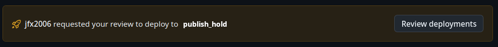

# Release Automation Setup

Release automation is triggered by the workflow_dispatch event on the "Shippable Build & Signing"
workflow. GitHub environments are used to set configuration variables and secrets for each
application and release type.

## Automatic setup

There is a script available for automatic setup, which is helpful if you want to replicate this on
your own repository for devlopment. Please see /scripts/setup_release_automation.

You can run it using:

```bash
python -m venv venv
source venv/bin/activate
pip install requests pynacl
cd .signing
python ../scripts/setup_release_automation -r yourfork/thunderbird-android
```

You will need the following files:

- The signing keys with their default filenames
- A matrix-account.json with the following keys:

```
{
  "homeserver": "matrix-client.matrix.org",
  "room": "room id here",
  "token": "matrix token here",
  "userMap": {
    "github_username": "@matrix_id:mozilla.org"
  }
}

```

- `play-store-account.json` with the service account json that will do the uploads
- `thunderbird-mobile-gh-releaser-bot.clientid.txt` as a simple file with the client ID of the releaser bot (you can skip this to use GitHub Actions as the user)
- `thunderbird-mobile-gh-releaser-bot.pem` with the private key of the releaser bot

## Build Environments

Build environments determine the configuration for the respective release channel. The following are
available:

- thunderbird_beta
- thunderbird_daily
- thunderbird_release

The following (non-sensitive) variables have been set:

- RELEASE_TYPE: daily | beta | release
- MATRIX_INCLUDES: A JSON string to determine the packages to be built

The following MATRIX_INCLUDES would build an apk and aab for Thunderbird, and an apk for K-9 Mail.

```json
[
  { "appName": "thunderbird", "packageFormat": "apk", "packageFlavor": "foss" },
  {
    "appName": "thunderbird",
    "packageFormat": "bundle",
    "packageFlavor": "full"
  },
  { "appName": "k9mail", "packageFormat": "apk", "packageFlavor": "foss" }
]
```

The environments are locked to the respective branch they belong to.

## Signing Environments

These environments contain the secrets for signing. Their names follow this pattern:

    <appName>_<releaseType>_<packageFlavor>
    thunderbird_beta_full
    thunderbird_beta_foss
    k9mail_beta_foss

The following secrets are needed:

- SIGNING_KEY: The base64 encoded signing key, see https://github.com/noriban/sign-android-release for details
- KEY_ALIAS: The alias of your signing key
- KEY_PASSWORD: The private key password for your signing keystore
- KEY_STORE_PASSWORD: The password to your signing keystore

The environments are locked to the respective branch they belong to.

## Publishing Hold Environment

The "publish_hold" is shared by all application variants and is used by the "pre_publish" job.
It has no secrets or variables, but "Required Reviewers" is set to trusted team members who oversee releases. The
effect is that after package signing completes, the publishing jobs that depend on it will not run until released
manually.



## Github Releases Environment

This environment will create the github release. It uses [actions/create-github-app-token](https://github.com/actions/create-github-app-token)
to upload the release with limited permissions.

- RELEASER_APP_CLIENT_ID: Environment variable with the OAuth Client ID of the GitHub app
- RELEASER_APP_PRIVATE_KEY: Secret with the private key of the app

The releases environment is locked to the release, beta and main branches.

If you leave out the environment, the Github Actions user will be used.

## Matrix Notify Environment

This environment will notify about build updates. It requires the following keys:

- MATRIX_NOTIFY_TOKEN: The Matrix token of the user
- MATRIX_NOTIFY_HOMESERVER: The homeserver for the account
- MATRIX_NOTIFY_ROOM: The room id to notify in
- MATRIX_NOTIFY_USER_MAP: A json object that maps github usernames to matrix ids

If you leave out this environment, no notifications will be sent.
