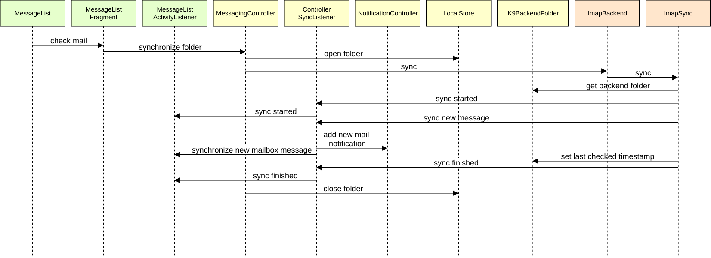
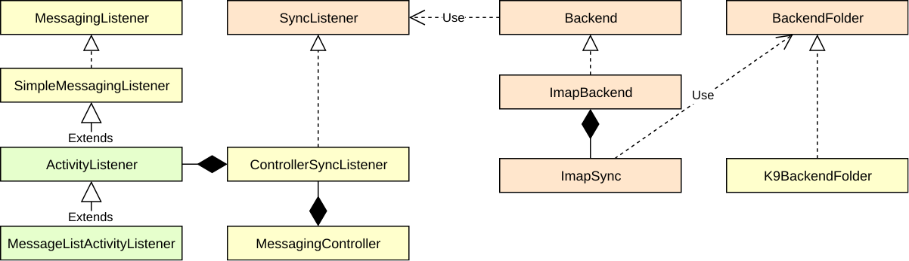

# Repository structure

The project is divided into several directories below which are nested gradle projects.

## app

This contains the highest level code such as UI and core logic.

## backend

APIs for sending and receiving messages

## mail

Low level code for dealing with internet mail protocols

## plugins

Additional, standalone, libraries used by Thunderbird for Android

# Walkthrough

To help you understand the design, the following sequence diagrams show typical flows through the
classes. Each class is colour-coded by its top-level project.

## Reading email

## Sending email

