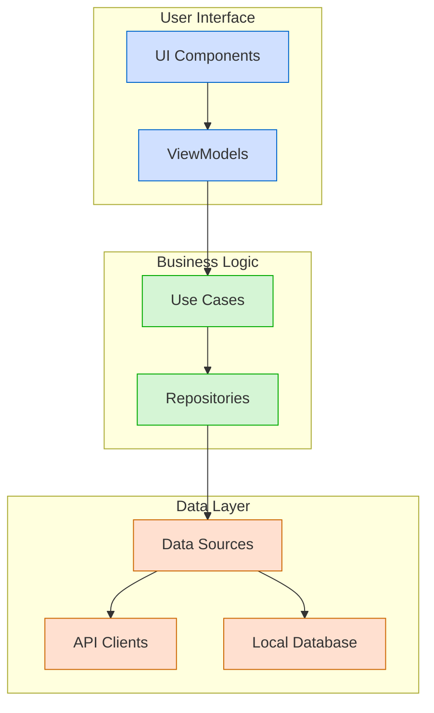
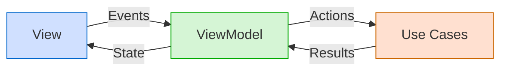
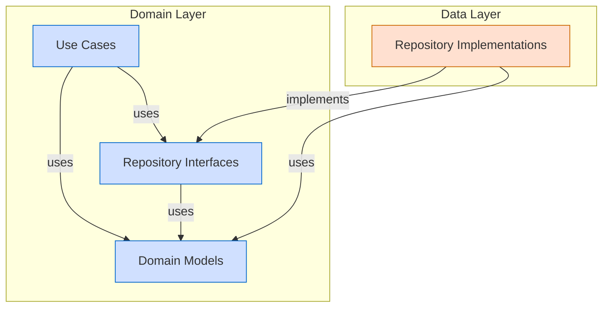
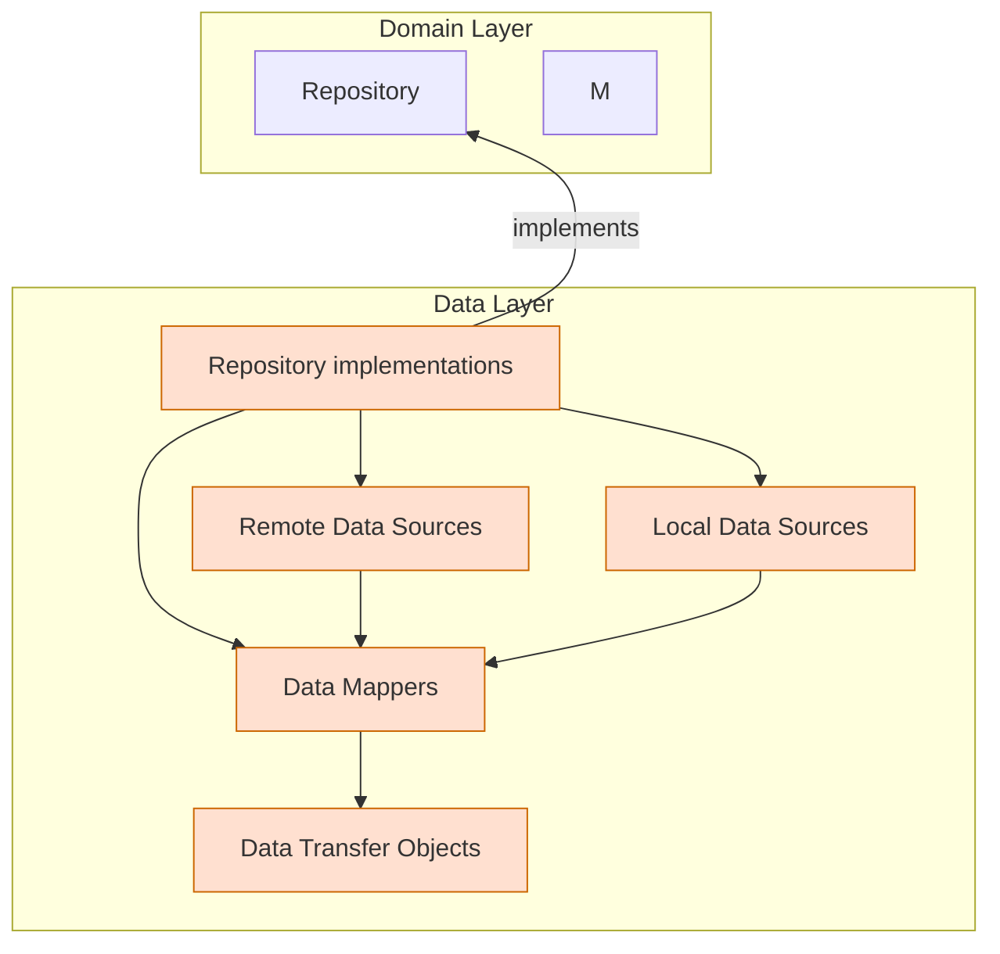
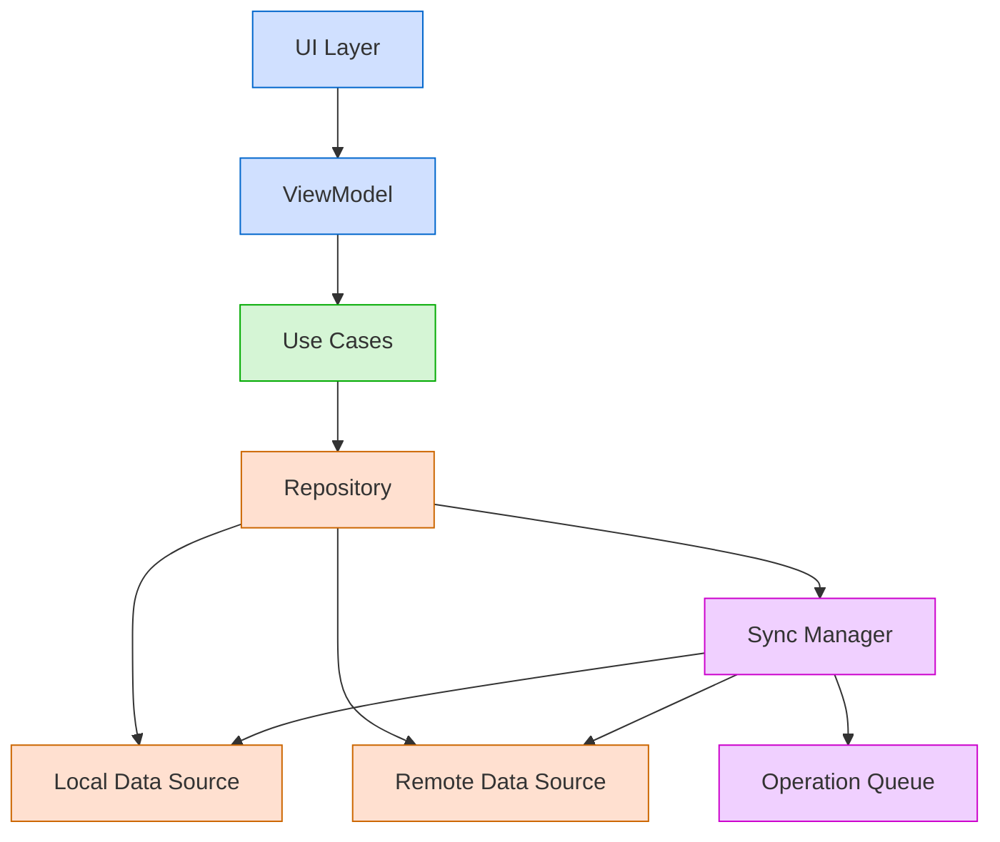

# 🏗️ Architecture

The application follows a modular architecture with clear separation between different layers and components. The architecture is designed to support both the Thunderbird for Android and K-9 Mail applications while maximizing code reuse, maintainability and enable adoption of Kotlin Multiplatform in the future.

## 🔑 Key Architectural Principles

- **🧩 Modularity**: The application is divided into distinct modules with clear responsibilities
- **🔀 Separation of Concerns**: Each module focuses on a specific aspect of the application
- **⬇️ Dependency Inversion**: Higher-level modules do not depend on lower-level modules directly
- **🎯 Single Responsibility**: Each component has a single responsibility
- **🔄 API/Implementation Separation**: Clear separation between public APIs and implementation details
- **🧹 Clean Architecture**: Separation of UI, domain, and data layers
- **🧪 Testability**: The architecture facilitates comprehensive testing at all levels
- **📱 Offline-First**: The application is designed to work offline with local data storage and synchronization with remote servers
- **🚀 Multi platform Compatibility**: The architecture is designed to support future Kotlin Multiplatform adoption

## 📝 Architecture Decision Records

The [Architecture Decision Records](adr/README.md) document the architectural decisions made during the development of the
project, providing context and rationale for key technical choices. Reading through these decisions will improve your
contributions and ensure long-term maintainability of the project.

## 📦 Module Structure

The application is organized into several module types:

- **📱 App Modules**: `app-thunderbird` and `app-k9mail` - Application entry points
- **🔄 App Common**: `app-common` - Shared code between applications
- **✨ Feature Modules**: `feature:*` - Independent feature modules
- **🧰 Core Modules**: `core:*` - Foundational components and utilities used across multiple features
- **📚 Library Modules**: `library:*` - Specific implementations for reuse
- **🔙 Legacy Modules**: Legacy code being gradually migrated

For more details on the module structure, see the [Module Structure](module-structure.md) document.

## 🧩 Architectural Patterns

The architecture follows several key patterns to ensure maintainability, testability, and separation of concerns:

### 🔄 API/Implementation Separation

Each module should be split into two main parts: **API** and **implementation**. This separation provides clear
boundaries between what a module exposes to other modules and how it implements its functionality internally:

- **📝 API**: Public interfaces, models, and contracts
- **⚙️ Implementation**: Concrete implementations of the interfaces

This separation provides clear boundaries, improves testability, and enables flexibility.

See [API Module](module-structure.md#-api-module) and
[Implementation Module](module-structure.md#-implementation-module) for more details.

### Clean Architecture

Thunderbird for Android uses **Clean Architecture** with three main layers (UI, domain, and data) to break down complex
feature implementation into manageable components. Each layer has a specific responsibility:

#### 🖼️ UI Layer (Presentation)

The UI layer is responsible for displaying data to the user and handling user interactions.

**Key Components:**
- **🎨 Compose UI**: Screen components built with Jetpack Compose
- **🧠 ViewModels**: Manage UI state and handle UI events
- **📊 UI State**: Immutable data classes representing the UI state

**Pattern: Model-View-Intent (MVI)**
- **📋 Model**: UI state representing the current state of the screen
- **👁️ View**: Compose UI that renders the state
- **🎯 Intent**: Events triggered by user actions



##### 🔄 Model-View-Intent (MVI)

The UI layer follows the Model-View-Intent (MVI) pattern, which provides a unidirectional data flow and clear separation between UI state and UI logic.



Key components:
- **👁️ View**: Renders the UI based on the current state and sends user events to the ViewModel
- **🧠 ViewModel**: Processes events, updates state, and triggers actions
- **📊 State**: Immutable representation of the UI state
- **🎮 Event**: User interactions or system events
- **⚡ Action**: Operations triggered by the ViewModel

#### 🧠 Domain Layer (Business Logic)

The domain layer contains the business logic and rules of the application. It is independent of the UI and data layers,
allowing for easy testing and reuse.

**Key Components:**
- **⚙️ Use Cases**: Encapsulate business logic operations
- **📋 Domain Models**: Represent business entities
- **📝 Repository Interfaces**: Define data access contracts



#### 💾 Data Layer

The data layer is responsible for data retrieval, storage, and synchronization.

**Key Components:**
- **📦 Repository implementations**: Implement repository interfaces from the domain layer
- **🔌 Data Sources**: Provide data from specific sources (API, database, preferences)
- **📄 Data Transfer Objects**: Represent data at the data layer

**Pattern: Data Source Pattern**
- 🔍 Abstracts data sources behind a clean API
-  Maps data between domain models and data transfer objects



## 🎨 UI Architecture

The UI is built using Jetpack Compose with a component-based architecture following the Model-View-Intent (MVI) pattern. This architecture provides a unidirectional data flow, clear separation of concerns, and improved testability.

For detailed information about the UI architecture, see the [UI Architecture](ui-architecture.md) document.

## 📱 Offline-First Approach

The application implements an offline-first Approach to provide a reliable user experience regardless of network conditions:

- 💾 Local database as the single source of truth
- 🔄 Background synchronization with remote servers
- 📋 Operation queueing for network operations
- 🔀 Conflict resolution for data modified both locally and remotely

#### Implementation Approach



The offline-first approach is implemented across all layers of the application:

1. **💾 Data Layer**:
   - 📊 Local database as the primary data source
   - 🌐 Remote data source for server communication
   - 📦 Repository pattern to coordinate between data sources
   - 🔄 Synchronization manager to handle data syncing
2. **🧠 Domain Layer**:
   - ⚙️ Use cases handle both online and offline scenarios
   - 📝 Business logic accounts for potential network unavailability
   - 📋 Domain models represent data regardless of connectivity state
3. **🖼️ UI Layer**:
   - 🧠 ViewModels expose UI state that reflects connectivity status
   - 🚦 UI components display appropriate indicators for offline mode
   - 👆 User interactions are designed to work regardless of connectivity

## 💉 Dependency Injection

The application uses [Koin](https://insert-koin.io/) for dependency injection, with modules organized by feature:

- **📱 App Modules**: Configure application-wide dependencies
- **🔄 App Common**: Shared dependencies between applications
- **✨ Feature Modules**: Configure feature-specific dependencies
- **🧰 Core Modules**: Configure core dependencies

```kotlin
// Example Koin module for a feature
val featureModule = module {
    viewModel { FeatureViewModel(get()) }
    single<FeatureRepository> { FeatureRepositoryImpl(get(), get()) }
    single<FeatureUseCase> { FeatureUseCaseImpl(get()) }
    single<FeatureApiClient> { FeatureApiClientImpl() }
}
```

## 🔄 Cross-Cutting Concerns

### ⚠️ Error Handling

- 🧠 Domain errors for business logic errors
- 💾 Data errors for data access errors
- 🖼️ UI error handling for user-friendly error presentation

### 📝 Logging

- 📊 Structured logging with different log levels

### 🔒 Security

- 🔐 Data encryption for sensitive information
- 🔑 Secure authentication mechanisms
- 🛡️ Network security with proper certificate validation

## 🧪 Testing Strategy

The architecture supports comprehensive testing:

- **🔬 Unit Tests**: Test individual components in isolation
- **🔌 Integration Tests**: Test interactions between components
- **📱 UI Tests**: Test the UI behavior and user flows

See the [Testing guide](../contributing/testing-guide.md) document for more details on how to write and run tests
for the application.

## 🔙 Legacy Integration

The application includes legacy code that is gradually being migrated to the new architecture:
- **📦 Legacy Modules**: Contain code from the original K-9 Mail application
- **🔄 Migration Strategy**: Gradual migration to the new architecture
- **🔌 Integration Points**: Clear interfaces between legacy and new code

For more details on the legacy integration, see the [Legacy Integration](legacy-module-integration.md) document.

## 🔄 User Flows

The [User Flows](user-flows.md) provides visual representations of typical user flows through the application, helping to understand how different components interact.
