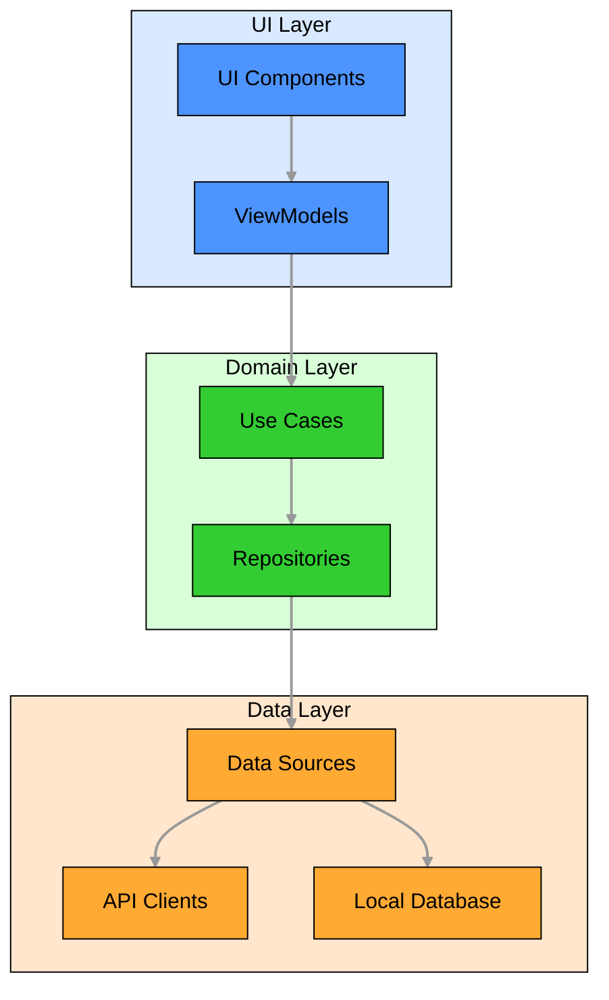
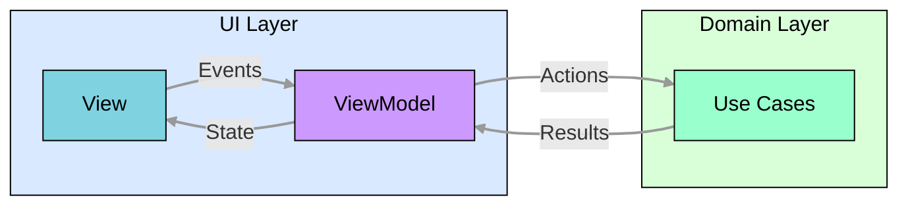
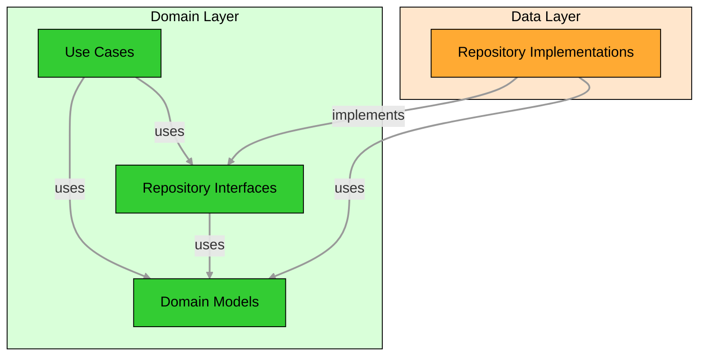
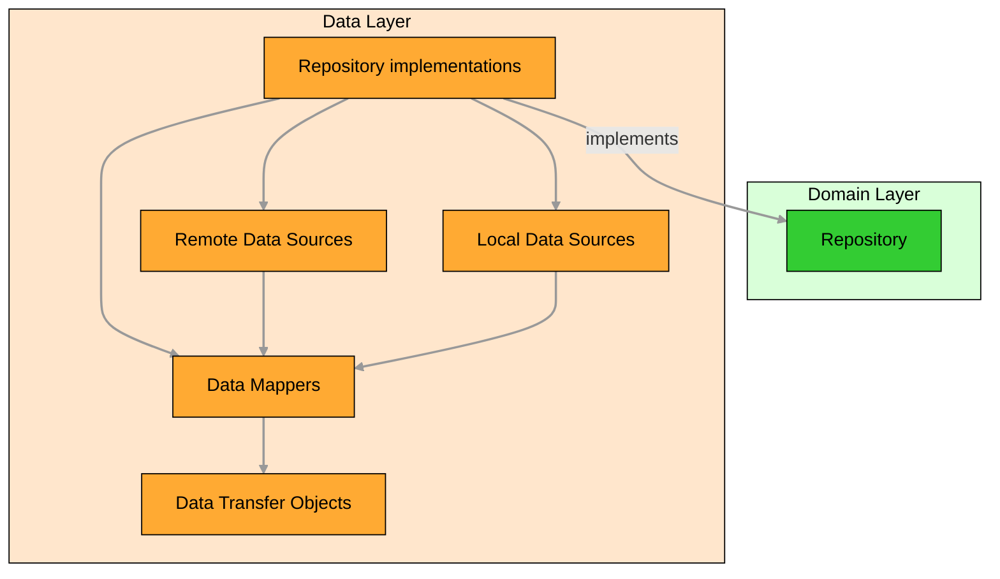
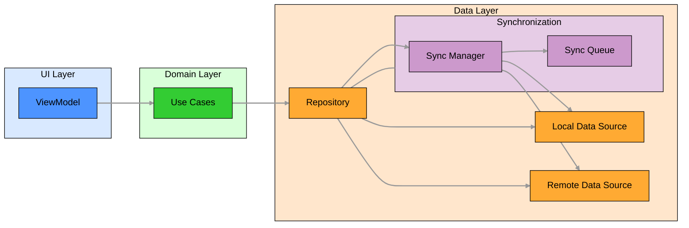

# 🏗️ Architecture

The application follows a modular architecture with clear separation between different layers and components. The architecture is designed to support both the Thunderbird for Android and K-9 Mail applications while maximizing code reuse, maintainability and enable adoption of Kotlin Multiplatform in the future.

## 🔑 Key Architectural Principles

- **🧩 Modularity**: The application is divided into distinct modules with clear responsibilities
- **🔀 Separation of Concerns**: Each module focuses on a specific aspect of the application
- **⬇️ Dependency Inversion**: Higher-level modules do not depend on lower-level modules directly
- **🎯 Single Responsibility**: Each component has a single responsibility
- **🔄 API/Implementation Separation**: Clear separation between public APIs and implementation details
- **🧹 Clean Architecture**: Separation of UI, domain, and data layers
- **🧪 Testability**: The architecture facilitates comprehensive testing at all levels
- **📱 Offline-First**: The application is designed to work offline with local data storage and synchronization with remote servers
- **🚀 Multi platform Compatibility**: The architecture is designed to support future Kotlin Multiplatform adoption

## 📝 Architecture Decision Records

The [Architecture Decision Records](adr/README.md) document the architectural decisions made during the development of the
project, providing context and rationale for key technical choices. Reading through these decisions will improve your
contributions and ensure long-term maintainability of the project.

## 📦 Module Structure

The application is organized into several module types:

- **📱 App Modules**: `app-thunderbird` and `app-k9mail` - Application entry points
- **🔄 App Common**: `app-common` - Shared code between applications
- **✨ Feature Modules**: `feature:*` - Independent feature modules
- **🧰 Core Modules**: `core:*` - Foundational components and utilities used across multiple features
- **📚 Library Modules**: `library:*` - Specific implementations for reuse
- **🔙 Legacy Modules**: Legacy code being gradually migrated

For more details on the module organization and structure, see the [Module Organization](module-organization.md) and
[Module Structure](module-structure.md) documents.

## 🧩 Architectural Patterns

The architecture follows several key patterns to ensure maintainability, testability, and separation of concerns:

### 🔄 API/Implementation Separation

Each module should be split into two main parts: **API** and **implementation**. This separation provides clear
boundaries between what a module exposes to other modules and how it implements its functionality internally:

- **📝 API**: Public interfaces, models, and contracts
- **⚙️ Implementation**: Concrete implementations of the interfaces

This separation provides clear boundaries, improves testability, and enables flexibility.

See [API Module](module-structure.md#-api-module) and
[Implementation Module](module-structure.md#-implementation-module) for more details.

### Clean Architecture

Thunderbird for Android uses **Clean Architecture** with three main layers (UI, domain, and data) to break down complex
feature implementation into manageable components. Each layer has a specific responsibility:

#### 🖼️ UI Layer (Presentation)

The UI layer is responsible for displaying data to the user and handling user interactions.

**Key Components:**
- **🎨 Compose UI**: Screen components built with Jetpack Compose
- **🧠 ViewModels**: Manage UI state and handle UI events
- **📊 UI State**: Immutable data classes representing the UI state

**Pattern: Model-View-Intent (MVI)**
- **📋 Model**: UI state representing the current state of the screen
- **👁️ View**: Compose UI that renders the state
- **🎯 Intent**: Events triggered by user actions



##### 🔄 Model-View-Intent (MVI)

The UI layer follows the Model-View-Intent (MVI) pattern, which provides a unidirectional data flow and clear separation between UI state and UI logic.



Key components:
- **👁️ View**: Renders the UI based on the current state and sends user events to the ViewModel
- **🧠 ViewModel**: Processes events, updates state, and triggers actions
- **📊 State**: Immutable representation of the UI state
- **🎮 Event**: User interactions or system events
- **⚡ Action**: Operations triggered by the ViewModel

#### 🧠 Domain Layer (Business Logic)

The domain layer contains the business logic and rules of the application. It is independent of the UI and data layers,
allowing for easy testing and reuse.

**Key Components:**
- **⚙️ Use Cases**: Encapsulate business logic operations
- **📋 Domain Models**: Represent business entities
- **📝 Repository Interfaces**: Define data access contracts



#### 💾 Data Layer

The data layer is responsible for data retrieval, storage, and synchronization.

**Key Components:**
- **📦 Repository implementations**: Implement repository interfaces from the domain layer
- **🔌 Data Sources**: Provide data from specific sources (API, database, preferences)
- **📄 Data Transfer Objects**: Represent data at the data layer

**Pattern: Data Source Pattern**
- 🔍 Abstracts data sources behind a clean API
-  Maps data between domain models and data transfer objects



## 🎨 UI Architecture

The UI is built using Jetpack Compose with a component-based architecture following the Model-View-Intent (MVI) pattern. This architecture provides a unidirectional data flow, clear separation of concerns, and improved testability.

For detailed information about the UI architecture, see the [UI Architecture](ui-architecture.md) document.

## 📱 Offline-First Approach

The application implements an offline-first Approach to provide a reliable user experience regardless of network conditions:

- 💾 Local database as the single source of truth
- 🔄 Background synchronization with remote servers
- 📋 Operation queueing for network operations
- 🔀 Conflict resolution for data modified both locally and remotely

#### Implementation Approach



The offline-first approach is implemented across all layers of the application:

1. **💾 Data Layer**:
   - 📊 Local database as the primary data source
   - 🌐 Remote data source for server communication
   - 📦 Repository pattern to coordinate between data sources
   - 🔄 Synchronization manager to handle data syncing
2. **🧠 Domain Layer**:
   - ⚙️ Use cases handle both online and offline scenarios
   - 📝 Business logic accounts for potential network unavailability
   - 📋 Domain models represent data regardless of connectivity state
3. **🖼️ UI Layer**:
   - 🧠 ViewModels expose UI state that reflects connectivity status
   - 🚦 UI components display appropriate indicators for offline mode
   - 👆 User interactions are designed to work regardless of connectivity

## 💉 Dependency Injection

The application uses [Koin](https://insert-koin.io/) for dependency injection, with modules organized by feature:

- **📱 App Modules**: Configure application-wide dependencies
- **🔄 App Common**: Shared dependencies between applications
- **✨ Feature Modules**: Configure feature-specific dependencies
- **🧰 Core Modules**: Configure core dependencies

```kotlin
// Example Koin module for a feature
val featureModule = module {
    viewModel { FeatureViewModel(get()) }
    single<FeatureRepository> { FeatureRepositoryImpl(get(), get()) }
    single<FeatureUseCase> { FeatureUseCaseImpl(get()) }
    single<FeatureApiClient> { FeatureApiClientImpl() }
}
```

## 🔄 Cross-Cutting Concerns

Cross-cutting concerns are aspects of the application that affect multiple features and cannot be cleanly handled
individually for every feature. These concerns require consistent implementation throughout the codebase to ensure
maintainability an reliability.

In Thunderbird for Android, several cross-cutting concerns are implemented as dedicated core modules to provide
standardized solutions that can be reused across the application:

- **⚠️ Error Handling**: Comprehensive error handling (`core/outcome`) transforms exceptions into domain-specific errors and provides user-friendly feedback.
- **📋 Logging**: Centralized logging system (`core/logging`) ensures consistent log formatting, levels, and storage.
- **🔒 Security**: Modules like `core/security` handle encryption, authentication, and secure data storage.

Work in progress:
- **🔐 Encryption**: The `core/crypto` module provides encryption and decryption utilities for secure data handling.
- **📦 Feature Flags**: The `core/feature-flags` module manages feature toggles and experimental features.
- **🔄 Synchronization**: The `core/sync` module manages background synchronization, conflict resolution, and offline-first behavior.
- **🛠️ Configuration Management**: Centralized handling of application settings and environment-specific configurations.

By implementing these concerns as core modules, the application achieves a clean and modular architecture that is easier to maintain and extend.

### ⚠️ Error Handling

The application implements a comprehensive error handling strategy across all layers. We favor using the Outcome pattern
over exceptions for expected error conditions, while exceptions are reserved for truly exceptional situations that
indicate programming errors or unrecoverable system failures.

- 🧠 **Domain Errors**: Encapsulate business logic errors as sealed classes, ensuring clear representation of specific
  error cases.
- 💾 **Data Errors**: Transform network or database exceptions into domain-specific errors using result patterns in repository implementations.
- 🖼️ **UI Error Handling**: Provide user-friendly error feedback by:
  - Mapping domain errors to UI state in ViewModels.
  - Displaying actionable error states in Compose UI components.
  - Offering retry options for network connectivity issues.

> [!NOTE]  
> Exceptions should be used sparingly. Favor the Outcome pattern and sealed classes for predictable error conditions to
> enhance maintainability and clarity.

#### 🛠️ How to Implement Error Handling

When implementing error handling in your code:

1. **Define domain-specific errors** as sealed classes in your feature's domain layer:

   ```kotlin
   sealed class AccountError {
       data class AuthenticationFailed(val reason: String) : AccountError()
       data class NetworkError(val exception: Exception) : AccountError()
       data class ValidationError(val field: String, val message: String) : AccountError()
   }
   ```
2. **Use result patterns (Outcome)** instead of exceptions for error handling:

   ```kotlin
   // Use the Outcome class for representing success or failure
   sealed class Outcome<out T, out E> {
       data class Success<T>(val value: T) : Outcome<T, Nothing>()
       data class Failure<E>(val error: E) : Outcome<Nothing, E>()
   }
   ```
3. **Transform external errors** into domain errors in your repositories using result patterns:

   ```kotlin
   // Return Outcome instead of throwing exceptions
   fun authenticate(credentials: Credentials): Outcome<AuthResult, AccountError> {
       return try {
           val result = apiClient.authenticate(credentials)
           Outcome.Success(result)
       } catch (e: HttpException) {
           val error = when (e.code()) {
               401 -> AccountError.AuthenticationFailed("Invalid credentials")
               else -> AccountError.NetworkError(e)
           }
           logger.error(e) { "Authentication failed: ${error::class.simpleName}" }
           Outcome.Failure(error)
       } catch (e: Exception) {
           logger.error(e) { "Authentication failed with unexpected error" }
           Outcome.Failure(AccountError.NetworkError(e))
       }
   }
   ```
4. **Handle errors in Use Cases** by propagating the Outcome:

   ```kotlin
   class LoginUseCase(
       private val accountRepository: AccountRepository,
       private val credentialValidator: CredentialValidator,
   ) {
       fun execute(credentials: Credentials): Outcome<AuthResult, AccountError> {
           // Validate input first
           val validationResult = credentialValidator.validate(credentials)
           if (validationResult is ValidationResult.Failure) {
               return Outcome.Failure(
                   AccountError.ValidationError(
                       field = validationResult.field,
                       message = validationResult.message
                   )
               )
           }

           // Proceed with authentication
           return accountRepository.authenticate(credentials)
       }
   }
   ```
5. **Handle outcomes in ViewModels** and transform them into UI state:

   ```kotlin
   viewModelScope.launch {
       val outcome = loginUseCase.execute(credentials)

       when (outcome) {
           is Outcome.Success -> {
               _uiState.update { it.copy(isLoggedIn = true) }
           }
           is Outcome.Failure -> {
               val errorMessage = when (val error = outcome.error) {
                   is AccountError.AuthenticationFailed -> 
                       stringProvider.getString(R.string.error_authentication_failed, error.reason)
                   is AccountError.NetworkError -> 
                       stringProvider.getString(R.string.error_network, error.exception.message)
                   is AccountError.ValidationError -> 
                       stringProvider.getString(R.string.error_validation, error.field, error.message)
               }
               _uiState.update { it.copy(error = errorMessage) }
           }
       }
   }
   ```
6. **Always log errors** for debugging purposes:

   ```kotlin
   // Logging is integrated into the Outcome pattern
   fun fetchMessages(): Outcome<List<Message>, MessageError> {
       return try {
           val messages = messageService.fetchMessages()
           logger.info { "Successfully fetched ${messages.size} messages" }
           Outcome.Success(messages)
       } catch (e: Exception) {
           logger.error(e) { "Failed to fetch messages" }
           Outcome.Failure(MessageError.FetchFailed(e))
       }
   }
   ```
7. **Compose multiple operations** that return Outcomes:

   ```kotlin
   fun synchronizeAccount(): Outcome<SyncResult, SyncError> {
       // First operation
       val messagesOutcome = fetchMessages()
       if (messagesOutcome is Outcome.Failure) {
           return Outcome.Failure(SyncError.MessageSyncFailed(messagesOutcome.error))
       }

       // Second operation using the result of the first
       val messages = messagesOutcome.getOrNull()!!
       val folderOutcome = updateFolders(messages)
       if (folderOutcome is Outcome.Failure) {
           return Outcome.Failure(SyncError.FolderUpdateFailed(folderOutcome.error))
       }

       // Return success with combined results
       return Outcome.Success(
           SyncResult(
               messageCount = messages.size,
               folderCount = folderOutcome.getOrNull()!!.size
           )
       )
   }
   ```

### 📝 Logging

The application uses a structured logging system with a well-defined API:

- 📊 **Logging Architecture**:
  - Core logging API (`core/logging/api`) defines interfaces like `Logger` and `LogSink`
  - Multiple implementations (composite, console) allow for flexible logging targets
  - Composite implementation enables logging to multiple sinks simultaneously
- 🔄 **Logger vs. Sink**:
  - **Logger**: The front-facing interface that application code interacts with to create log entries
    - Provides methods for different log levels (verbose, debug, info, warn, error)
    - Handles the creation of log events with appropriate metadata (timestamp, tag, etc.)
    - Example: `DefaultLogger` implements the `Logger` interface and delegates to a `LogSink`
  - **LogSink**: The back-end component that receives log events and determines how to process them
    - Defines where and how log messages are actually stored or displayed
    - Filters log events based on configured log levels
    - Can be implemented in various ways (console output, file storage, remote logging service)
    - Multiple sinks can be used simultaneously via composite pattern
- 📋 **Log Levels**:
  - `VERBOSE`: Most detailed log level for debugging
  - `DEBUG`: Detailed information for diagnosing problems
  - `INFO`: General information about application flow
  - `WARN`: Potential issues that don't affect functionality
  - `ERROR`: Issues that affect functionality but don't crash the application

#### 🛠️ How to Implement Logging

When adding logging to your code:

1. **Inject a Logger** into your class:

   ```kotlin
   class AccountRepository(
       private val apiClient: ApiClient,
       private val logger: Logger,
   ) {
       // Repository implementation
   }
   ```
2. **Choose the appropriate log level** based on the importance of the information:
   - Use `verbose` for detailed debugging information (only visible in debug builds)
   - Use `debug` for general debugging information
   - Use `info` for important events that should be visible in production
   - Use `warn` for potential issues that don't affect functionality
   - Use `error` for issues that affect functionality
3. **Use lambda syntax** to avoid string concatenation when logging isn't needed:

   ```kotlin
   // Good - string is only created if this log level is enabled
   logger.debug { "Processing message with ID: $messageId" }

   // Avoid - string is always created even if debug logging is disabled
   logger.debug("Processing message with ID: " + messageId)
   ```
4. **Include relevant context** in log messages:

   ```kotlin
   logger.info { "Syncing account: ${account.email}, folders: ${folders.size}" }
   ```
5. **Log exceptions** with the appropriate level and context:

   ```kotlin
   try {
       apiClient.fetchMessages()
   } catch (e: Exception) {
       logger.error(e) { "Failed to fetch messages for account: ${account.email}" }
       throw MessageSyncError.FetchFailed(e)
   }
   ```
6. **Use tags** for better filtering when needed:

   ```kotlin
   private val logTag = LogTag("AccountSync")

   fun syncAccount() {
       logger.info(logTag) { "Starting account sync for: ${account.email}" }
   }
   ```

### 🔒 Security

Security is a critical aspect of an email client. The application implements:

- 🔐 **Data Encryption**:
  - End-to-end encryption using OpenPGP (via the `legacy/crypto-openpgp` module)
  - Classes like `EncryptionDetector` and `OpenPgpEncryptionExtractor` handle encrypted emails
  - Local storage encryption for sensitive data like account credentials
- 🔑 **Authentication**:
  - Support for various authentication types (OAuth, password, client certificate)
  - Secure token storage and management
  - Authentication error handling and recovery
- 🛡️ **Network Security**:
  - TLS for all network connections with certificate validation
  - Certificate pinning for critical connections
  - Protection against MITM attacks

> [!NOTE]
> This section is a work in progress. The security architecture is being developed and will be documented in detail
> as it evolves.

#### 🛠️ How to Implement Security

When implementing security features in your code:

1. **Never store sensitive data in plain text**:

   ```kotlin
   // Bad - storing password in plain text
   sharedPreferences.putString("password", password)

   // Good - use the secure credential storage
   val credentialStorage = get<CredentialStorage>()
   credentialStorage.storeCredentials(accountUuid, credentials)
   ```
2. **Use encryption for sensitive data**:

   ```kotlin
   // For data that needs to be stored encrypted
   val encryptionManager = get<EncryptionManager>()
   val encryptedData = encryptionManager.encrypt(sensitiveData)
   database.storeEncryptedData(encryptedData)
   ```
3. **Validate user input** to prevent injection attacks:

   ```kotlin
   // Validate input before using it
   if (!InputValidator.isValidEmailAddress(userInput)) {
       throw ValidationError("Invalid email address")
   }
   ```
4. **Use secure network connections**:

   ```kotlin
   // The networking modules enforce TLS by default
   // Make sure to use the provided clients rather than creating your own
   val networkClient = get<NetworkClient>()
   ```

## 🧪 Testing Strategy

The architecture supports comprehensive testing:

- **🔬 Unit Tests**: Test individual components in isolation
- **🔌 Integration Tests**: Test interactions between components
- **📱 UI Tests**: Test the UI behavior and user flows

See the [Testing guide](../contributing/testing-guide.md) document for more details on how to write and run tests
for the application.

## 🔙 Legacy Integration

The application includes legacy code that is gradually being migrated to the new architecture:
- **📦 Legacy Modules**: Contain code from the original K-9 Mail application
- **🔄 Migration Strategy**: Gradual migration to the new architecture
- **🔌 Integration Points**: Clear interfaces between legacy and new code

For more details on the legacy integration, see the [Legacy Integration](legacy-module-integration.md) document.

## 🔄 User Flows

The [User Flows](user-flows.md) provides visual representations of typical user flows through the application, helping to understand how different components interact.
