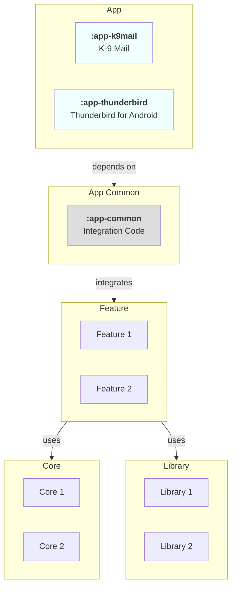
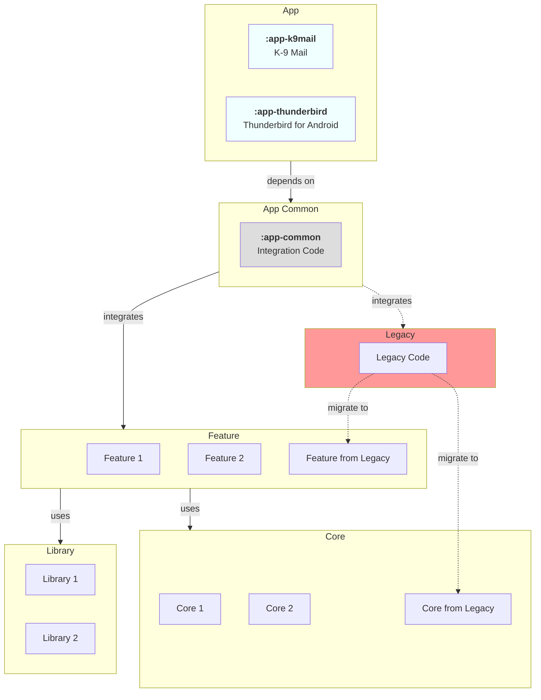

# [Project Structure]

- Issue: [#7852](https://github.com/thunderbird/thunderbird-android/issues/7852)
- Pull Request: [#7829](https://github.com/thunderbird/thunderbird-android/pull/7829)

## Status

- **Accepted**

## Context

The project consists of two distinct applications. To improve maintainability and streamline development, we propose a modular structure using Gradle. This structure is designed to enable clear separation of concerns, facilitate scalable growth, and ensure efficient dependency management. It consists of various module types such as `app`, `app-common`, `feature`, `core`, and `library` modules, promoting enhanced modular reusability.

## Decision

To achieve the goals outlined in the context, we have decided to adopt the following modular structure:

1. **App Modules**:

   - `app-thunderbird` and `app-k9mail` are the modules for the two applications, Thunderbird for Android and K-9 Mail respectively. These modules will contain app-specific implementations, configurations, resources, and startup logic. They should solely depend on the `app-common` module for shared functionalities and may selectively integrate `feature` and `core` to setup app-specific needs.

2. **App Common Module**:

   - `app-common`: Acts as the central hub for shared code between both applications. This module serves as the primary "glue" that binds various `feature` modules together, providing a seamless integration point. While it can depend on `library` modules for additional functionalities, its main purpose is to orchestrate the interactions among the `feature` and `core` modules, ensuring similar functionality across both applications. This module should be kept lean to avoid unnecessary dependencies and ensure it remains focused on shared functionality.

3. **Feature Modules**:

   - `feature:*`: These are independent feature modules, that encapsulate distinct user-facing features. They are designed to be reusable and can be integrated into any application module as needed. They maintain dependencies on `core` modules and may interact with other `feature` or `library` modules.

4. **Core Module**:

   - `core:*`: The core modules contain essential utilities and base classes used across the entire project. These modules are grouped by their functionality (e.g., networking, database management, theming, common utilities). This segmentation allows for cleaner dependency management and specialization within foundational aspects.

5. **Library Modules**:

   - `library:*` These modules are for specific implementations that might be used across various features or applications. They could be third-party integrations or complex utilities and eventually shared across multiple projects.

### Legacy Modules

Modules that are still required for the project to function, but don't follow the new project structure.

These modules should not be used for new development.

The goal is to migrate the functionality of these modules to the new structure over time. By placing them under the `legacy` module, we can easily identify and manage them.

## Consequences

### Positive Consequences

- Improved modularity facilitates easier code maintenance and scaling.
- Clear separation of concerns reduces dependencies and potential conflicts between modules.
- Enhanced reusability of the `feature`, `core` and `library` modules across different parts of the application or even in different projects.

### Negative Consequences

- Initial complexity in setting up and managing multiple modules may increase the learning curve and setup time for new developers.
- Over-modularization can lead to excessive abstraction, potentially impacting runtime performance and complicating the debugging process.
- Legacy modules may require additional effort to migrate to the new structure, potentially causing delays in the adoption of the new architecture.
