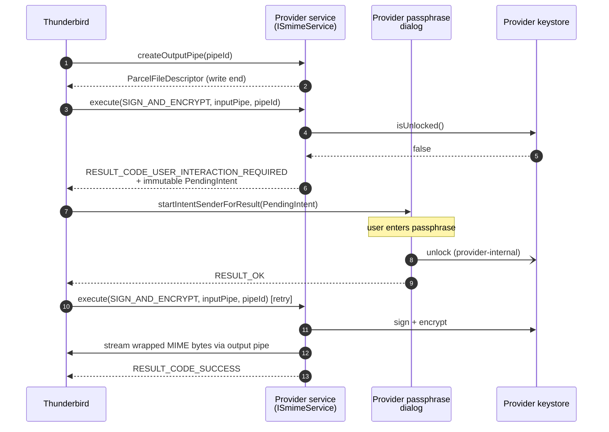

# Use a Companion App + AIDL Service for S/MIME

## Status

- **Accepted**

## Context

Thunderbird for Android needs to support end-to-end encryption with S/MIME, in addition to its existing OpenPGP support.
S/MIME has the same broad shape as OpenPGP — sign, encrypt, decrypt, verify, certificate lookup — but uses a different
trust model (X.509 certificates and CAs) and a substantially different implementation stack (Bouncy Castle's CMS layer,
PKCS#12 import, OCSP, CRL distribution, key-store management with passphrase entry).

We evaluated three integration strategies:

- **Option A — in-process library.** Bundle a full S/MIME implementation directly into Thunderbird, alongside the
  existing `legacy/crypto-openpgp` module. Tight integration, no IPC, but a very large surface area to maintain:
  certificate stores, OCSP, CRL fetching, PKCS#12 import, keystore UI, passphrase entry, etc. Doubles Thunderbird's
  crypto-attack surface and significantly enlarges the app's dependency footprint.

- **Option B — embed a third-party crypto core.** Pull in an existing S/MIME library (e.g. the CipherMail core) as a
  JAR/AAR. Smaller than Option A but still leaves Thunderbird responsible for keystore lifecycle, certificate UI, and
  passphrase prompts. License compatibility (the reference S/MIME stack is GPL) is also a hard blocker for Thunderbird's
  app distribution.

- **Option C — companion app over AIDL.** Thunderbird depends only on a small AIDL API and binds, at runtime, to a
  separate S/MIME provider app (CipherMail) that owns all key material, certificate stores, and crypto operations.
  This mirrors how OpenKeychain already provides OpenPGP for Thunderbird via `plugins/openpgp-api-lib`.

Option C provides the cleanest symmetry with the existing OpenPGP integration, isolates the GPL'd crypto core in a
separate process and a separate app distribution, and keeps Thunderbird's binary size and dependency graph essentially
unchanged.

## Decision

We will integrate S/MIME via a companion-app architecture, paralleling the existing OpenPGP / OpenKeychain integration.

Specifically:

- A new module `plugins/smime-api/smime-api/` defines the AIDL service contract and its Parcelable result types.
  It mirrors `plugins/openpgp-api-lib/openpgp-api/` in layout and licensing (Apache 2.0).
- The reference provider is **CipherMail** (`com.ciphermail.android`), an existing standalone Android app maintained
  in a separate repository, which adds an `SmimeService` bound service implementing `ISmimeService`.
- Thunderbird discovers providers at runtime via an `<intent-filter>` query for `com.ciphermail.smime.api.ISmimeService`.
  When more than one provider is installed, `SmimeAppSelectDialog` lets the user choose.
- The service contract exposes five actions: `CHECK_PERMISSION`, `DECRYPT_VERIFY`, `SIGN_AND_ENCRYPT`,
  `GET_CERTIFICATES`, `IMPORT_CERTIFICATE`. Bulk MIME data streams through `ParcelFileDescriptor` pipes rather than
  Intent extras, keeping Binder transactions small.
- Cross-process user interaction (e.g. keystore-passphrase entry) follows the same `RESULT_CODE_USER_INTERACTION_REQUIRED`
  + `PendingIntent` pattern OpenKeychain already uses. The provider's passphrase dialog runs in the provider's process;
  Thunderbird launches it via `startIntentSenderForResult` and retries the operation on `RESULT_OK`.
- Per-account configuration mirrors OpenPGP: a new `smimeProvider` field on `LegacyAccount` selects which installed
  provider that account uses, surfaced as a Preference under Settings → S/MIME.

### Request flow — sign and encrypt (with passphrase unlock)

The `USER_INTERACTION_REQUIRED` reply returns within tens of milliseconds.
The retry succeeds without further user input because the provider's
keystore is now unlocked. Decrypt + verify follows the same shape, with
`SmimeDecryptionResult` and `SmimeSignatureResult` returned as result
Parcelables in step 11.

## Consequences

### Positive Consequences

- S/MIME implementation, key material, and certificate stores stay outside the Thunderbird process and APK.
- License isolation: the GPL crypto core ships in a separate app with its own distribution channel.
- Symmetry with OpenPGP makes the integration easy to reason about; existing patterns (`MessageCryptoHelper`,
  `RecipientPresenter`, `MessageCompose`) extend directly.
- Multi-provider support is free: any app that declares the AIDL service appears in `SmimeAppSelectDialog`.
- Thunderbird's binary size and dependency graph are essentially unchanged — only the small AIDL stub is added.

### Negative Consequences

- Users must install two apps to use S/MIME. CipherMail is published on Google Play (and is planned for F-Droid once
  this companion API lands upstream), so the install is a single search-and-install step, but it is still a separate
  user action that Thunderbird cannot perform automatically. The S/MIME preference row surfaces an explanatory message
  when no provider is installed.
- Cross-process round-trips add latency on the first call after process start (provider cold-start, keystore unlock).
  Subsequent calls are fast.
- The cross-process passphrase-unlock dance is more involved than an in-process prompt and was a source of early bugs
  (cached-passphrase singletons, broadcast receivers, AndroidKeyStore key loss after reinstall).
- The contract between Thunderbird and the provider becomes a versioned external API; breaking changes require an
  `EXTRA_API_VERSION` bump and explicit incompatibility handling in `SmimeError.INCOMPATIBLE_API_VERSIONS`.
- Two repositories must be kept in sync: `plugins/smime-api/smime-api/` here, and the mirrored module in the CipherMail
  repository at `smime-api/`.
