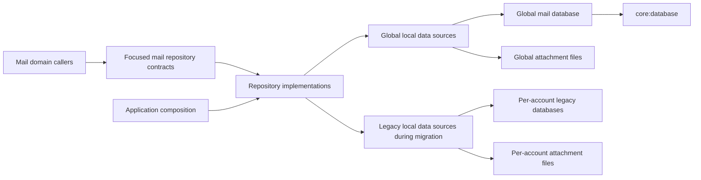

# Database Architecture

> **Status:** Proposed direction. This describes the target architecture introduced by Global Database. It is not a
> description of the current legacy implementation.

## Purpose

The database architecture provides one local source of truth for mail data in the application, while keeping
mail domain code independent of storage technology and legacy storage types.
It establishes the boundaries that Global Database implements. The [RFC](../engineering/rfcs/0007-global-database.md)
and [technical design](../engineering/technical-designs/0003-global-database.md) remain the authoritative records
for its scope and implementation.

## Current and target state

Today, legacy mail storage uses one SQLite database and one attachment directory per account.

Global Database introduces one Room 3-backed mail database and one file-backed attachment directory for the
application.

## Boundaries and ownership

- **Mail repository contracts** are the only storage boundary visible to mail-domain callers. They follow the
  [Repository pattern ADR](../engineering/adr/0010-adopt-project-wide-repository-pattern.md): they are focused,
  explicitly account-scoped, and do not expose Room, SQL, cursors, files, or legacy `LocalStore` types.
- **Repository implementations and local data sources** belong to the mail feature's internal persistence
  implementation. They own mappings between domain data and both global and legacy representations.
- **The global mail database** owns the legacy-compatible mail schema, migration metadata, and derived data.
  It is one physical database for the application, not one database per account.
- **The attachment store** remains file-backed for content that legacy already held on disk, which is every body part
  above a size threshold. Parts at or below it stay `message_parts` BLOBs, as in legacy. Database records and attachment
  files are associated through internal persistence mappings.
- **`core:database`** implements Room 3 as one domain-neutral backend and provides lifecycle, transaction, migration,
  and Android/JVM desktop driver support needed by the mail implementation. It composes feature schema contributions
  deterministically and owns one coordinated schema and migration history. It must not own mail schema, mail entities
  or DAOs, repository contracts, or mail domain types.
- **Application composition** binds repository contracts to one implementation. It is the only place that switches from
  legacy to global storage after successful migration.

## Data and migration model

The global schema begins as a compatible representation of the legacy mail-store schema and behavior.
Account-local numeric IDs are preserved through account-qualified legacy keys. Global identifiers are added only where
repository contracts require them.
The [legacy table inventory](../engineering/technical-designs/0003-global-database/legacy-table-inventory.md)
defines the exact source-to-target mapping, including external attachment files.

Migration has one authoritative storage representation at a time:

|          Migration phase           |           Authoritative storage           |                                Normal mail access                                 |
|------------------------------------|-------------------------------------------|-----------------------------------------------------------------------------------|
| Before cutover                     | Legacy per-account storage                | Legacy repository implementation                                                  |
| Import and validation              | Legacy per-account storage                | Migration gate holds UI and background mail work. Global data remains unpublished |
| After cutover state is established | Global mail database and attachment store | Global repository implementation                                                  |

No normal caller may read from or write to both representations.
Legacy database and attachment artifacts are deleted only after validation and the durable cutover state is established.
The legacy storage implementation stays in the codebase, unbound and unused, and a later release removes it.

## Constraints

- Global Database does not redesign or normalize the legacy mail schema.
- Android and JVM desktop drivers are in scope. The global attachment-store contract is KMP-safe on both targets.
  Legacy import is Android-only.
- On Android, a dedicated migration screen owns the migration UI. It could reuse the existing database-migration
  activity or introduce a suitable replacement. It shows non-sensitive progress and a completion or failure state with
  retry and local report export. The shared migration gate blocks normal mail access and background sync until cutover
  or failure.
- Database implementation types remain internal and follow the API/internal module boundary.
- Migration reports are local and user-exportable, but exclude personally identifiable data and are never uploaded.

## Related documentation

- [RFC 0007: Global Database](../engineering/rfcs/0007-global-database.md)
- [Technical Design 0003: Global Database](../engineering/technical-designs/0003-global-database.md)
- [Legacy Table Inventory](../engineering/technical-designs/0003-global-database/legacy-table-inventory.md)

