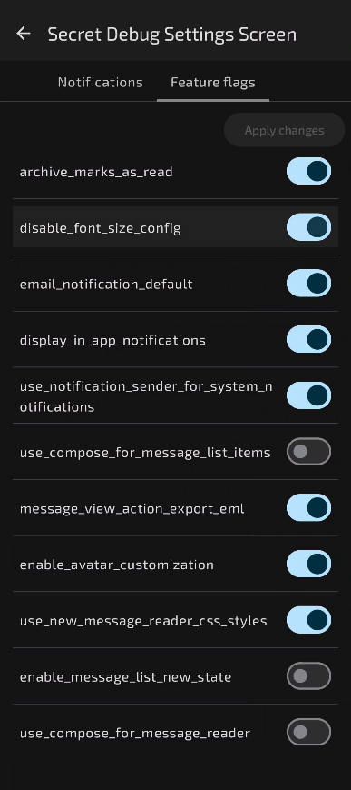

# Feature Flags in Thunderbird and K9 for Android

A feature flag can be nothing more than a simple boolean that can enable or disable a feature that we're working on. While some companies may use their feature flags for A/B testing, with timestamps controlling releases, and any other features they may want more control over. We primarily use them to turn off new features before they're ready to be released to the wider userbase. This is in part because we work on the app using our own forked repositories, and rarely create feature branches to merge ongoing projects into. This isn't a problem because we use local feature flags on debugging builds only, and allows easier testing of new features we're working on.

In this guide, you'll learn where our feature flags live, how to add your own, and how to make use of them. It'll come in handy if you want to work on a larger project than one single PR could create.

#### When Should You Add a Feature Flag?

We use feature flags to close off parts of the app that aren’t for public consumption yet. We put our feature flags in our code, not using remote services, and if you build a debug version of the Thunderbird or K9 app, you can choose which feature flags to test for yourself. This comes at some risk. These are in-development features, features that were too large to put into the app in one commit, or could potentially break the app and need further testing before we can enable them for our production users. However, our contributors know what they’re doing, and understand that these features are incomplete.

If you’re making something that’s too large for a single pull request, or believe it needs to be tested alongside existing code, a feature flag is the perfect way to get started.

## Important Feature Flag Classes

First, a quick overview on the classes you'll be working with to create your feature flag.

- `FeatureFlag`
  - Package: `net.thunderbird.core.featureflag`
  - Data class, takes a `FeatureFlagKey` and an `enabled` boolean, defaults to false
  - Example: `FeatureFlag(MessageReaderFeatureFlags.UseComposeForMessageReader)`
    - This would be set automatically to false
- `FeatureFlagKey`
  - Passed in to the `FeatureFlag` class as the first paramater
  - Defines the string that will serve as the key for a feature flag
  - Constructor takes in a single string to use as the key
  - Only currently has 2 feature flags in the Keys object, the rest are in their respective packages,
    - `DisplayInAppNotifications`
    - `UseNotificationSenderForSystemNotifications`
  - Has a utility function for Strings, `String.toFeatureFlagKey` which is just `FeatureFlagKey(this)`
  - Can pass in a pre-defined string or a string literal along with the `toFeatureFlag()` extension function to generate aa `FeatureFlagKey`
  - Example: `val myFeatureFlagKey = "my_feature_flag_key".toFeatureFlagKey()`
- `DefaultFeatureFlagOverrides`
  - Implements the `FeatureFlagOverrides` interface
  - Creates a catalog of all available feature flags for a particular build/application/module
  - Mostly used for its `getCatalog()` function, which returns a `Flow<List<FeatureFlag>>`
  - Also has the ability to get/set individual feature flags by `FeatureFlagKey`, as well as clear one feature flag or all of them in the collection
- `FeatureFlagFactory`
  - Interface that has to be implemented in each application/module
  - K9: `single<FeatureFlagFactory> { K9FeatureFlagFactory() }`
    - `app.k9mail.featureflag` package
    - `appModule` defines it in the `K9KoinModule` file
  - Thunderbird: `single<FeatureFlagFactory> { TbFeatureFlagFactory() }`
    - Located in `net.thunderbird.android.featureflag` package
    - in the `appModule` definition, `ThunderbirdKoinModule.kt`
  - The classes implementing it will be where your feature flags "live," where you define them and where they're set.
- `TbFeatureFlagFactory`
  - Implementation of `FeatureFlagFactory` for the Thunderbird App
  - Contains the feature flags for the Thunderbird app
  - Package: `net.thunderbird.android.featureflag`
  - Different versions in different directories to define the build. Each build will use the `TbFeatureFlagFactory` from its own directory. See the "[How to Add a Feature Flag](#how-to-add-a-feature-flag)" section below to find all of the factory locations you'll have to change to create a new flag
  - Creates a flow for `getCatalog()` so updates to the flags can trigger downstream listeners/collectors
  - You can set up feature flags in specific classes, but they still have to be named individually here, for example, these are feature flags related to MessageList:
    - `FeatureFlag(MessageListFeatureFlags.UseComposeForMessageListItems, enabled = false),`
    - `FeatureFlag(MessageListFeatureFlags.EnableMessageListNewState, enabled = false),`
      - These are both defined in the `MessageListFeatureFlags` object in the `net.thunderbird.feature.mail.message.list` package
- `K9FeatureFlagFactory`
  - Package: `package app.k9mail.featureflag`
  - This is the same as the `TbFeatureFlagFactory` class, implementing the `FeatureFlagFactory` interface for the K9 app

## How to Add a Feature Flag

Now that you're ready to add your own feature flag to the app, you need to answer a few questions. Where do you put your feature flag definition, where do you generate the feature flag itself, and how do you provide it to the apps. Here's how to do those steps.

#### Decide Where Your Feature Flag Belongs

Place your feature flag in the feature you’re working on. For example, a MessageList feature flag object, `MessageListFeatureFlags`, lives in the `net.thunderbird.feature.mail.message.list` package. It’s specifically in `‌./thunderbird-android/feature/mail/message/list/api/src/main/kotlin/net/thunderbird/feature/mail/message/list/MessageListFeatureFlags.kt`. Note that it’s placed in the api directory.

#### Make the Feature Flag

If there’s already an object, you can simply add a new `FeatureFlagKey(val key: String)` object, like so: `val UseComposeForMessageReader = FeatureFlagKey("use_compose_for_message_reader")`. Otherwise, you’ll want to make a simple object to hold your feature flag (or flags). That might look something like this:

```kotlin
object MessageReaderFeatureFlags {
    val UseComposeForMessageReader = FeatureFlagKey("use_compose_for_message_reader")
}
```

#### Add Your Feature Flag to the Providers

Your feature flag will have to be in every app the feature will be available as well as all the build types. That includes release and debug, even if you won’t be adding it to a release build for some time.
Remember, we also will want to set the default value to turn the feature off.

You’ll be adding your `FeatureFlag` to the `FeatureFlagFactory` implementation for your build. This will include a line like this in the `getCatalog()` function:

```kotlin
override fun getCatalog(): Flow<List<FeatureFlag>> = flow {
    emit(
        listOf(
            ...
            FeatureFlag(MessageReaderFeatureFlags.UseComposeForMessageReader, enabled = false),
        ),
    )
}
```

Here are the locations you might have to add it to currently. However, as time goes on, we may have other build flavors and apps to add it to, so be sure to check.

**For Thunderbird:**

- `app-thunderbird/src/release/kotlin/net/thunderbird/android/featureflag/TbFeatureFlagFactory.kt`
- `app-thunderbird/src/beta/kotlin/net/thunderbird/android/featureflag/TbFeatureFlagFactory.kt`
- `app-thunderbird/src/daily/kotlin/net/thunderbird/android/featureflag/TbFeatureFlagFactory.kt`
- `app-thunderbird/src/debug/kotlin/net/thunderbird/android/featureflag/TbFeatureFlagFactory.kt`

**For K9 Mail:**

- `app-k9mail/src/release/kotlin/app/k9mail/featureflag/K9FeatureFlagFactory.kt`
- `app-k9mail/src/debug/kotlin/app/k9mail/featureflag/K9FeatureFlagFactory.kt`

Creating a feature flag to start your work is enough to create a pull request. Doing work in small parts like this is what feature flags enable, and it’s perfectly acceptable to submit a pull request for feature flags alone, as long as you’re linking to the full project in the description so a reviewer knows what you intend to use the flag for.

#### Ensure Your Flag Is Part of the Build

Ensure to include `projects.core.featureflag` in the feature's gradle file. For example, for a flag related to the message reader, I'd ensure we have the common dependency mentioned in the `build.gradle.kts` file located in `feature/mail/message/reader/api/build.gradle.kts` like so:

```kotlin
kotlin {
    ...
    sourceSets {
        commonMain.dependencies {
            ...
            implementation(projects.core.featureflag)
        }
    }
}
```

#### Accessing Your Feature Flag

The feature flags for each build are provided by Koin. You’ll get an instance of the `FeatureFlagProvider` for your build with `val featureFlagProvider = get<FeatureFlagProvider>()`. From there, you can access your feature flag with the key like so:

```kotlin
if (featureFlagProvider.provide(MessageReaderFeatureFlags.UseNewMessageReaderCssStyles).isEnabled()) {
    // Do the thing
}
```

You can certainly store the value separately as well

```kotlin
val composeForMessageReader = featureFlagProvider.provide(UseComposeForMessageReader)
...
if (composeForMessageReader.isEnabled()) {
    // Do the thing
}
```

## Ensuring Contributors Know About Your Feature Flag

After you've added a feature flag, you should make a pull request just for the flag itself. If you're working on an incremental project, it makes sense to break it up as much as possible, and can ensure you have a working feature flag in the app quickly, so you can start to do the work you'll put behind it.

After you've added the feature flag into the codebase and added your own code that will sit behind it, you should also ensure that anyone looking at the subsequent pull requests behind that feature flag know to use it to test the feature. It can also make projects associated with the same feature flag easier to search for and review in context later.

When you create a PR, use the `feature-flag` label in GitHub. This is found on the right sidebar in your pull request. Also, mention the feature flag directly in the text of your pull request. This can be as simple as a line like "feature flag: `your_feature_flag`"

## Seeing Your Feature Flag



You're probably thinking you have to add the feature flag to some list now, right? Wrong! When you do a debug build, you'll be able to access the new feature flag right away. You can find the feature flag you've just made in the "Secret Debug Settings Screen." This is displayed by the `DebugFeatureFlagSection` composable function. You'll be able to enable your feature flag and test your new feature right from here. To access the "Secret Debug Settings Screen," you can either use the three dot button on the message list screen and select "DEBUG: Feature Flags," or you can go into the side menu, down to Settings, General Settings, Debugging, and tap "Open Secret debug screen."

Enjoy testing your new feature!

