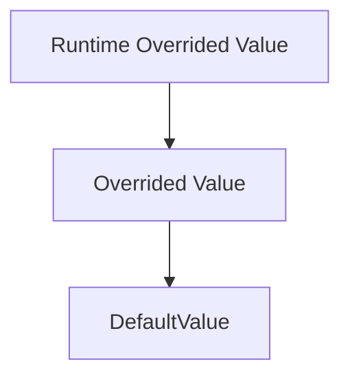
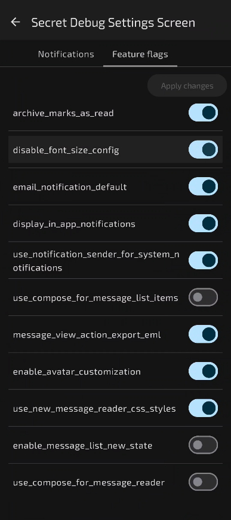

# Feature Flags

A feature flag can be nothing more than a simple boolean that can enable or disable a feature that we're working on.
While some companies may use their feature flags for A/B testing, with timestamps controlling releases, and any other
features they may want more control over.

We primarily use them to turn off new features before they're ready to be released to the wider userbase. This is in
part because we work on the app using our own forked repositories, and rarely create feature branches to merge ongoing
projects into. This isn't a problem because we use local feature flags on debugging builds only, and allows easier
testing of new features we're working on.

In this guide, you'll learn where our feature flags live, how to add your own, and how to make use of them. It'll come
in handy if you want to work on a larger project than one single PR could create.

#### When Should You Add a Feature Flag?

We use feature flags to close off parts of the app that aren’t for public consumption yet. We put our feature flags in
our code, not using remote services, and if you build a debug version of the Thunderbird or K9 app, you can choose which
feature flags to test for yourself. This comes at some risk. These are in-development features, features that were too
large to put into the app in one commit, or could potentially break the app and need further testing before we can
enable them for our production users. However, our contributors know what they’re doing, and understand that these
features are incomplete.

If you’re making something that’s too large for a single pull request, or believe it needs to be tested alongside
existing code, a feature flag is the perfect way to get started.

## The Feature Flag architecture

First, a quick overview on what the Feature Flag architecture looks like will help you to understand how to work with
it.

### The Feature Flag Catalog

We use a JSON catalog to define our feature flags and in which app or build type they are enabled or not. This catalog
is defined
at [config/featureflag/thunderbird_mobile_featureflag.catalog.json](../../config/featureflag/thunderbird_mobile_featureflag.catalog.json)
and you don't need to include it inside the app's module, as our architecture will import it right after the project is
configured.

There is also a [`JSON Schema]`(../../config/featureflag/thunderbird_mobile_featureflag.schema.json), which will help
you
to validate if the flags you are defining are correct. Nonetheless, if some requirement isn't covered by the schema,
the [
`FeatureFlagRootPlugin`](../../build-plugin/plugin/src/main/kotlin/net/thunderbird/gradle/plugin/featureflag/FeatureFlagRootPlugin.kt)
will make sure all the catalog definition is valid.

### Important Feature Flag Classes

First, a quick overview on the classes the feature flag architecture provides. Although you rarely need to perform a
change on those classes, it is always good to know how they work:

- `FeatureFlagKey`
  - An interface that defines the key and the description—if present—of a feature flag
  - **MUST** not be implemented outside the `:core:featureflag` project, unless in tests
  - Used by [
    `FeatureFlagLibraryPlugin`](../../build-plugin/plugin/src/main/kotlin/net/thunderbird/gradle/plugin/featureflag/FeatureFlagLibraryPlugin.kt)
    automatically generate the `GeneratedFeatureFlagKey` enum class;
    see [How to Add a Feature Flag](#how-to-add-a-feature-flag)).
- `FeatureFlagProvider`
  - The very base interface that provides whether a Feature Flag is enabled, disabled or unavailable
  - Is the interface you will be injecting in your class to verify a `FeatureFlagKey`
  - Example:

    ```kotlin
    class MyViewModel: ViewModel() {
        private val featureFlagProvider: FeatureFlagProvider by inject()
        fun awesomeGuardedLogic() {
            if (featureFlagProvider.provide(GeneratedFeatureFlagKey.USE_COMPOSE_FOR_MESSAGE_READER).isEnabled()) {
                // Do the thing!
            }
        }
    }
    ```
- `CatalogFeatureFlagProvider` and `BaseCatalogFeatureFlagProvider`
  - The interface and abstract class for every flag provider that is based on a JSON catalog
  - Every flag provider we have in the codebase will use implement or extend it
  - While the `CatalogFeatureFlagProvider` defines what the contract for a provider based on a JSON catalog,
  - The `BaseCatalogFeatureFlagProvider` defines the base definition for the `provide` method and an initialization
    method.
- `DataSourceCatalogFeatureFlagProvider`
  - An abstract class that defines how a provider that depends on a data source is initialized
  - This is the base class for the providers that either fetch the JSON catalog from local and, eventually, remotely.
  - `RuntimeDebugOverrideFeatureFlagProvider`
  - Extends `BaseCatalogFeatureFlagProvider` abstract class
  - The provider that allows us to override any feature flag in a debuggable app.
  - It also saves the current overrides using a [`ConfigStore`](../../core/configstore/api/src/commonMain/kotlin/net/thunderbird/core/configstore/ConfigStore.kt),
    so in the next time we open the app, it persists our flag overrides.
- `BundledCatalogFeatureFlagProvider`
  - Extends the `DataSourceCatalogFeatureFlagProvider` abstract class
  - The provider which fetches the bundled JSON catalog delivered with the app
  - It also keeps track of the default flags; used in the [`DebugFeatureFlagSectionViewModel`](../../feature/debug-settings/src/main/kotlin/net/thunderbird/feature/debug/settings/featureflag/DebugFeatureFlagSectionViewModel.kt)
    to restore the default values.
- `MultiFeatureFlagProviderEvaluator`
  - Is the Feature Flag Provider used to evaluate the flag resolution and deliver the correct value
  - It stores a `List` of `CatalogFeatureFlagProvider` and choose the correct one when the `provide` function is
    called
  - Its instance is the one delivered to who ever injects a `FeatureFlagProvider`.

## How to Add a Feature Flag

Now that you're ready to add your own feature flag to the app, you need to answer a few questions. Where do you put your
feature flag definition, where do you generate the feature flag itself, and how do you provide it to the apps. Here's
how to do those steps.

#### Where Your Feature Flag Belongs

All Feature Flags **MUST** be defined in the JSON Catalog located
at [config/featureflag/thunderbird_mobile_featureflag.catalog.json](../../config/featureflag/thunderbird_mobile_featureflag.catalog.json).

#### Make the Feature Flag

Inside the JSON Catalog, you must first add the flag definition inside the `flags` array:

```json
{
    "$schema": "thunderbird_mobile_featureflag.schema.json",
    "version": "2026-07-30.1",
    "flags": [
        {
            "key": "my_new_flag",
            "default": false,
            "description": "A developer friendly information of what the flag refers to",
            "time_to_promote": "2030-12-31"
        }
    ],
    "overrides": {
        "thunderbird": {
            "debug": {
                "my_new_flag": true
            }
        },
        "k9": {
            "debug": {
                "my_new_flag": true
            }
        }
    }
}
```

- **Required fields:** only `key` and `default` are required in the key definition; however we strongly advise you to
  fill the others, as it will give the maintainers more context of what is your feature about.
- **Optional fields:**
  - `description`: The description is helpful to explain to others maintainers what the flag is about and what are the
    consequences of enabling or disabling it. The description is displayed bellow the feature key in the
    `SecretDebugScreen`
  - `time_to_promote`: Help us to track if a feature should be promoted to `daily`, `beta`, or `release`; in the
    future, the plan is to use this field to create warnings in the codebase where the feature is already on release,
    but the feature flag is still in the app, helping to remove dead code.

Also remember to update the `version` field whenever you add a new flag. Lastly, make sure you enable in the apps and
build type.

#### Overriding a Feature Flag for in an App or a Build Type

The ideal is to always create the new Feature Flag as disabled by default, as shown in the example in the previous
section. However, how do you may want to enable it by default on `debug` for both TfA and K9.

To enabled—or disable—a feature flag, it is just a matter of adding its key inside the `override.<app>.<build_type>`,
with the value you want to use.

For example, in the previous section catalog snippet, the `my_new_flag` is defined as `false` by default, but both TfA
and K9 overrides it for `debug`.

This means the flag, once running the app on a debuggable app, will be enabled, but when running in the others (TfA
Daily, TfA Beta, TfA and K9-Mail) it will be Disabled.

The order of evaluation is:


```mermaid
flowchart TD
    RT --> OV --> DF
    RT[Runtime Overrided Value]
    OV[Overrided Value]
    DF[DefaultValue]
```

#### Do I need to add the Feature Flag to the Providers?

The answer is: NO! The new Feature Flag architecture will take care of mapping the new key once the project is
configured and to include it to the `GeneratedFeatureFlagKey`.

Make sure to always run Gradle sync after updating the catalog, so the new key is ready for use.

#### Ensure Your Flag Is Part of the Build

Ensure to include `projects.core.featureflag` in the feature's gradle file. For example, for a flag related to the
message reader, I'd ensure we have the common dependency mentioned in the `build.gradle.kts` file located in
`feature/mail/message/reader/api/build.gradle.kts` like so:

```kotlin
kotlin {
    ...
    sourceSets {
        commonMain.dependencies {
            ...
            implementation(projects.core.featureflag)
        }
    }
}
```

#### Accessing Your Feature Flag

The feature flags for each build are provided by Koin. You’ll get an instance of the `FeatureFlagProvider` for your
build with `val featureFlagProvider = get<FeatureFlagProvider>()`. From there, you can access your feature flag with the
key like so:

```kotlin
if (featureFlagProvider.provide(GeneratedFeatureFlagKey.USE_COMPOSE_FOR_MESSAGE_READER).isEnabled()) {
    // Do the thing
}
```

You can certainly store the value separately as well

```kotlin
val composeForMessageReader = featureFlagProvider.provide(GeneratedFeatureFlagKey.USE_COMPOSE_FOR_MESSAGE_READER)
...
if (composeForMessageReader.isEnabled()) {
    // Do the thing
}
```

## Ensuring Contributors Know About Your Feature Flag

After you've added a feature flag, you should make a pull request just for the flag itself. If you're working on an
incremental project, it makes sense to break it up as much as possible, and can ensure you have a working feature flag
in the app quickly, so you can start to do the work you'll put behind it.

After you've added the feature flag into the codebase and added your own code that will sit behind it, you should also
ensure that anyone looking at the subsequent pull requests behind that feature flag know to use it to test the feature.
It can also make projects associated with the same feature flag easier to search for and review in context later.

When you create a PR, use the `feature-flag` label in GitHub. This is found on the right sidebar in your pull request.
Also, mention the feature flag directly in the text of your pull request. This can be as simple as a line like "feature
flag: `your_feature_flag`"

## Seeing Your Feature Flag



You're probably thinking you have to add the feature flag to some list now, right? Wrong! When you do a debug build,
you'll be able to access the new feature flag right away. You can find the feature flag you've just made in the "Secret
Debug Settings Screen." This is displayed by the `DebugFeatureFlagSection` composable function. You'll be able to enable
your feature flag and test your new feature right from here. To access the "Secret Debug Settings Screen," you can
either use the three dot button on the message list screen and select "DEBUG: Feature Flags," or you can go into the
side menu, down to Settings, General Settings, Debugging, and tap "Open Secret debug screen."

Enjoy testing your new feature!

