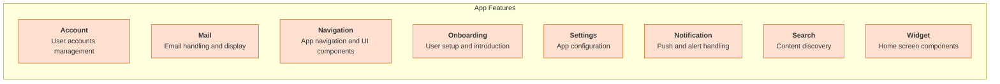
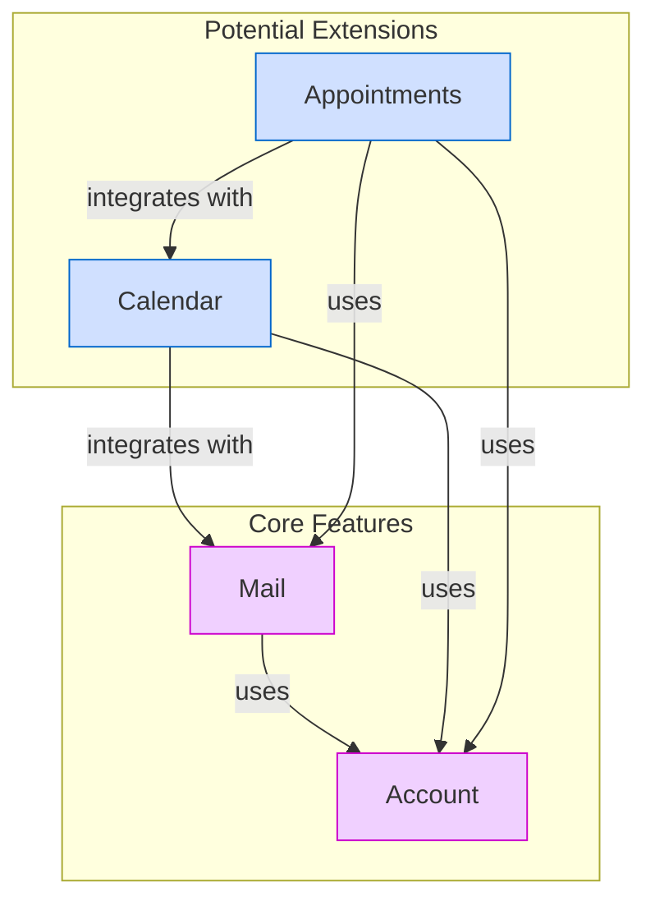

# 📦 Feature Modules and Extensions

The Thunderbird for Android project is organized into multiple feature modules, each encapsulating a specific
functionality of the application. This document provides an overview of the main feature modules, how they are
split into subfeatures, and how the application can be extended with additional features.

## 📋 Feature Module Overview

The application is composed of several core feature modules, each responsible for a specific aspect of the
application's functionality:



## 🧩 Feature Module Details

### 🔑 Account Module

The Account module manages all aspects of email accounts, including setup, configuration, and authentication.

```shell
feature:account
├── feature:account:api
├── feature:account:impl
├── feature:account:setup
│   ├── feature:account:setup:api
│   └── feature:account:setup:impl
├── feature:account:settings
│   ├── feature:account:settings:api
│   └── feature:account:settings:impl
├── feature:account:server
│   ├── feature:account:server:api
│   ├── feature:account:server:impl
│   ├── feature:account:server:certificate
│   │   ├── feature:account:server:certificate:api
│   │   └── feature:account:server:certificate:impl
│   ├── feature:account:server:settings
│   │   ├── feature:account:server:settings:api
│   │   └── feature:account:server:settings:impl
│   └── feature:account:server:validation
│       ├── feature:account:server:validation:api
│       └── feature:account:server:validation:impl
├── feature:account:auth
│   ├── feature:account:auth:api
│   ├── feature:account:auth:impl
│   └── feature:account:auth:oauth
│       ├── feature:account:auth:oauth:api
│       └── feature:account:auth:oauth:impl
└── feature:account:storage
    ├── feature:account:storage:api
    ├── feature:account:storage:impl
    └── feature:account:storage:legacy
        ├── feature:account:storage:legacy:api
        └── feature:account:storage:legacy:impl
```

#### Subfeatures:

- **API/Implementation**: Core public interfaces and implementations for account management
- **Setup**: New account setup wizard functionality
  - **API**: Public interfaces for account setup
  - **Implementation**: Concrete implementations of setup flows
- **Settings**: Account-specific settings management
  - **API**: Public interfaces for account settings
  - **Implementation**: Concrete implementations of settings functionality
- **Server**: Server configuration and management
  - **API/Implementation**: Core server management interfaces and implementations
  - **Certificate**: SSL certificate handling
  - **Settings**: Server settings configuration
  - **Validation**: Server connection validation
- **Auth**: Authentication functionality
  - **API/Implementation**: Core authentication interfaces and implementations
  - **OAuth**: OAuth-specific authentication implementation
- **Storage**: Account data persistence
  - **API/Implementation**: Core storage interfaces and implementations
  - **Legacy**: Legacy storage implementation

### 📧 Mail Module

The Mail module handles core email functionality, including message display, composition, and folder management.

```shell
feature:mail
├── feature:mail:api
├── feature:mail:impl
├── feature:mail:account
│   ├── feature:mail:account:api
│   └── feature:mail:account:impl
├── feature:mail:folder
│   ├── feature:mail:folder:api
│   └── feature:mail:folder:impl
├── feature:mail:compose
│   ├── feature:mail:compose:api
│   └── feature:mail:compose:impl
└── feature:mail:message
    ├── feature:mail:message:api
    ├── feature:mail:message:impl
    ├── feature:mail:message:view
    │   ├── feature:mail:message:view:api
    │   └── feature:mail:message:view:impl
    └── feature:mail:message:list
        ├── feature:mail:message:list:api
        └── feature:mail:message:list:impl
```

#### Subfeatures:

- **API/Implementation**: Core public interfaces and implementations for mail functionality
- **Account**: Mail-specific account interfaces and implementations
  - **API**: Public interfaces for mail account integration
  - **Implementation**: Concrete implementations of mail account functionality
- **Folder**: Email folder management
  - **API**: Public interfaces for folder operations
  - **Implementation**: Concrete implementations of folder management
- **Compose**: Email composition functionality
  - **API**: Public interfaces for message composition
  - **Implementation**: Concrete implementations of composition features
- **Message**: Message handling and display
  - **API/Implementation**: Core message handling interfaces and implementations
  - **View**: Individual message viewing functionality
  - **List**: Message list display and interaction

### 🧭 Navigation Module

The Navigation module provides UI components for navigating through the application.

```shell
feature:navigation
├── feature:navigation:api
├── feature:navigation:impl
└── feature:navigation:drawer
    ├── feature:navigation:drawer:api
    ├── feature:navigation:drawer:impl
    ├── feature:navigation:drawer:dropdown
    │   ├── feature:navigation:drawer:dropdown:api
    │   └── feature:navigation:drawer:dropdown:impl
    └── feature:navigation:drawer:siderail
        ├── feature:navigation:drawer:siderail:api
        └── feature:navigation:drawer:siderail:impl
```

#### Subfeatures:

- **API/Implementation**: Core public interfaces and implementations for navigation
- **Drawer**: Navigation drawer functionality
  - **API/Implementation**: Core drawer interfaces and implementations
  - **Dropdown**: Dropdown-style navigation implementation
  - **Siderail**: Side rail navigation implementation

### 🚀 Onboarding Module

The Onboarding module guides new users through the initial setup process.

```shell
feature:onboarding
├── feature:onboarding:api
├── feature:onboarding:impl
├── feature:onboarding:main
│   ├── feature:onboarding:main:api
│   └── feature:onboarding:main:impl
├── feature:onboarding:welcome
│   ├── feature:onboarding:welcome:api
│   └── feature:onboarding:welcome:impl
├── feature:onboarding:permissions
│   ├── feature:onboarding:permissions:api
│   └── feature:onboarding:permissions:impl
└── feature:onboarding:migration
    ├── feature:onboarding:migration:api
    ├── feature:onboarding:migration:impl
    ├── feature:onboarding:migration:thunderbird
    │   ├── feature:onboarding:migration:thunderbird:api
    │   └── feature:onboarding:migration:thunderbird:impl
    └── feature:onboarding:migration:noop
        ├── feature:onboarding:migration:noop:api
        └── feature:onboarding:migration:noop:impl
```

#### Subfeatures:

- **API/Implementation**: Core public interfaces and implementations for onboarding
- **Main**: Main onboarding flow
  - **API**: Public interfaces for the main onboarding process
  - **Implementation**: Concrete implementations of the onboarding flow
- **Welcome**: Welcome screens and initial user experience
  - **API**: Public interfaces for welcome screens
  - **Implementation**: Concrete implementations of welcome screens
- **Permissions**: Permission request handling
  - **API**: Public interfaces for permission management
  - **Implementation**: Concrete implementations of permission requests
- **Migration**: Data migration from other apps
  - **API/Implementation**: Core migration interfaces and implementations
  - **Thunderbird**: Thunderbird-specific migration implementation
  - **Noop**: No-operation implementation for testing

### ⚙️ Settings Module

The Settings module provides interfaces for configuring application behavior.

```shell
feature:settings
├── feature:settings:api
├── feature:settings:impl
├── feature:settings:import
│   ├── feature:settings:import:api
│   └── feature:settings:import:impl
└── feature:settings:ui
    ├── feature:settings:ui:api
    └── feature:settings:ui:impl
```

#### Subfeatures:

- **API/Implementation**: Core public interfaces and implementations for settings
- **Import**: Settings import functionality
  - **API**: Public interfaces for settings import
  - **Implementation**: Concrete implementations of import functionality
- **UI**: Settings user interface components
  - **API**: Public interfaces for settings UI
  - **Implementation**: Concrete implementations of settings screens

### 🔔 Notification Module

The Notification module handles push notifications and alerts for new emails and events.

```shell
feature:notification
├── feature:notification:api
├── feature:notification:impl
├── feature:notification:email
│   ├── feature:notification:email:api
│   └── feature:notification:email:impl
└── feature:notification:push
    ├── feature:notification:push:api
    └── feature:notification:push:impl
```

#### Subfeatures:

- **API/Implementation**: Core public interfaces and implementations for notifications
- **Email**: Email-specific notification handling
  - **API**: Public interfaces for email notifications
  - **Implementation**: Concrete implementations of email alerts
- **Push**: Push notification handling
  - **API**: Public interfaces for push notifications
  - **Implementation**: Concrete implementations of push notification processing

### 🔍 Search Module

The Search module provides functionality for searching through emails and contacts.

```shell
feature:search
├── feature:search:api
├── feature:search:impl
├── feature:search:email
│   ├── feature:search:email:api
│   └── feature:search:email:impl
├── feature:search:contact
│   ├── feature:search:contact:api
│   └── feature:search:contact:impl
└── feature:search:ui
    ├── feature:search:ui:api
    └── feature:search:ui:impl
```

#### Subfeatures:

- **API/Implementation**: Core public interfaces and implementations for search functionality
- **Email**: Email-specific search capabilities
  - **API**: Public interfaces for email search
  - **Implementation**: Concrete implementations of email search
- **Contact**: Contact search functionality
  - **API**: Public interfaces for contact search
  - **Implementation**: Concrete implementations of contact search
- **UI**: Search user interface components
  - **API**: Public interfaces for search UI
  - **Implementation**: Concrete implementations of search screens

### 📱 Widget Module

The Widget module provides home screen widgets for quick access to email functionality.

```shell
feature:widget
├── feature:widget:api
├── feature:widget:impl
├── feature:widget:message-list
│   ├── feature:widget:message-list:api
│   └── feature:widget:message-list:impl
├── feature:widget:message-list-glance
│   ├── feature:widget:message-list-glance:api
│   └── feature:widget:message-list-glance:impl
├── feature:widget:shortcut
│   ├── feature:widget:shortcut:api
│   └── feature:widget:shortcut:impl
└── feature:widget:unread
    ├── feature:widget:unread:api
    └── feature:widget:unread:impl
```

#### Subfeatures:

- **API/Implementation**: Core public interfaces and implementations for widgets
- **Message List**: Email list widget
  - **API**: Public interfaces for message list widget
  - **Implementation**: Concrete implementations of message list widget
- **Message List Glance**: Glanceable message widget
  - **API**: Public interfaces for glance widget
  - **Implementation**: Concrete implementations of glance widget
- **Shortcut**: App shortcut widgets
  - **API**: Public interfaces for shortcut widgets
  - **Implementation**: Concrete implementations of shortcut widgets
- **Unread**: Unread message counter widget
  - **API**: Public interfaces for unread counter widget
  - **Implementation**: Concrete implementations of unread counter widget

## 🔄 Supporting Feature Modules

In addition to the core email functionality, the application includes several supporting feature modules:

### 🔎 Autodiscovery Module

The Autodiscovery module automatically detects email server settings.

#### Subfeatures:

- **API** (`feature:autodiscovery:api`): Public interfaces
- **Autoconfig** (`feature:autodiscovery:autoconfig`): Automatic configuration
- **Service** (`feature:autodiscovery:service`): Service implementation
- **Demo** (`feature:autodiscovery:demo`): Demonstration implementation

### 💰 Funding Module

The Funding module handles in-app financial contributions and funding options.

#### Subfeatures:

- **API** (`feature:funding:api`): Public interfaces
- **Google Play** (`feature:funding:googleplay`): Google Play billing integration
- **Link** (`feature:funding:link`): External funding link handling
- **Noop** (`feature:funding:noop`): No-operation implementation

### 🔄 Migration Module

The Migration module handles data migration between different email clients.

#### Subfeatures:

- **Provider** (`feature:migration:provider`): Migration data providers
- **QR Code** (`feature:migration:qrcode`): QR code-based migration
- **Launcher** (`feature:migration:launcher`): Migration launcher
  - **API** (`feature:migration:launcher:api`): Launcher interfaces
  - **Noop** (`feature:migration:launcher:noop`): No-operation implementation
  - **Thunderbird** (`feature:migration:launcher:thunderbird`): Thunderbird-specific implementation

### 📊 Telemetry Module

The Telemetry module handles usage analytics and reporting.

#### Subfeatures:

- **API** (`feature:telemetry:api`): Public interfaces
- **Noop** (`feature:telemetry:noop`): No-operation implementation
- **Glean** (`feature:telemetry:glean`): Mozilla Glean integration

## 🔌 Extending with Additional Features

The modular architecture of Thunderbird for Android allows for easy extension with additional features. To give you an
idea how the app could be extended when building a new feature, here are some theoretical examples along with their
structure:

### 📅 Calendar Feature

A Calendar feature could be added to integrate calendar functionality with email.

```shell
feature:calendar
├── feature:calendar:api
├── feature:calendar:impl
├── feature:calendar:event
│   ├── feature:calendar:event:api
│   └── feature:calendar:event:impl
└── feature:calendar:sync
    ├── feature:calendar:sync:api
    └── feature:calendar:sync:impl
```

### 🗓️ Appointments Feature

An Appointments feature could manage meetings and appointments.

```shell
feature:appointment
├── feature:appointment:api
├── feature:appointment:impl
├── feature:appointment:scheduler
│   ├── feature:appointment:scheduler:api
│   └── feature:appointment:scheduler:impl
└── feature:appointment:notification
    ├── feature:appointment:notification:api
    └── feature:appointment:notification:impl
```

## 🔗 Feature Relationships

Features in the application interact with each other through well-defined APIs. The diagram below illustrates the
relationships between different features:



## 📏 Feature Module Best Practices

When developing new feature modules or extending existing ones, follow these best practices:

1. **API-First Design**: Define clear public interfaces before implementation
2. **Single Responsibility**: Each feature module should have a single, well-defined responsibility
3. **Minimal Dependencies**: Minimize dependencies between feature modules
4. **Proper Layering**: Follow Clean Architecture principles within each feature
5. **Testability**: Design features to be easily testable in isolation
6. **Documentation**: Document the purpose and usage of each feature module
7. **Consistent Naming**: Follow the established naming conventions
8. **Feature Flags**: Use feature flags for gradual rollout and A/B testing
9. **Accessibility**: Ensure all features are accessible to all users
10. **Internationalization**: Design features with internationalization in mind

By following these guidelines, the Thunderbird for Android application can maintain a clean, modular architecture while expanding its functionality to meet user needs.
