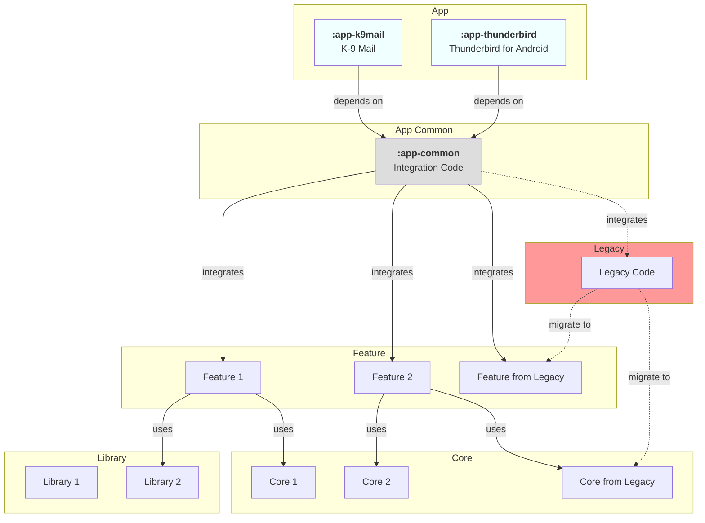

# 🔙 Legacy Integration

The legacy module integration diagram below explains how legacy code is integrated into the new modular architecture and
outlines the strategy for migrating legacy functionality:

- **Integration Approach**: Legacy modules are integrated through the App Common module, which provides adapters and
  bridges
- **Migration Strategy**: Legacy code is gradually migrated to new feature and core modules
- **Transitional State**: During migration, both legacy and new modules coexist, with clear integration points
- **Dependency Direction**: New modules should not depend on legacy modules; the dependency flow is one-way from legacy
  to new

