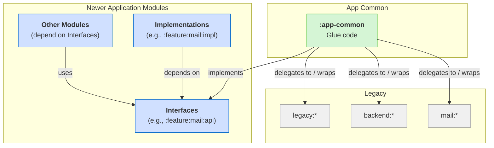
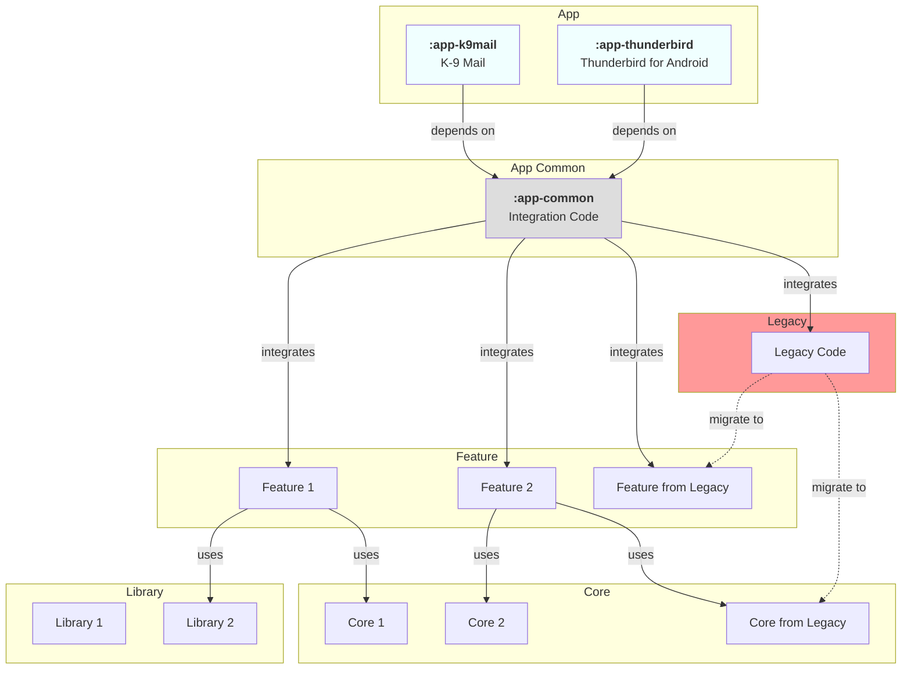

# 🔙 Legacy Module Integration

This document outlines how existing legacy code is integrated into the new modular architecture of the application and
the strategy for its migration. The core principle is to isolate legacy code and provide a controlled way for
newer modules to interact with legacy functionality without becoming directly dependent on it.

> [!NOTE]  
> This document should be read in conjunction with [Module Structure](module-structure.md) and [Module Organization](module-organization.md) to get a complete understanding of the modular architecture.

## Overview

The Thunderbird for Android project is transitioning from a monolithic architecture to a modular one. During this
transition, we need to maintain compatibility with existing legacy code while gradually migrating to the new
architecture. The `legacy:*`, `mail:*`, and `backend:*` modules contain functionality that is still essential for the
project but does not yet adhere to the new modular architecture. These modules are integrated into the new architecture
through the `:app-common` module, which acts as a bridge or adapter to provide access to legacy functionality without
directly depending on it.

The key components in this integration strategy are:

1. **Legacy Modules**: `legacy:*`, `mail:*`, and `backend:*` modules containing existing functionality
2. **Interfaces**: Well-defined interfaces in `feature:*:api` and `core:*` modules
3. **App Common Bridge**: The `:app-common` module that implements these interfaces and delegates to legacy code
4. **Dependency Injection**: Configuration that provides the appropriate implementations to modules

## Integration Approach "_The App Common Bridge_"

Newer application modules (such as features or core components) depend on well-defined **Interfaces**
(e.g., those found in `feature:*:api` modules). Typically, a feature will provide its own modern **Implementation**
(e.g., `:feature:mail:impl`) for its API.

However, to manage dependencies on code still within `legacy:*`, `mail:*`, and `backend:*` modules and prevent it
from spreading, we use `app-common` as **bridge** or **adapter** to provide an alternative implementation for these. In
this role, `app-common` is responsible for:

1. **Implementing interfaces**: `app-common` provides concrete implementations for interfaces that newer modules define.
2. **Delegating to legacy code**: Internally, these `app-common` implementations will delegate calls, adapt data, and manage interactions with the underlying `legacy:*`, `mail:*`, and `backend:*` modules.
3. **Containing glue code**: All logic required to connect the modern interfaces with the legacy systems is encapsulated within `app-common`.

This approach ensures that:
*   Newer modules are decoupled from legacy implementations: They only interact with the defined interfaces, regardless of whether the implementation is the modern feature `impl` or the `app-common` bridge.
*   Legacy code is isolated.
*   A clear path for refactoring is maintained: Initially, the application might be configured to use the `app-common` bridge. As new, native implementations in feature modules (e.g., `:feature:mail:impl`) mature, the dependency injection can be switched to use them, often without changes to the modules consuming the interface.

### Bridge Pattern Flow

The typical flow is:

1. **Interfaces**: Interfaces are defined, usually within the `api` module of a feature (e.g., `:feature:mail:api`) or a core module. These interfaces represent the contract for a piece of functionality.
2. **New Module Dependency**: Newer modules (e.g., `:feature:somefeature:impl` or other parts of `:app-common`) depend on these defined interfaces, to avoid dependency on concrete legacy classes.
3. **Implementation**: The `:app-common` module provides concrete implementations for these interfaces.
4. **Delegation to Legacy**: Internally, these implementations within `:app-common` delegate the actual work to the code residing in the legacy modules (e.g., `legacy:*`, `mail:*`, `backend:*`).
5. **Dependency Injection**: The application's dependency injection framework is configured to provide instances of these `:app-common` bridge implementations when a newer module requests an implementation of the interface.

This pattern ensures that newer modules remain decoupled from the specifics of legacy code.

The following diagram illustrates this pattern, showing how both a feature's own implementation and `app-common` can relate to the interfaces, with `app-common` specifically bridging to legacy systems:



### Implementation Techniques

Several techniques are used to implement the bridge pattern effectively:

1. **Wrapper Classes**: Creating immutable data classes that wrap legacy data structures, implementing interfaces from the new architecture. These wrappers should not contain conversion methods but should delegate this responsibility to specific mapper classes.

2. **Adapter Implementations**: Classes in `:app-common` that implement interfaces from the new architecture but delegate to legacy code internally.

3. **Data Conversion**: Dedicated mapper classes that handle mapping between legacy and new data structures, ensuring clean separation of concerns.

#### Example: Account Profile Bridge

A concrete example of this pattern is the account profile bridge, which demonstrates a complete implementation of the bridge pattern across multiple layers:

1. **Modern Interfaces**:
   - `AccountProfileRepository` in `feature:account:api` defines the high-level contract for account profile management
   - `AccountProfileLocalDataSource` in `feature:account:core` defines the data access contract
2. **Modern Data Structure**: `AccountProfile` in `feature:account:api` is a clean, immutable data class that represents account profile information in the new architecture.
3. **Repository Implementation**: `DefaultAccountProfileRepository` in `feature:account:core` implements the `AccountProfileRepository` interface and depends on `AccountProfileLocalDataSource`.
4. **Bridge Implementation**: `DefaultAccountProfileLocalDataSource` in `app-common` implements the `AccountProfileLocalDataSource` interface and serves as the bridge to legacy code.
5. **Legacy Access**: The bridge uses `DefaultLegacyAccountWrapperManager` to access legacy account data:
   - `LegacyAccountWrapperManager` in `core:android:account` defines the contract for legacy account access
   - `LegacyAccountWrapper` in `core:android:account` is an immutable wrapper around the legacy `LegacyAccount` class
6. **Data Conversion**: The bridge uses a dedicated mapper class to convert between modern `AccountProfile` objects and legacy account data.
7. **Dependency Injection**: The `appCommonAccountModule` in `app-common` registers `DefaultAccountProfileLocalDataSource` as implementations of the respective interface.

This multi-layered approach allows newer modules to interact with legacy account functionality through clean, modern interfaces without directly depending on legacy code. It also demonstrates how bridges can be composed, with higher-level bridges (AccountProfile) building on lower-level bridges (LegacyAccountWrapper).

## Testing Considerations

Testing bridge implementations requires special attention to ensure both the bridge itself and its integration with legacy code work correctly:

1. **Unit Testing Bridge Classes**:
   - Test the bridge implementation in isolation by faking/stubbing the legacy dependencies
   - Verify that the bridge correctly translates between the new interfaces and legacy code
   - Focus on testing the conversion logic and error handling
2. **Integration Testing**:
   - Test the bridge with actual legacy code to ensure proper integration
   - Verify that the bridge correctly handles all edge cases from legacy code
3. **Test Doubles**:
   - Create fake implementations of bridge classes for testing other components
   - Example: `FakeLegacyAccountWrapperManager` can be used to test components that depend on `LegacyAccountWrapperManager`
4. **Migration Testing**:
   - When migrating from a legacy bridge to a new implementation, test both implementations with the same test suite
   - Ensure behavior consistency during the transition

### Testing Examples

Below are examples of tests for legacy module integration, demonstrating different testing approaches and best practices.

#### Example 1: Unit Testing a Bridge Implementation

This example shows how to test a bridge implementation (`DefaultAccountProfileLocalDataSource`) in isolation by using a fake implementation of the legacy dependency (`FakeLegacyAccountWrapperManager`):

```kotlin
class DefaultAccountProfileLocalDataSourceTest {

    @Test
    fun `getById should return account profile`() = runTest {
        // arrange
        val accountId = AccountIdFactory.create()
        val legacyAccount = createLegacyAccount(accountId)
        val accountProfile = createAccountProfile(accountId)
        val testSubject = createTestSubject(legacyAccount)

        // act & assert
        testSubject.getById(accountId).test {
            assertThat(awaitItem()).isEqualTo(accountProfile)
        }
    }

    @Test
    fun `getById should return null when account is not found`() = runTest {
        // arrange
        val accountId = AccountIdFactory.create()
        val testSubject = createTestSubject(null)

        // act & assert
        testSubject.getById(accountId).test {
            assertThat(awaitItem()).isEqualTo(null)
        }
    }

    @Test
    fun `update should save account profile`() = runTest {
        // arrange
        val accountId = AccountIdFactory.create()
        val legacyAccount = createLegacyAccount(accountId)
        val accountProfile = createAccountProfile(accountId)

        val updatedName = "updatedName"
        val updatedAccountProfile = accountProfile.copy(name = updatedName)

        val testSubject = createTestSubject(legacyAccount)

        // act & assert
        testSubject.getById(accountId).test {
            assertThat(awaitItem()).isEqualTo(accountProfile)

            testSubject.update(updatedAccountProfile)

            assertThat(awaitItem()).isEqualTo(updatedAccountProfile)
        }
    }

    private fun createTestSubject(
        legacyAccount: LegacyAccountWrapper?,
    ): DefaultAccountProfileLocalDataSource {
        return DefaultAccountProfileLocalDataSource(
            accountManager = FakeLegacyAccountWrapperManager(
                initialAccounts = if (legacyAccount != null) {
                    listOf(legacyAccount)
                } else {
                    emptyList()
                },
            ),
            dataMapper = DefaultAccountProfileDataMapper(
                avatarMapper = DefaultAccountAvatarDataMapper(),
            ),
        )
    }
}
```

Key points:
- The test creates a controlled test environment using a fake implementation of the legacy dependency
- It tests both success cases and error handling (account not found)
- It verifies that the bridge correctly translates between legacy data structures and domain models
- The test is structured with clear arrange, act, and assert sections

#### Example 2: Creating Test Doubles for Legacy Dependencies

This example shows how to create a fake implementation of a legacy dependency (`FakeLegacyAccountWrapperManager`) for testing:

```kotlin
internal class FakeLegacyAccountWrapperManager(
    initialAccounts: List<LegacyAccountWrapper> = emptyList(),
) : LegacyAccountWrapperManager {

    private val accountsState = MutableStateFlow(
        initialAccounts,
    )
    private val accounts: StateFlow<List<LegacyAccountWrapper>> = accountsState

    override fun getAll(): Flow<List<LegacyAccountWrapper>> = accounts

    override fun getById(id: AccountId): Flow<LegacyAccountWrapper?> = accounts
        .map { list ->
            list.find { it.id == id }
        }

    override suspend fun update(account: LegacyAccountWrapper) {
        accountsState.update { currentList ->
            currentList.toMutableList().apply {
                removeIf { it.uuid == account.uuid }
                add(account)
            }
        }
    }
}
```

Key points:
- The fake implementation implements the same interface as the real implementation
- It provides a simple in-memory implementation for testing
- It uses Kotlin Flows to simulate the reactive behavior of the real implementation
- It allows for easy setup of test data through the constructor parameter

#### Example 3: Testing Data Conversion Logic

This example shows how to test data conversion logic in bridge implementations:

```kotlin
class DefaultAccountProfileDataMapperTest {

    @Test
    fun `toDomain should convert ProfileDto to AccountProfile`() {
        // Arrange
        val dto = createProfileDto()
        val expected = createAccountProfile()

        val testSubject = DefaultAccountProfileDataMapper(
            avatarMapper = FakeAccountAvatarDataMapper(
                dto = dto.avatar,
                domain = expected.avatar,
            ),
        )

        // Act
        val result = testSubject.toDomain(dto)

        // Assert
        assertThat(result.id).isEqualTo(expected.id)
        assertThat(result.name).isEqualTo(expected.name)
        assertThat(result.color).isEqualTo(expected.color)
        assertThat(result.avatar).isEqualTo(expected.avatar)
    }

    @Test
    fun `toDto should convert AccountProfile to ProfileDto`() {
        // Arrange
        val domain = createAccountProfile()
        val expected = createProfileDto()

        val testSubject = DefaultAccountProfileDataMapper(
            avatarMapper = FakeAccountAvatarDataMapper(
                dto = expected.avatar,
                domain = domain.avatar,
            ),
        )

        // Act
        val result = testSubject.toDto(domain)

        // Assert
        assertThat(result.id).isEqualTo(expected.id)
        assertThat(result.name).isEqualTo(expected.name)
        assertThat(result.color).isEqualTo(expected.color)
        assertThat(result.avatar).isEqualTo(expected.avatar)
    }
}
```

Key points:
- The test verifies that the mapper correctly converts between legacy data structures (DTOs) and domain models
- It tests both directions of the conversion (toDomain and toDto)
- It uses a fake implementation of a dependency (FakeAccountAvatarDataMapper) to isolate the test
- It verifies that all properties are correctly mapped

#### Best Practices for Testing Legacy Module Integration

1. **Isolate the Bridge**: Test the bridge implementation in isolation by using fake or mock implementations of legacy dependencies.
2. **Test Both Directions**: For data conversion, test both directions (legacy to domain and domain to legacy).
3. **Cover Edge Cases**: Test edge cases such as null values, empty collections, and error conditions.
4. **Use Clear Test Structure**: Structure tests with clear arrange, act, and assert sections.
5. **Create Reusable Test Fixtures**: Create helper methods for creating test data to make tests more readable and maintainable.
6. **Test Reactive Behavior**: For reactive code (using Flows, LiveData, etc.), use appropriate testing utilities (e.g., Turbine for Flow testing).
7. **Verify Integration**: In addition to unit tests, create integration tests that verify the bridge works correctly with actual legacy code.
8. **Test Migration Path**: When migrating from a legacy bridge to a new implementation, test both implementations with the same test suite to ensure behavior consistency.

## Migration Strategy

The long-term strategy involves gradually migrating functionality out of the legacy modules:

1. **Identify Functionality**: Pinpoint specific functionalities within legacy modules that need to be modernized.
2. **Define Interfaces**: Ensure clear interfaces are defined (typically in feature `api` modules) for this functionality.
3. **Entity Modeling**: Create proper domain entity models that represent the business objects as immutable data classes.
4. **Implement in New Modules**: Re-implement the functionality within new, dedicated feature `impl` modules or core modules.
5. **Update Bridge (Optional)**: If `:app-common` was bridging to this specific legacy code, its bridge implementation can be updated or removed.
6. **Switch DI Configuration**: Update the dependency injection to provide the new modern implementation instead of the legacy bridge.
7. **Retire Legacy Code**: Once no longer referenced, the corresponding legacy code can be safely removed.

### Migration Example

Using the account profile example, the migration process would look like:

1. **Identify**: Account profile functionality in legacy modules needs modernization.
2. **Define Interfaces**:
   - `AccountProfileRepository` interface is defined in `feature:account:api`
   - `AccountProfileLocalDataSource` interface is defined in `feature:account:core`
3. **Entity Modeling**: Create `AccountProfile` as an immutable data class in `feature:account:api`.
4. **Implement**: Create a new implementation of `AccountProfileLocalDataSource` in a modern module, e.g., `feature:account:impl`.
5. **Update Bridge**: Update or remove `DefaultAccountProfileLocalDataSource` in `app-common`.
6. **Switch DI**: Update `appCommonAccountModule` to provide the new implementation instead of `DefaultAccountProfileLocalDataSource`.
7. **Retire**: Once all references to legacy account code are removed, the legacy code and lower-level bridges (`LegacyAccountWrapperManager`, `DefaultLegacyAccountWrapperManager`) can be safely deleted.

This approach ensures a smooth transition with minimal disruption to the application's functionality.

## Dependency Direction

A strict dependency rule is enforced: **New modules (features, core) must not directly depend on legacy modules.**
The dependency flow is always from newer modules to interfaces, with `:app-common` providing the implementation.
If `:app-common` bridges to legacy code, that is an internal detail of `:app-common`.

The legacy module integration diagram below explains how legacy code is integrated into the new modular architecture:



