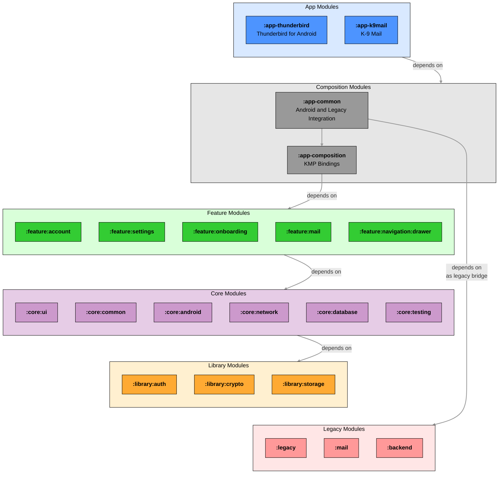
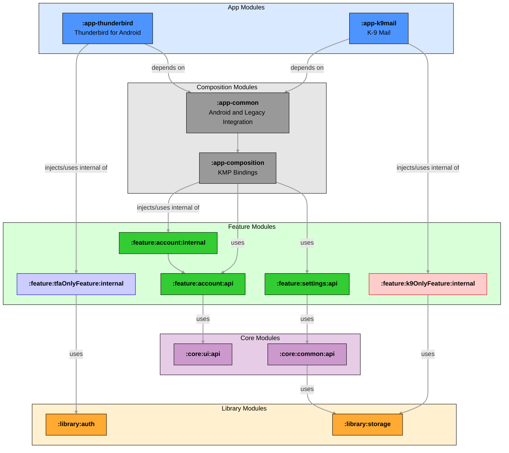

# 📦 Module Organization

The Thunderbird for Android project is following a modularization approach, where the codebase is divided into multiple
distinct modules. These modules encapsulate specific functionality and can be developed, tested, and maintained
independently. This modular architecture promotes reusability, scalability, and maintainability of the codebase.

This document outlines the adopted module organization for the Thunderbird for Android project, serving as a guide for
developers to understand the codebase structure and ensure consistent architectural patterns.

## 📂 Module Overview

The modules are organized into several types, each serving a specific purpose in the overall architecture:

```mermaid
graph TB
    subgraph APP[App Modules]
        direction TB
        APP_TB["`**:app-thunderbird**<br>Thunderbird for Android`"]
        APP_K9["`**:app-k9mail**<br>K-9 Mail`"]
    end

    subgraph COMPOSITION[Composition Modules]
        direction TB
        APP_COMPOSITION["`**:app-composition**<br>KMP Bindings`"]
        COMMON_APP["`**:app-common**<br>Android and Legacy Integration`"]
    end

    subgraph FEATURE[Feature Modules]
        direction TB
        FEATURE_ACCOUNT["`**:feature:account**`"]
        FEATURE_SETTINGS["`**:feature:settings**`"]
        FEATURE_ONBOARDING["`**:feature:onboarding**`"]
        FEATURE_MAIL["`**:feature:mail**`"]
        FEATURE_NAV_DRAWER["`**:feature:navigation:drawer**`"]
    end

    subgraph CORE[Core Modules]
        direction TB
        CORE_UI["`**:core:ui**`"]
        CORE_COMMON["`**:core:common**`"]
        CORE_ANDROID["`**:core:android**`"]
        CORE_NETWORK["`**:core:network**`"]
        CORE_DATABASE["`**:core:database**`"]
        CORE_TESTING["`**:core:testing**`"]
    end

    subgraph LIBRARY[Library Modules]
        direction TB
        LIB_AUTH["`**:library:auth**`"]
        LIB_CRYPTO["`**:library:crypto**`"]
        LIB_STORAGE["`**:library:storage**`"]
    end

    subgraph LEGACY[Legacy Modules]
        direction TB
        LEGACY_K9["`**:legacy**`"]
        LEGACY_MAIL["`**:mail**`"]
        LEGACY_BACKEND["`**:backend**`"]
    end

    APP ~~~ COMPOSITION
    COMPOSITION ~~~ FEATURE
    FEATURE ~~~ CORE
    CORE ~~~ LIBRARY
    LIBRARY ~~~ LEGACY

    APP --> |depends on| COMPOSITION
    COMMON_APP --> APP_COMPOSITION
    APP_COMPOSITION --> |depends on| FEATURE
    FEATURE --> |depends on| CORE
    CORE --> |depends on| LIBRARY
    COMMON_APP --> |depends on<br>as legacy bridge| LEGACY

    classDef app fill:#d9e9ff,stroke:#000000,color:#000000
    classDef app_module fill:#4d94ff,stroke:#000000,color:#000000
    classDef common fill:#e6e6e6,stroke:#000000,color:#000000
    classDef common_module fill:#999999,stroke:#000000,color:#000000
    classDef feature fill:#d9ffd9,stroke:#000000,color:#000000
    classDef feature_module fill:#33cc33,stroke:#000000,color:#000000
    classDef core fill:#e6cce6,stroke:#000000,color:#000000
    classDef core_module fill:#cc99cc,stroke:#000000,color:#000000
    classDef library fill:#fff0d0,stroke:#000000,color:#000000
    classDef library_module fill:#ffaa33,stroke:#000000,color:#000000
    classDef legacy fill:#ffe6e6,stroke:#000000,color:#000000
    classDef legacy_module fill:#ff9999,stroke:#000000,color:#000000

    linkStyle default stroke:#999,stroke-width:2px
    linkStyle 0,1,2,3,4 stroke-width:0px

    class APP app
    class APP_TB,APP_K9 app_module
    class COMPOSITION common
    class APP_COMPOSITION,COMMON_APP common_module
    class FEATURE feature
    class FEATURE_ACCOUNT,FEATURE_SETTINGS,FEATURE_ONBOARDING,FEATURE_MAIL,FEATURE_NAV_DRAWER feature_module
    class CORE core
    class CORE_UI,CORE_COMMON,CORE_ANDROID,CORE_DATABASE,CORE_NETWORK,CORE_TESTING core_module
    class LIBRARY library
    class LIB_AUTH,LIB_CRYPTO,LIB_STORAGE library_module
    class LEGACY legacy
    class LEGACY_MAIL,LEGACY_BACKEND,LEGACY_K9 legacy_module
```

### Module Types

#### 📱 App Modules

The App Modules (`app-thunderbird` and `app-k9mail`) contain the application-specific code, including:
- Application entry points and initialization logic
- Final dependency injection setup
- Navigation configuration
- Integration with feature modules solely for that application
- App-specific themes and resources (strings, themes, etc.)

#### 🧩 App Composition Module

The KMP `app-composition` module is the central integration point for shared, platform-independent application wiring.
It binds feature and core contracts to their internal implementations for reuse by Android and future application
targets.

##### What Should Go in App Composition

The `app-composition` module should contain:

1. **Shared Application Logic**: Platform-independent code needed by all application targets but not owned by one
   feature. This avoids duplication between application targets.
2. **Feature Integration Code**: Wiring that coordinates features, such as account and mail, while keeping their
   implementations separate.
3. **Shared Dependency Injection Setup**: Koin modules that bind KMP-capable feature and core implementations
   consistently for every application target.
4. **Compile-Time Application Assembly**: Shared assembled structures, such as the application database schema.

##### What Should Not Go in App Composition

The following should not be placed in `app-composition`:

1. **Feature-Specific Business Logic**: Mail composition logic, for example, belongs in `feature:mail`.
2. **Reusable UI Components**: A shared button belongs in `core:ui`; mail-specific UI belongs in `feature:mail`.
3. **Platform APIs**: Android or other platform-specific setup belongs in the relevant application integration module.
4. **Legacy Dependencies**: Legacy mail code remains in its legacy module and is exposed through a bridge in
   `app-common`.
5. **New Feature Implementations**: A calendar implementation, for example, belongs in `feature:calendar` and is only
   bound here.

#### 🔄 App Common Module

The Android `app-common` module consumes `app-composition` and provides:

1. **Android Application Setup**: Shared Android initialization, lifecycle, resources, and platform services. For
   example, `BaseApplication` provides common Android application initialization.
2. **Legacy Code Bridges and Adapters**: Implementations of modern interfaces that delegate to `legacy:*`, `mail:*`, or
   `backend:*`.
3. **Android and Legacy Dependency Injection**: Bindings that cannot yet be shared across KMP targets.

For example, `DefaultAccountProfileLocalDataSource` implements an account interface and delegates to legacy account
storage. This bridge remains in `app-common` until a KMP implementation replaces it.

##### Decision Criteria for New Code

When deciding where code belongs, consider:

1. **Is it shared application wiring and KMP-compatible?** Put it in `app-composition`.
2. **Is it Android-specific?** Put it in `app-common` or an Android application module.
3. **Does it bridge to legacy code?** Put the bridge in `app-common`.
4. **Is it specific to one feature domain?** Put it in that feature module.
5. **Is it reusable UI?** Put it in `core:ui` or the owning feature.
6. **Is it application-specific?** Put it in `app-k9mail` or `app-thunderbird`.

Platform-independent bindings should move from `app-common` to `app-composition` when their implementations and full
dependency graphs support the required KMP targets.

#### ✨ Feature Modules

The `feature:*` modules are independent and encapsulate distinct user-facing feature domains. They are designed to be
reusable and can be integrated into any application module as needed.

Feature internal modules (e.g., `:feature:account:internal`) must not depend directly on other feature
internal modules. Instead, they should depend on the public `:api` module of other features (e.g.,
`:feature:someOtherFeature:api`) to access their functionality through defined contracts, see
[module structure](module-structure.md#-api-module) for more details.

When features are complex, they can be split into smaller sub feature modules, addressing specific aspects or
functionality within a feature domain:

- `:feature:account:api`: Public interfaces for account management
- `:feature:account:settings:api`: Public interfaces for account settings
- `:feature:account:settings:internal`: Internal implementation details of account settings

#### 🧰 Core Modules

The `core:*` modules contain foundational functionality used across the application:

- **core:ui**: UI components, themes, and utilities
- **core:common**: Common utilities and extensions
- **core:network**: Networking utilities and API client infrastructure
- **core:database**: Database infrastructure and utilities
- **core:testing**: Testing utilities

Core modules should only contain generic, reusable components that have no specific business logic.
Business objects (e.g., account, mail, etc.) should live in their respective feature modules.

#### 📚 Library Modules

The `library:*` modules are for specific implementations that might be used across various features or applications.
They could be third-party integrations or complex utilities and eventually shared across multiple projects.

#### 🔙 Legacy Modules

The `legacy:*` modules that are still required for the project to function, but don't follow the new project structure.
These modules should not be used for new development. The goal is to migrate the functionality of these modules to the
new structure over time.

Similarly the `mail:*` and `backend:*` modules are legacy modules that contain the old mail and backend implementations.
These modules are being gradually replaced by the new feature modules.

The `legacy` modules and their bridges remain isolated in `app-common`. Shared modern bindings belong in
`app-composition`. See [module legacy integration](legacy-module-integration.md) for the migration path.

## 🔗 Module Dependencies

The module dependency diagram below illustrates how different modules interact with each other in the project,
showing the dependencies and integration points between modules:

- **App Modules**: Depend on application composition and selectively integrate app-specific feature modules
- **App Composition**: Binds shared KMP feature and core implementations
- **App Common**: Adds Android integration and legacy bridges
- **Feature Modules**: Use core modules and libraries for their implementation, may depend on other feature API modules
- **App-Specific Features**: Some features are integrated directly by specific apps (K-9 Mail or Thunderbird)

Rules for module dependencies:
- **One-Way Dependencies**: Modules should not depend on each other in a circular manner
- **API-Internal Separation**: Other modules must only declare dependencies on `:feature:*:api` or `:core:*:api` of other areas. Depending on `:feature:*:internal` or `:core:*:internal` from a different area is prohibited. See [module structure](module-structure.md#module-structure).
- **Feature Integration**: Shared KMP bindings belong in `app-composition`; Android and legacy bindings belong in
`app-common`
- **Dependency Direction**: Dependencies should flow from app modules through composition to features, core, and
libraries

```mermaid
graph TB
    subgraph APP[App Modules]
        direction TB
        APP_TB["`**:app-thunderbird**<br>Thunderbird for Android`"]
        APP_K9["`**:app-k9mail**<br>K-9 Mail`"]
    end

    subgraph COMPOSITION[Composition Modules]
        direction TB
        APP_COMPOSITION["`**:app-composition**<br>KMP Bindings`"]
        COMMON_APP["`**:app-common**<br>Android and Legacy Integration`"]
    end

    subgraph FEATURE[Feature Modules]
        direction TB
        FEATURE_ACCOUNT_API["`**:feature:account:api**`"]
        FEATURE_ACCOUNT_INTERNAL["`**:feature:account:internal**`"]
        FEATURE_SETTINGS_API["`**:feature:settings:api**`"]
        FEATURE_K9["`**:feature:k9OnlyFeature:internal**`"]
        FEATURE_TB["`**:feature:tfaOnlyFeature:internal**`"]
    end

    subgraph CORE[Core Modules]
        direction TB
        CORE_UI_API["`**:core:ui:api**`"]
        CORE_COMMON_API["`**:core:common:api**`"]
    end

    subgraph LIBRARY[Library Modules]
        direction TB
        LIB_AUTH["`**:library:auth**`"]
        LIB_STORAGE["`**:library:storage**`"]
    end

    APP_K9 --> |depends on| COMMON_APP
    APP_TB --> |depends on| COMMON_APP
    COMMON_APP --> APP_COMPOSITION
    APP_COMPOSITION --> |uses| FEATURE_ACCOUNT_API
    APP_COMPOSITION --> |injects/uses internal of| FEATURE_ACCOUNT_INTERNAL
    FEATURE_ACCOUNT_INTERNAL --> FEATURE_ACCOUNT_API
    APP_COMPOSITION --> |uses| FEATURE_SETTINGS_API
    APP_K9 --> |injects/uses internal of| FEATURE_K9
    APP_TB --> |injects/uses internal of| FEATURE_TB
    FEATURE_ACCOUNT_API --> |uses| CORE_UI_API
    FEATURE_SETTINGS_API --> |uses| CORE_COMMON_API
    FEATURE_TB --> |uses| LIB_AUTH
    FEATURE_K9 --> |uses| LIB_STORAGE
    CORE_COMMON_API --> |uses| LIB_STORAGE

    classDef app fill:#d9e9ff,stroke:#000000,color:#000000
    classDef app_module fill:#4d94ff,stroke:#000000,color:#000000
    classDef common fill:#e6e6e6,stroke:#000000,color:#000000
    classDef common_module fill:#999999,stroke:#000000,color:#000000
    classDef feature fill:#d9ffd9,stroke:#000000,color:#000000
    classDef feature_module fill:#33cc33,stroke:#000000,color:#000000
    classDef core fill:#e6cce6,stroke:#000000,color:#000000
    classDef core_module fill:#cc99cc,stroke:#000000,color:#000000
    classDef library fill:#fff0d0,stroke:#000000,color:#000000
    classDef library_module fill:#ffaa33,stroke:#000000,color:#000000
    classDef legacy fill:#ffe6e6,stroke:#000000,color:#000000
    classDef legacy_module fill:#ff9999,stroke:#000000,color:#000000

    linkStyle default stroke:#999,stroke-width:2px

    class APP app
    class APP_TB,APP_K9 app_module
    class COMPOSITION common
    class APP_COMPOSITION,COMMON_APP common_module
    class FEATURE feature
    class FEATURE_ACCOUNT_API,FEATURE_ACCOUNT_INTERNAL,FEATURE_SETTINGS_API feature_module
    class CORE core
    class CORE_UI_API,CORE_COMMON_API core_module
    class LIBRARY library
    class LIB_AUTH,LIB_STORAGE library_module

    classDef featureK9 fill:#ffcccc,stroke:#cc0000,color:#000000
    classDef featureTB fill:#ccccff,stroke:#0000cc,color:#000000
    class FEATURE_K9 featureK9
    class FEATURE_TB featureTB
```

