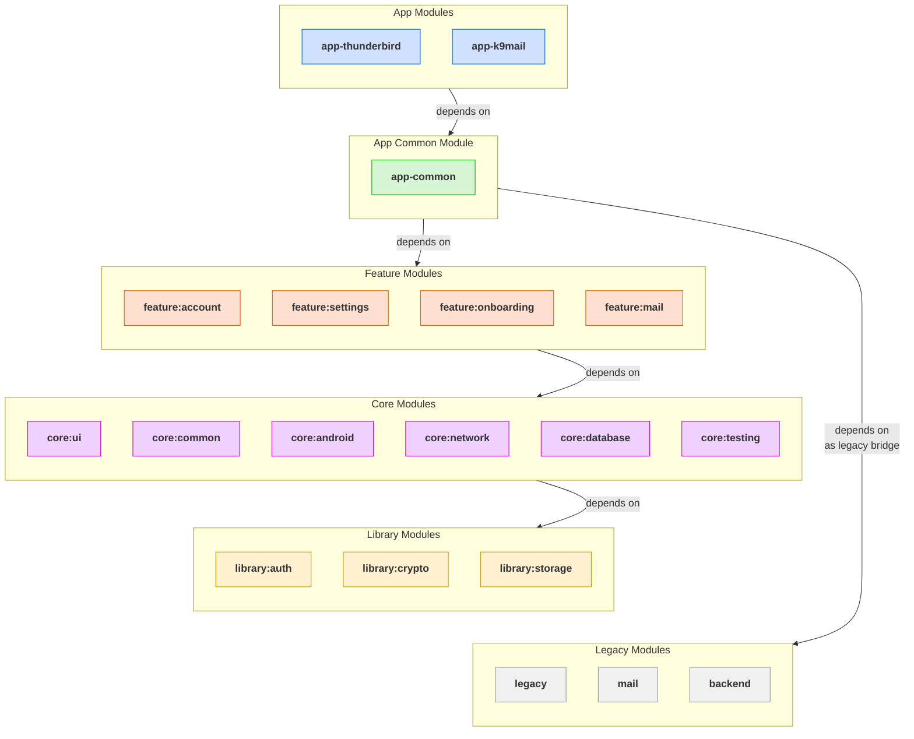
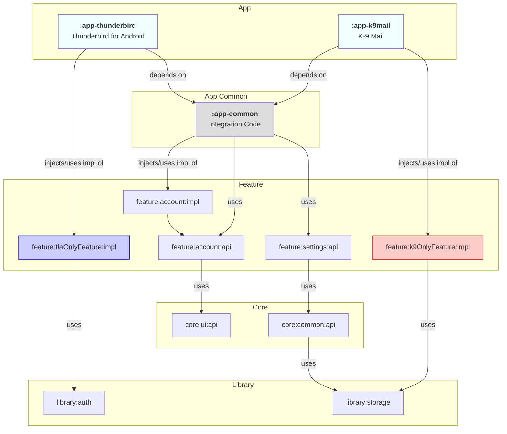

# 📦 Module Organization

The Thunderbird for Android project is following a modularization approach, where the codebase is divided into multiple
distinct modules. These modules encapsulate specific functionality and can be developed, tested, and maintained
independently. This modular architecture promotes reusability, scalability, and maintainability of the codebase.

This document outlines the adopted module organization for the Thunderbird for Android project, serving as a guide for
developers to understand the codebase structure and ensure consistent architectural patterns.

## 📂 Module Overview

The modules are organized into several types, each serving a specific purpose in the overall architecture:

### Module Types

#### 📱 App Modules

The App Modules (`app-thunderbird` and `app-k9mail`) contain the application-specific code, including:
- Application entry points and initialization logic
- Final dependency injection setup
- Navigation configuration
- Integration with feature modules solely for that application
- App-specific themes and resources (strings, themes, etc.)

#### 🔄 App Common Module

The `app-common` module acts as the central hub for shared code between both applications. This module serves as the
primary "glue" that binds various `feature` modules together, providing a seamless integration point. It also contains:
- Shared application logic
- Feature coordination
- Common dependency injection setup
- Legacy code bridges and adapters

##### What Should Go in App Common

The app-common module should contain:

1. **Shared Application Logic**: Code that's needed by both app modules but isn't specific to any one feature.
   - Example: `BaseApplication` provides common application initialization, language management, and theme setup.
   - This avoids duplication between app-thunderbird and app-k9mail.
2. **Feature Integration Code**: Code that connects different features together.
   - Example: Code that coordinates between account and mail features.
   - This maintains separation between features while allowing them to work together.
3. **Common Dependency Injection Setup**: Koin modules that configure dependencies shared by both applications.
   - Example: `AppCommonModule` includes legacy modules and app-common specific modules.
   - This ensures consistent dependency configuration across both applications.
4. **Legacy Code Bridges/Adapters**: Implementations of interfaces defined in feature modules that delegate to legacy code.
   - Example: `DefaultAccountProfileLocalDataSource` implements `AccountProfileLocalDataSource` from `feature:account:core` and delegates to legacy account code.
   - These bridges isolate legacy code and prevent direct dependencies on it from feature modules.

##### What Should NOT Go in App Common

The following should NOT be placed in app-common:

1. **Feature-Specific Business Logic**: Business logic that belongs to a specific feature domain should be in that feature's module.
   - Example: Mail composition logic should be in `feature:mail`, not in app-common.
   - This maintains clear separation of concerns and feature independence.
2. **UI Components**: UI components should be in core:ui or in feature modules.
   - Example: A custom button component should be in core:ui, while a mail-specific UI component should be in feature:mail.
   - This ensures proper layering and reusability.
3. **Direct Legacy Code**: Legacy code should remain in legacy modules, with app-common providing bridges.
   - Example: Don't move legacy mail code into app-common; instead, create a bridge in app-common.
   - This maintains the separation between legacy and modern code.
4. **New Feature Implementations**: New features should be implemented in feature modules, not in app-common.
   - Example: A new calendar feature should be in `feature:calendar`, not in app-common.
   - This ensures features can evolve independently.

##### Decision Criteria for New Contributors

When deciding whether code belongs in app-common or a feature module, consider:

1. **Is it shared between both applications?** If yes, it might belong in app-common.
2. **Is it specific to a single feature domain?** If yes, it belongs in that feature module.
3. **Does it bridge to legacy code?** If yes, it belongs in app-common.
4. **Does it coordinate between multiple features?** If yes, it might belong in app-common.
5. **Is it a new feature implementation?** If yes, create a new feature module instead.

Remember that app-common should primarily contain integration code, shared application logic, and bridges to legacy code. Feature-specific logic should be in feature modules, even if used by both applications.

#### ✨ Feature Modules

The `feature:*` modules are independent and encapsulate distinct user-facing feature domains. They are designed to be
reusable and can be integrated into any application module as needed.

Feature implementation modules (e.g., `:feature:account:impl`) should ideally not depend directly on other feature
implementation modules. Instead, they should depend on the public `:api` module of other features (e.g.,
`:feature:someOtherFeature:api`) to access their functionality through defined contracts, see
[module structure](module-structure.md#-api-module) for more details.

When features are complex, they can be split into smaller sub feature modules, addressing specific aspects or
functionality within a feature domain:

- `:feature:account:api`: Public interfaces for account management
- `:feature:account:settings:api`: Public interfaces for account settings
- `:feature:account:settings:impl`: Concrete implementations of account settings

#### 🧰 Core Modules

The `core:*` modules contain foundational functionality used across the application:

- **core:ui**: UI components, themes, and utilities
- **core:common**: Common utilities and extensions
- **core:network**: Networking utilities and API client infrastructure
- **core:database**: Database infrastructure and utilities
- **core:testing**: Testing utilities

Core modules should only contain generic, reusable components that have no specific business logic.
Business objects (e.g., account, mail, etc.) should live in their respective feature modules.

#### 📚 Library Modules

The `library:*` modules are for specific implementations that might be used across various features or applications.
They could be third-party integrations or complex utilities and eventually shared across multiple projects.

#### 🔙 Legacy Modules

The `legacy:*` modules that are still required for the project to function, but don't follow the new project structure.
These modules should not be used for new development. The goal is to migrate the functionality of these modules to the
new structure over time.

Similarly the `mail:*` and `backend:*` modules are legacy modules that contain the old mail and backend implementations.
These modules are being gradually replaced by the new feature modules.

The `legacy` modules are integrated into the `app-common` module, allowing them to be used by other parts of the app.
The glue code for bridging legacy code to the new modular architecture is also located in the `app-common` module. See
[module legacy integration](legacy-module-integration.md) for more details.

## 🔗 Module Dependencies

The module dependency diagram below illustrates how different modules interact with each other in the project,
showing the dependencies and integration points between modules:

- **App Modules**: Depend on the App Common module for shared functionality and selectively integrate feature modules
- **App Common**: Integrates various feature modules to provide a cohesive application
- **Feature Modules**: Use core modules and libraries for their implementation, may depend on other feature api modules
- **App-Specific Features**: Some features are integrated directly by specific apps (K-9 Mail or Thunderbird)

Rules for module dependencies:
- **One-Way Dependencies**: Modules should not depend on each other in a circular manner
- **API-Implementation Separation**: Modules should depend on `api` modules, not `implementation` modules, see [module structure](module-structure.md#module-structure)
- **Feature Integration**: Features should be integrated through the `app-common` module, which acts as the central integration hub
- **Dependency Direction**: Dependencies should flow from app modules to common, then to features, and finally to core and libraries

