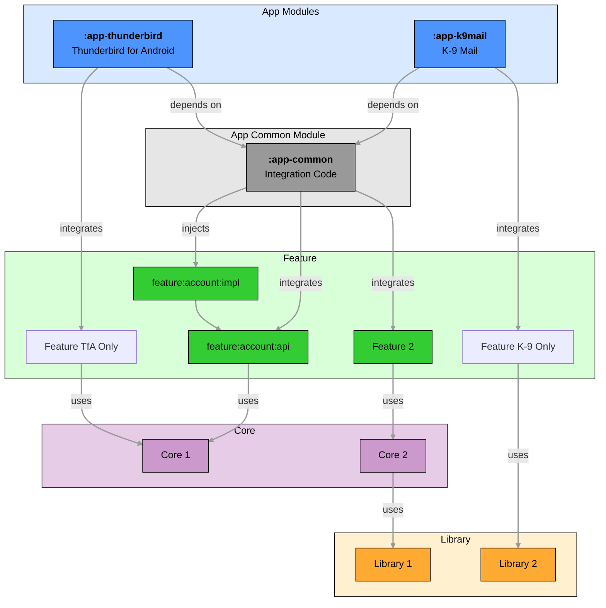

# 📦 Module Structure

The Thunderbird for Android project is following a modularization approach, where the codebase is divided into multiple
distinct modules. These modules encapsulate specific functionality and can be developed, tested, and maintained
independently. This modular architecture promotes reusability, scalability, and maintainability of the codebase.

Each module should be split into two main parts: **API** and **implementation**. This separation provides clear
boundaries between what a module exposes to other modules and how it implements its functionality internally.

When a feature is complex, it can be further split into sub modules, allowing for better organization and smaller modules
for distinct functionalities within a feature domain.

This approach promotes:
- **Loose coupling**: Modules interact through well-defined interfaces
- **Interchangeable implementations**: Different implementations can be swapped without affecting consumers
- **Improved build times**: Reduces the scope of recompilation when changes are made
- **Better testability**: Modules can be tested in isolation
- **Clear ownership**: Teams can own specific modules

### 📝 API Module

The API module defines the public contract that other modules can depend on. It should be stable, well-documented, and
change infrequently.

The API module contains:

- **Public interfaces**: Contracts that define the module's capabilities
- **Data models**: Entities that are part of the public API
- **Constants and enums**: Shared constants and enumeration types
- **Extension functions**: Utility functions that extend public types
- **Navigation definitions**: Navigation routes and arguments

The API module should be minimal and focused on defining the contract that other modules can depend on. It should not
contain any implementation details.

#### Naming Convention

API modules should follow the naming convention:
- `feature:<feature-name>:api` for feature modules
- `core:<core-name>:api` for core modules

#### Example structure for a feature API module:

```bash
feature:account:api
├── src/main/kotlin/net/thunderbird/feature/account/api
│   ├── AccountManager.kt (interface)
│   ├── Account.kt (entity)
│   ├── AccountNavigation.kt (interface)
│   ├── AccountType.kt (entity)
│   └── AccountExtensions.kt (extension functions)
```

#### API Design Guidelines

When designing APIs, follow these principles:
- **Minimal surface area**: Expose only what is necessary
- **Immutable data**: Use immutable data structures where possible
- **Clear contracts**: Define clear method signatures with documented parameters and return values
- **Error handling**: Define how errors are communicated (exceptions, result types, etc.)

### ⚙️ Implementation Module

The implementation module depends on the API module but should not be depended upon by other modules (except for
dependency injection setup).

The implementation module contains:

- **Interface implementations**: Concrete implementations of the interfaces defined in the API module
- **Internal components**: Classes and functions used internally
- **Data sources**: Repositories, database access, network clients
- **UI components**: Screens, composables, and ViewModels

#### Naming Convention

Implementation modules should follow the naming convention:
- `feature:<feature-name>:impl` for standard implementations
- `feature:<feature-name>:impl-<variant>` for variant-specific implementations
- `core:<core-name>:impl` for core module implementations

#### Multiple Implementations

When multiple implementations are needed, such as for different providers or platforms, they can be placed in separate
modules and named accordingly:
- `feature:account:impl-gmail` - Gmail-specific implementation
- `feature:account:impl-yahoo` - Yahoo-specific implementation
- `feature:account:impl-noop` - No-operation implementation for testing

#### Example structure for a variant implementation:

```bash
feature:account:impl-gmail
├── src/main/kotlin/app/thunderbird/feature/account/gmail
│   └── GmailAccountManager.kt
```

#### Clean Architecture in Implementation Modules

A complex feature implementation module should apply **Clean Architecture** principles, separating concerns into:

- **UI Layer**: Compose UI components, ViewModels, and UI state management
- **Domain Layer**: Use cases, domain models, and business logic
- **Data Layer**: Repositories, data sources, and data mapping

```bash
feature:account:impl
├── src/main/kotlin/app/thunderbird/feature/account/impl
│   ├── data/
│   │   ├── repository/
│   │   ├── datasource/
│   │   └── mapper/
│   ├── domain/
│   │   ├── repository/
│   │   ├── entity/
│   │   └── usecase/
│   └── ui/
│       ├── AccountScreen.kt
│       └── AccountViewModel.kt
```

#### Implementation Best Practices

- **Internal visibility**: Use the `internal` modifier for classes and functions that should not be part of the public API
- **Encapsulation**: Keep implementation details hidden from consumers
- **Testability**: Design implementations to be easily testable
- **Dependency injection**: Use constructor injection for dependencies
- **Error handling**: Implement robust error handling according to API contracts
- **Performance**: Consider performance implications of implementations
- **Logging**: Include appropriate logging for debugging and monitoring

### 🧪 Testing Module

Testing modules provide test implementations, utilities, and frameworks for testing other modules. They are essential for ensuring the quality and correctness of the codebase.

#### Contents

The testing module contains:

- **Test utilities**: Helper functions and classes for testing
- **Test frameworks**: Custom test frameworks and extensions
- **Test fixtures**: Reusable test setups and teardowns
- **Test matchers**: Custom matchers for assertions

#### Naming Convention

Testing modules should follow the naming convention:
- `feature:<feature-name>:testing` for feature-specific test utilities
- `core:<core-name>:testing` for core test utilities
- `<module-name>:test` for module-specific tests

#### Example structure for a testing module:

```bash
feature:account:testing
├── src/main/kotlin/app/thunderbird/feature/account/testing
│   ├── AccountTestUtils.kt
│   └── AccountTestMatchers.kt
```

#### Testing Best Practices

- **Reusability**: Create reusable test utilities and data factories
- **Isolation**: Tests should be isolated and not depend on external systems
- **Readability**: Tests should be easy to read and understand
- **Maintainability**: Tests should be easy to maintain and update
- **Coverage**: Tests should cover all critical paths and edge cases

### 🤖 Fake Module

Fake modules provide alternative implementations of interfaces for testing, development, or demonstration purposes. They are simpler than the real implementations and are designed to be used in controlled environments.

#### Contents

The fake module contains:

- **Fake implementations**: Simplified implementations of interfaces
- **Generic test data**: Basic, reusable sample data for testing and demonstration
- **In-memory data stores**: In-memory alternatives to real data stores
- **Controlled behavior**: Implementations with predictable, configurable behavior
- **Test doubles**: Mocks, stubs, and spies for testing

> [!IMPORTANT]
> Fake modules should be limited to the most generic data and implementations. Specific use cases or test setups should be part of the actual test, not the fake module.

#### Naming Convention

Fake modules should follow the naming convention:
- `feature:<feature-name>:fake` for feature-specific fake implementations
- `core:<core-name>:fake` for core fake implementations

#### Example structure for a fake module:

```bash
feature:account:fake
├── src/main/kotlin/app/thunderbird/feature/account/fake
│   ├── FakeAccountRepository.kt
│   ├── FakeAccountDataSource.kt
│   ├── InMemoryAccountStore.kt
│   ├── FakeAccountManager.kt
│   └── data/
│       ├── FakeAccountData.kt
│       └── FakeAccountProfileData.kt
```

#### Fake Implementation Best Practices

- **Simplicity**: Fake implementations should be simpler than real implementations
- **Deterministic behavior**: Behavior should be predictable and controllable
- **Configuration**: Allow configuration of behavior for different test scenarios
- **Visibility**: Make internal state visible for testing assertions
- **Performance**: Fake implementations should be fast for testing efficiency
- **Generic test data**: Include basic, reusable test data that can be used across different tests
- **Realistic but generic data**: Test data should be realistic enough to be useful but generic enough to be reused
- **Separation of concerns**: Keep specific test scenarios and edge cases in the actual tests, not in the fake module

### 🔄 Common Module

Common modules provide shared functionality that is used by multiple modules within a feature. They contain
implementation details, utilities, and components that need to be shared between related modules but are not part of
the public API.

#### Contents

The common module contains:

- **Shared utilities**: Helper functions and classes used across related modules
- **Internal implementations**: Implementation details shared between modules
- **Shared UI components**: Reusable UI components specific to a feature domain
- **Data repositories**: Shared data storage and access implementations
- **Constants and resources**: Shared constants, strings, and other resources

#### Naming Convention

Common modules should follow the naming convention:
- `feature:<feature-name>:common` for feature-specific common code
- `core:<core-name>:common` for core common code

#### Example structure for a common module:

```bash
feature:account:common
├── src/main/kotlin/net/thunderbird/feature/account/common
│   ├── AccountCommonModule.kt
│   ├── data/
│   │   └── InMemoryAccountStateRepository.kt
│   ├── domain/
│   │   ├── AccountDomainContract.kt
│   │   ├── input/
│   │   │   └── NumberInputField.kt
│   │   └── entity/
│   │       ├── AccountState.kt
│   │       ├── AccountDisplayOptions.kt
│   │       └── AuthorizationState.kt
│   └── ui/
│       ├── WizardNavigationBar.kt
│       └── WizardNavigationBarState.kt
```

#### Common Module Best Practices

- **Internal visibility**: Use the `internal` modifier for classes and functions that should not be part of the public API
- **Clear organization**: Organize code into data, domain, and UI packages for better maintainability
- **Shared contracts**: Define clear interfaces for functionality that will be implemented by multiple modules
- **Reusable components**: Create UI components that can be reused across different screens within a feature
- **Stateless where possible**: Design components to be stateless and receive state through parameters
- **Minimal dependencies**: Keep dependencies to a minimum to avoid transitive dependency issues
- **Documentation**: Document the purpose and usage of shared components
- **Avoid leaking implementation details**: Don't expose implementation details that could create tight coupling

## 🔗 Module Dependencies

The module dependency diagram below illustrates how different modules interact with each other in the project, showing
the dependencies and integration points between modules.



### Module Interaction Patterns

- **App Modules**: Depend on the App Common module for shared functionality and selectively integrate feature modules
- **App Common**: Integrates various feature modules to provide a cohesive application
- **Feature Modules**: Use core modules and libraries for their implementation, may depend on other feature API modules
- **App-Specific Features**: Some features are integrated directly by specific apps (K-9 Mail or Thunderbird)

### Dependency Rules

These rules must be strictly followed:

1. **One-Way Dependencies**:
   - Modules should not depend on each other in a circular manner
   - Dependencies should form a directed acyclic graph (DAG)
2. **API-Implementation Separation**:
   - Modules should depend only on API modules, not implementation modules
   - Implementation modules should be referenced only in dependency injection setup
3. **Feature Integration**:
   - Features should be integrated through the App Common module, which acts as a central hub
   - Direct dependencies between feature implementations should be avoided, or limited to API modules
4. **Dependency Direction**:
   - Dependencies should flow from app modules to common, then to features, and finally to core and libraries
   - Higher-level modules should depend on lower-level modules, not vice versa
5. **Minimal Dependencies**:
   - Each module should have the minimal set of dependencies required
   - Avoid unnecessary dependencies that could lead to bloat

### Dependency Management

- **Explicit Dependencies**: All dependencies should be explicitly declared in the module's build file
- **Transitive Dependencies**: Avoid relying on transitive dependencies
- **Version Management**: Use centralized version management for dependencies
- **Dependency Visibility**: Use appropriate visibility modifiers to limit access to implementation details

### Dependency Injection

- Use Koin for dependency injection
- Configure module dependencies in dedicated Koin modules
- Inject API interfaces, not implementation classes
- Use lazy injection where appropriate to improve startup performance

## 📏 Module Granularity

Determining the right granularity for modules is crucial for maintainability and scalability. This section provides
guidelines on when to create new modules and how to structure them.

### When to Create a New Module

Create a new module when:

1. **Distinct Functionality**: The code represents a distinct piece of functionality with clear boundaries
2. **Reusability**: The functionality could be reused across multiple features or applications
3. **Build Performance**: Breaking down large modules improves build performance
4. **Testing**: Isolation improves testability

### When to Split a Module

Split an existing module when:

1. **Size**: The module has grown too large (>10,000 lines of code as a rough guideline)
2. **Complexity**: The module has become too complex with many responsibilities
3. **Dependencies**: The module has too many dependencies
4. **Build Time**: The module takes too long to build

### When to Keep Modules Together

Keep functionality in the same module when:

1. **Cohesion**: The functionality is highly cohesive and tightly coupled
2. **Small Size**: The functionality is small and simple
3. **Single Responsibility**: The functionality represents a single responsibility

