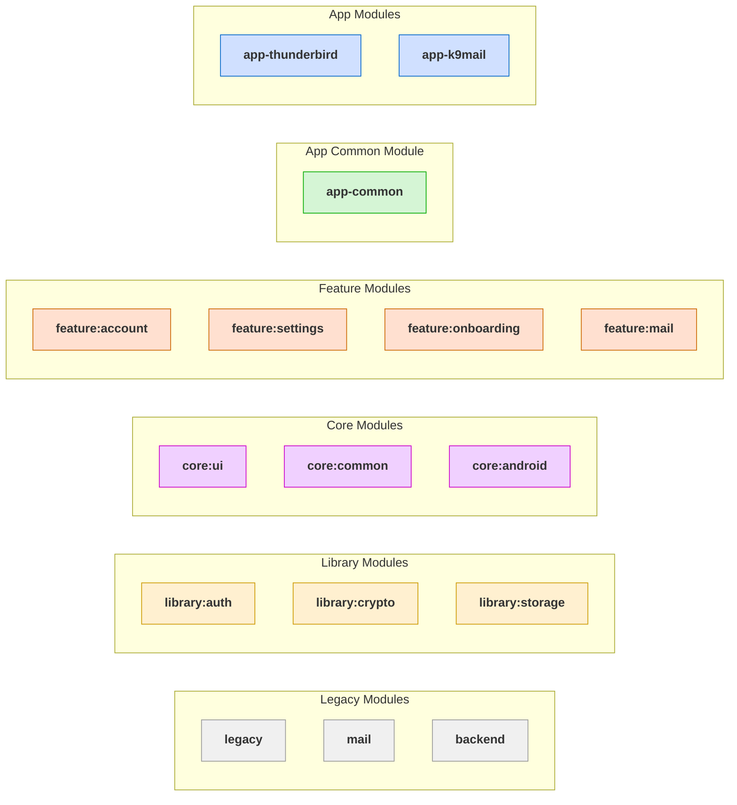
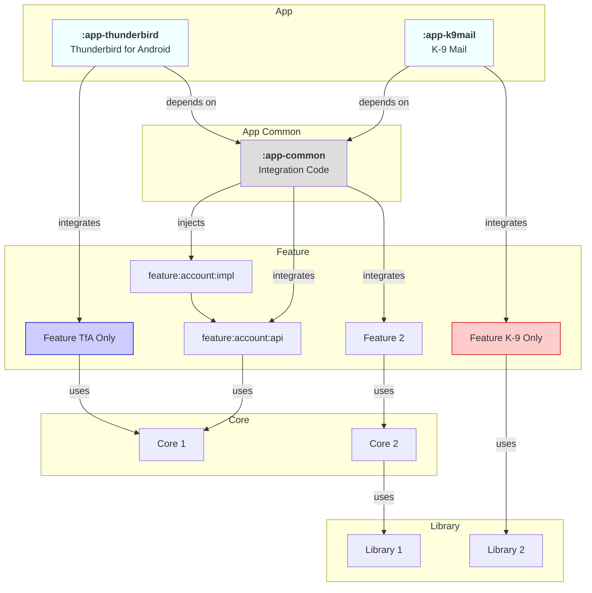

# 📦 Module Structure

The Thunderbird for Android project is following a modularization approach, where the codebase is divided into multiple
distinct modules. These modules encapsulate specific functionality and can be developed, tested, and maintained
independently. This modular architecture promotes reusability, scalability, and maintainability of the codebase.

## 📂 Module Organization

The modules are organized into several types, each serving a specific purpose in the overall architecture:


```mermaid
graph TB
    subgraph APP[App Modules]
        direction TB
        APP_TB["`**app-thunderbird**`"]
        APP_K9["`**app-k9mail**`"]
    end

    subgraph COMMON[App Common Module]
        direction TB
        APP_COMMON["`**app-common**`"]
    end

    subgraph FEATURE[Feature Modules]
        direction TB
        FEATURE_ACCOUNT["`**feature:account**`"]
        FEATURE_SETTINGS["`**feature:settings**`"]
        FEATURE_ONBOARDING["`**feature:onboarding**`"]
        FEATURE_MAIL["`**feature:mail**`"]
    end

    subgraph CORE[Core Modules]
        direction TB
        CORE_UI["`**core:ui**`"]
        CORE_COMMON["`**core:common**`"]
        CORE_ANDROID["`**core:android**`"]
    end

    subgraph LIBRARY[Library Modules]
        direction TB
        LIB_AUTH["`**library:auth**`"]
        LIB_CRYPTO["`**library:crypto**`"]
        LIB_STORAGE["`**library:storage**`"]
    end

    subgraph LEGACY[Legacy Modules]
        direction TB
        LEGACY_K9["`**legacy**`"]
        LEGACY_MAIL["`**mail**`"]
        LEGACY_BACKEND["`**backend**`"]
    end

    APP ~~~ COMMON
    COMMON ~~~ FEATURE
    FEATURE ~~~ CORE
    CORE ~~~ LIBRARY
    LIBRARY ~~~ LEGACY

    classDef app fill: #d0e0ff, stroke: #0066cc
    classDef common fill: #d5f5d5, stroke: #00aa00
    classDef feature fill: #ffe0d0, stroke: #cc6600
    classDef core fill: #f0d0ff, stroke: #cc00cc
    classDef library fill: #fff0d0, stroke: #cc9900
    classDef legacy fill: #f0f0f0, stroke: #999999

    class APP_TB,APP_K9 app
    class APP_COMMON common
    class FEATURE_ACCOUNT,FEATURE_SETTINGS,FEATURE_ONBOARDING,FEATURE_MAIL feature
    class CORE_UI,CORE_COMMON,CORE_ANDROID core
    class LIB_AUTH,LIB_CRYPTO,LIB_STORAGE library
    class LEGACY_MAIL,LEGACY_BACKEND,LEGACY_K9 legacy
```

### Module Types

#### 📱 App Modules

The app modules (`app-thunderbird` and `app-k9mail`) contain the application-specific code, including:
- Application entry points and initialization logic
- Final dependency injection setup
- Navigation configuration
- Integration with feature modules solely for that application
- App-specific themes and resources (strings, themes, etc.)

#### 🔄 App Common Module

The `app-common` module acts as the central hub for shared code between both applications. This module serves as the
primary "glue" that binds various `feature` modules together, providing a seamless integration point. It also contains:
- Shared application logic
- Feature coordination
- Common dependency injection setup

#### ✨ Feature Modules

The `feature:*` modules are independent and encapsulate distinct user-facing feature domains. They are designed to be
reusable and can be integrated into any application module as needed.

These modules should not depend on each other, except for the `api` module, which provides the public interfaces and
contracts for the feature.

When features are complex, they can be split into smaller sub feature modules, addressing specific aspects or
functionality within a feature domain:

- `:feature:account:api`: Public interfaces for account management
- `:feature:account:settings:api`: Public interfaces for account settings
- `:feature:account:settings:impl`: Concrete implementations of account settings

#### 🧰 Core Modules

The `core:*` modules contain foundational functionality used across the application:

- **core:ui**: UI components, themes, and utilities
- **core:common**: Common utilities and extensions
- **core:network**: Networking utilities and API client infrastructure
- **core:database**: Database infrastructure and utilities
- **core:testing**: Testing utilities

Core modules should only contain generic, reusable components that have no specific business logic.
Business objects (e.g., account, mail, etc.) should live in their respective feature modules.

#### 📚 Library Modules

The `library:*` modules are for specific implementations that might be used across various features or applications.
They could be third-party integrations or complex utilities and eventually shared across multiple projects.

#### 🔙 Legacy Modules

The `legacy:*` modules that are still required for the project to function, but don't follow the new project structure.
These modules should not be used for new development. The goal is to migrate the functionality of these modules to the
new structure over time.

Similarly the `mail:*` and `backend:*` modules are legacy modules that contain the old mail and backend implementations.
These modules are being gradually replaced by the new feature modules.

## 🧱 Internal Module Structure

Each module should be split into two main parts: **API** and **implementation**. This separation provides clear boundaries
between what a module exposes to other modules and how it implements its functionality internally.

When a feature is complex, it can be further split into sub modules, allowing for better organization and smaller modules
for distinct functionalities within a feature domain.

### 📝 API Module

The API module contains:

- **Public interfaces**: Contracts that define the module's capabilities
- **Data models**: Entities that are part of the public API
- **Constants and enums**: Shared constants and enumeration types
- **Extension functions**: Utility functions that extend public types
- **Navigation definitions**: Navigation routes and arguments

The API module should be minimal and focused on defining the contract that other modules can depend on. It should not
contain any implementation details.

Example structure for a feature module:

```bash
feature:account:api
├── src/main/kotlin/app/k9mail/feature/account/api
│   ├── AccountManager.kt (interface)
│   ├── Account.kt (entity)
│   ├── AccountNavigation.kt (interface)
│   ├── AccountType.kt (entity)
│   └── AccountExtensions.kt (extension functions)
```

### ⚙️ Implementation Module

The implementation module depends on the API module but should not be depended upon by other modules (except for
dependency injection setup).

The implementation module contains:

- **Interface implementations**: Concrete implementations of the interfaces defined in the API module
- **Internal components**: Classes and functions used internally
- **Data sources**: Repositories, database access, network clients
- **UI components**: Screens, composables, and ViewModels

Example structure for a feature module:

```bash
feature:account:impl-gmail
├── src/main/kotlin/app/thunderbird/feature/account/gmail
│   └── GmailAccountManager.kt
```

When multiple implementations are needed, such as for different providers, they can be placed in separate modules
and named accordingly (e.g., `feature:account:impl-gmail`, `feature:account:impl-yahoo`, `feature:account:impl-noop`).

A complex feature implementation module could apply **Clean Architecture** principles, separating concerns into:

- **UI Layer**: Compose UI components, ViewModels, and UI state management
- **Domain Layer**: Use cases, domain models, and business logic
- **Data Layer**: Repositories, data sources, and data mapping

```bash
feature:account:impl-ui
├── src/main/kotlin/app/thunderbird/feature/account/impl/ui
│   ├── data/
│   │   ├── repository/
│   │   ├── datasource/
│   │   └── mapper/
│   ├── domain/
│   │   ├── repository/
│   │   ├── entity/
│   │   └── usecase/
│   └── ui/
│       ├── AccountScreen.kt
│       └── AccountViewModel.kt
```

## 🔗 Module Dependencies

The module dependency diagram below illustrates how different modules interact with each other in the project,
showing the dependencies and integration points between modules:

- **App Modules**: Depend on the App Common module for shared functionality and selectively integrate feature modules
- **App Common**: Integrates various feature modules to provide a cohesive application
- **Feature Modules**: Use core modules and libraries for their implementation, may depend on other feature api modules
- **App-Specific Features**: Some features are integrated directly by specific apps (K-9 Mail or Thunderbird)

Rules for module dependencies:
- **One-Way Dependencies**: Modules should not depend on each other in a circular manner
- **API-Implementation Separation**: Modules should depend on API modules, not implementation modules
- **Feature Integration**: Features should be integrated through the App Common module, which acts as a central hub
- **Dependency Direction**: Dependencies should flow from app modules to common, then to features, and finally to core and libraries


```mermaid
graph TB
    subgraph APP[App]
        direction TB
        APP_K9["`**:app-k9mail**<br>K-9 Mail`"]
        APP_TB["`**:app-thunderbird**<br>Thunderbird for Android`"]
    end

    subgraph COMMON[App Common]
        direction TB
        APP_COMMON["`**:app-common**<br>Integration Code`"]
    end

    subgraph FEATURE[Feature]
        direction TB
        FEATURE1[feature:account:api]
        FEATURE2[feature:account:impl]
        FEATURE3[Feature 2]
        FEATURE_K9[Feature K-9 Only]
        FEATURE_TB[Feature TfA Only]
    end

    subgraph CORE[Core]
        direction TB
        CORE1[Core 1]
        CORE2[Core 2]
    end

    subgraph LIBRARY[Library]
        direction TB
        LIB1[Library 1]
        LIB2[Library 2]
    end

    APP_K9 --> |depends on| APP_COMMON
    APP_TB --> |depends on| APP_COMMON
    APP_COMMON --> |integrates| FEATURE1
    APP_COMMON --> |injects| FEATURE2
    FEATURE2 --> FEATURE1
    APP_COMMON --> |integrates| FEATURE3
    APP_K9 --> |integrates| FEATURE_K9
    APP_TB --> |integrates| FEATURE_TB
    FEATURE1 --> |uses| CORE1
    FEATURE3 --> |uses| CORE2
    FEATURE_TB --> |uses| CORE1
    FEATURE_K9 --> |uses| LIB2
    CORE2 --> |uses| LIB1

    classDef module fill:yellow
    classDef app fill:azure
    classDef app_common fill:#ddd
    classDef featureK9 fill:#ffcccc,stroke:#cc0000
    classDef featureTB fill:#ccccff,stroke:#0000cc
    class APP_K9 app
    class APP_TB app
    class APP_COMMON app_common
    class FEATURE_K9 featureK9
    class FEATURE_TB featureTB
```

