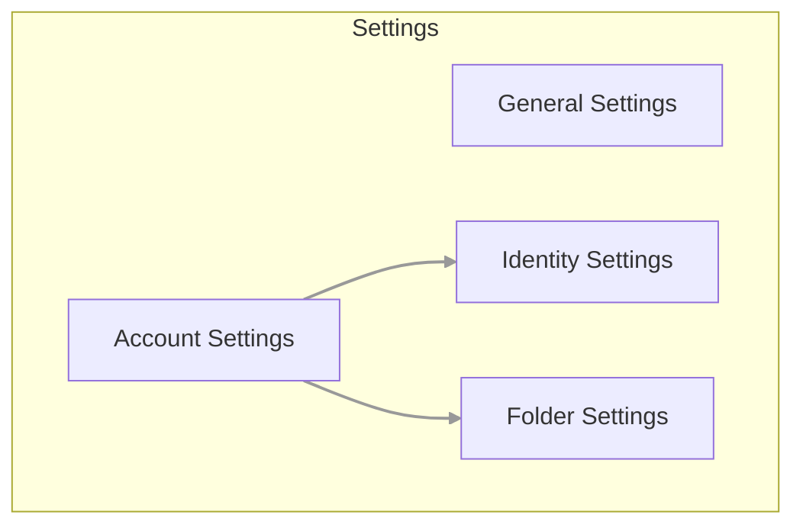
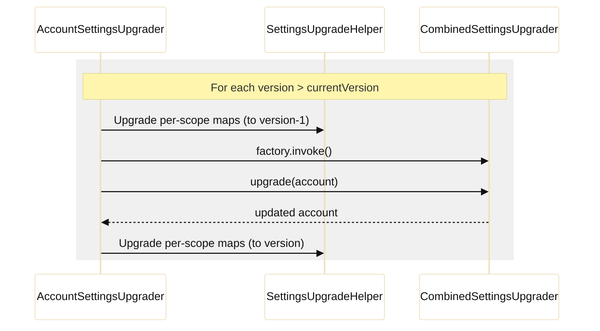

# ⚙️ Settings Architecture

This document describes the settings architecture in Thunderbird for Android, explaining how preferences are organized,
stored, and upgraded.

## 🏗️ Overview

Settings are divided into several scopes to handle different levels of configuration:



- **General Settings**: Application-wide preferences (e.g., theme, language, global notification settings).
- **Account Settings**: Preferences specific to a single email account (e.g., check frequency, notification sounds).
- **Identity Settings**: Preferences specific to a user identity within an account (e.g., name, email address, signature).
- **Folder Settings**: Preferences specific to a mail folder (e.g., notification state, sync settings).

## 📂 Code Location

Most of the settings definition and validation logic resides in the `legacy:core` module:

- `com.fsck.k9.preferences.Settings`: Base classes for setting types (Boolean, String, Enum, etc.) and versioning logic.
- `com.fsck.k9.preferences.AccountSettingsDescriptions`: Definitions and upgraders for account-level settings.
- `com.fsck.k9.preferences.IdentitySettingsDescriptions`: Definitions and upgraders for identity-level settings.
- `com.fsck.k9.preferences.CombinedSettingsUpgraders`: Registry for complex, multi-component upgraders.
- `com.fsck.k9.preferences.ValidatedSettings`: Data classes representing the structure of validated settings.

> [!TIP]
> Use `ValidatedSettings.kt` as the source of truth for the data structure when implementing complex `CombinedSettingsUpgrader` logic.

## 🔑 Preferences vs. Metadata

A key architectural distinction in this codebase is the separation of **Fixed Metadata** from **User Preferences**:

1. **Fixed Metadata**: Fundamental attributes like an account's `uuid`, `name`, or an identity's `email`. These are treated as structural properties and are typically mapped to specific database columns or high-level keys.
2. **User Preferences (The `settings` Map)**: These are key-value pairs stored in a `MutableMap`. They represent choices made by the user that don't change the fundamental nature of the account (e.g., "Always BCC", "Show images").

## 🆕 How to Add a New Setting

Adding a new setting typically involves the following steps:

1. **Define the Setting**: Add a new entry to the `SETTINGS` map in `AccountSettingsDescriptions` (or `IdentitySettingsDescriptions`).
2. **Assign a Version**: Use the current `Settings.VERSION` for the initial version of your setting.
3. **Increment Global Version**: If you are adding a setting that didn't exist before, or changing the structure of existing settings, increment `Settings.VERSION`.

> [!IMPORTANT]
> When incrementing `Settings.VERSION`, ensure you update all relevant `AccountSettingsDescriptions`, `IdentitySettingsDescriptions`, and tests.

4. **Update UI**: Implement the UI component in the relevant settings screen using Jetpack Compose and the Atomic Design system. Ensure you use components from `core:ui:compose:designsystem`.

Example entry in `AccountSettingsDescriptions`:

```java
s.put("myNewSetting", Settings.versions(
    new V(Settings.VERSION, new BooleanSetting(true))
));
```

## 🔄 Settings Upgraders

As the application evolves, the format and structure of saved settings may change. Upgraders migrate data from an older
version to a newer one during settings import or app updates.

The upgrade process follows a specific sequence:



### 1. SettingsUpgrader

The `SettingsUpgrader` is the standard interface for upgrading a specific map of key-value preferences.

- **Interface**: `fun interface SettingsUpgrader { fun upgrade(settings: MutableMap<String, Any?>) }`
- **When to use**: When you only need to modify, rename, or transform existing keys within the `settings` map.
- **Data processed**: A single `MutableMap<String, Any?>` for the scope being upgraded.
- **Registration**: Registered in maps like `AccountSettingsDescriptions.UPGRADERS` (version → upgrader).

### 2. CombinedSettingsUpgrader

The `CombinedSettingsUpgrader` is used for complex migrations that require context from multiple parts of an account.

- **Interface**: `fun interface CombinedSettingsUpgrader { fun upgrade(account: ValidatedSettings.Account): ValidatedSettings.Account }`
- **When to use**: When the upgrade depends on "core" account data (e.g., `uuid`, `name`) or needs to affect multiple sub-components (e.g., changing folder settings based on a server setting).
- **Registration**: Registered as version → factory in `CombinedSettingsUpgraders.UPGRADERS`.

## 📏 Upgrader Guidelines

- **Deterministic**: Prefer pure, deterministic, and side-effect-free transformations.
- **No Side Effects**: Avoid performing network calls or file I/O inside upgraders.
- **Privacy**: **NEVER** log PII (names, email addresses, tokens, credentials). Use the project's `Logger` via DI where appropriate, but never for sensitive data.
- **Performance**: Upgraders execute synchronously during import/upgrade; keep them lean and fast.
- **Idempotency**: Ensure that running the same upgrader multiple times (if it were to happen) doesn't corrupt data.

## 🔍 Validation

Before settings are applied or stored, they are validated against their descriptions. The `Settings.validate()` method ensures that:
- All required keys are present (or uses default values).
- Values are of the correct type.
- Values fall within allowed ranges or enum sets.

For the exact types and shape of the data, see `ValidatedSettings.kt`.

## 📚 Related Documentation

For information on how settings are persisted to the database and how to perform low-level database migrations,
see the [Preference Migration Guide](../developer/preference-migration-guide.md).

