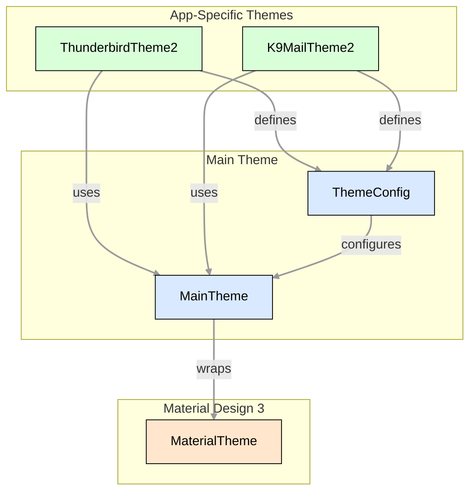

# 🎭 Theming

This document provides a detailed explanation of the theming system used in our applications. It covers the theme
architecture, components, customization, and usage.

- **✨ Material Design 3**: Based on Material Design 3 principles
- **🎨 Colors**: Custom color schemes with light and dark modes
  - **🌓 Dark Mode**: Full support for light and dark themes
  - **🌈 Dynamic Color**: Support for dynamic color based on system settings
- **🪜 Elevations**: Consistent elevation system for shadows
- **🖼️ Images**: Images and icons consistent with the theme
- **🔶 Shapes**: Customizable shape system for components
- **📐 Sizes**: Standardized sizes for components
- **📏 Spacings**: Consistent spacing system for layout
- **🅰️ Typography**: Consistent typography system

## 📱 Theme Architecture

Our theme architecture is designed with several key principles in mind:

1. **Consistency**: Provide a unified look and feel across all applications while allowing for brand-specific customization
2. **Flexibility**: Support different visual identities for different applications (Thunderbird, K-9 Mail) using the same underlying system
3. **Extensibility**: Enable easy addition of new theme components or modification of existing ones
4. **Maintainability**: Centralize theme definitions to simplify updates and changes
5. **Material Design Compatibility**: Build on top of Material Design 3 while extending it with our specific needs

The theming system follows a hierarchical structure:



### 🏗️ Architecture Layers

The theme system consists of three main layers:

1. **App-Specific Themes Layer**: The top layer contains theme implementations for specific applications (ThunderbirdTheme2, K9MailTheme2). Each app theme:
   - Defines its own brand colors, logos, and other app-specific visual elements
   - Creates a ThemeConfig with these customizations
   - Uses the MainTheme as its foundation
2. **Main Theme Layer**: The middle layer provides our extended theming system:
   - MainTheme: A composable function that sets up the theme environment
   - ThemeConfig: A data class that holds all theme components
   - This layer extends Material Design with additional components like custom spacings, elevations, and app-specific colors
3. **Material Design Layer**: The foundation layer is Material Design 3:
   - Provides the base theming system (colors, typography, shapes)
   - Ensures compatibility with standard Material components
   - Our MainTheme wraps MaterialTheme and converts our theme components to Material 3 format when needed

### 🔄 Data Flow

The theme data flows through the system as follows:

1. App-specific themes (ThunderbirdTheme2, K9MailTheme2) define their visual identity through a ThemeConfig
2. ThemeConfig is passed to MainTheme, which:
   - Selects the appropriate color scheme based on dark/light mode
   - Configures system bars (status bar, navigation bar)
   - Provides all theme components through CompositionLocal providers
   - Converts our theme components to Material 3 format and configures MaterialTheme
3. Composables access theme properties through the MainTheme object
4. Material components automatically use the Material 3 theme derived from our theme

### 🌟 Benefits

This architecture provides several benefits:

- **Separation of Concerns**: Each layer has a specific responsibility
- **Code Reuse**: Common theme logic is shared between applications
- **Customization**: Each application can have its own visual identity
- **Consistency**: All applications share the same theming structure and components
- **Extensibility**: New theme components can be added without changing the overall architecture
- **Compatibility**: Works with both our custom components and standard Material components

## 🧩 Theme Components

The theming system consists of several components that work together to provide a comprehensive and consistent visual experience across the application. Each component is responsible for a specific aspect of the UI design.

### 🔧 ThemeConfig

The `ThemeConfig` is the central configuration class that holds all theme components. It serves as a container for all theme-related settings and is passed to the `MainTheme` composable.

```kotlin
data class ThemeConfig(
    val colors: ThemeColorSchemeVariants,
    val elevations: ThemeElevations,
    val images: ThemeImageVariants,
    val shapes: ThemeShapes,
    val sizes: ThemeSizes,
    val spacings: ThemeSpacings,
    val typography: ThemeTypography,
)
```

The `ThemeConfig` allows for:
- Centralized management of all theme components
- Easy switching between light and dark themes
- Simplified theme customization for different applications
- Consistent theme application throughout the app

### 🎨 ThemeColorScheme

The `ThemeColorScheme` defines all colors used in the application. It extends Material Design 3's color system with additional colors specific to our applications.

```kotlin
data class ThemeColorScheme(
    // Material 3 colors
    val primary: Color,
    val onPrimary: Color,
    val primaryContainer: Color,
    val onPrimaryContainer: Color,
    val secondary: Color,
    val onSecondary: Color,
    val secondaryContainer: Color,
    val onSecondaryContainer: Color,
    val tertiary: Color,
    val onTertiary: Color,
    val tertiaryContainer: Color,
    val onTertiaryContainer: Color,
    val error: Color,
    val onError: Color,
    val errorContainer: Color,
    val onErrorContainer: Color,
    val surfaceDim: Color,
    val surface: Color,
    val surfaceBright: Color,
    val onSurface: Color,
    val onSurfaceVariant: Color,
    val surfaceContainerLowest: Color,
    val surfaceContainerLow: Color,
    val surfaceContainer: Color,
    val surfaceContainerHigh: Color,
    val surfaceContainerHighest: Color,
    val inverseSurface: Color,
    val inverseOnSurface: Color,
    val inversePrimary: Color,
    val outline: Color,
    val outlineVariant: Color,
    val scrim: Color,

    // Extra colors
    val info: Color,
    val onInfo: Color,
    val infoContainer: Color,
    val onInfoContainer: Color,
    val success: Color,
    val onSuccess: Color,
    val successContainer: Color,
    val onSuccessContainer: Color,
    val warning: Color,
    val onWarning: Color,
    val warningContainer: Color,
    val onWarningContainer: Color,
)
```

The color scheme is organized into:
- **Base colors**: Primary, secondary, and tertiary colors that define the app's brand identity
- **Surface colors**: Colors for backgrounds, cards, and other surfaces
- **Content colors**: Colors for text and icons that appear on various backgrounds (prefixed with "on")
- **Container colors**: Colors for containers like buttons, chips, and other interactive elements
- **Utility colors**: Colors for specific purposes like errors, outlines, and scrims

Colors are provided in variants for both light and dark themes through the `ThemeColorSchemeVariants` class:

```kotlin
data class ThemeColorSchemeVariants(
    val light: ThemeColorScheme,
    val dark: ThemeColorScheme,
)
```

### 🪜 ThemeElevations

The `ThemeElevations` component defines standard elevation values used throughout the application to create a consistent sense of depth and hierarchy.

```kotlin
data class ThemeElevations(
    val level0: Dp,
    val level1: Dp,
    val level2: Dp,
    val level3: Dp,
    val level4: Dp,
    val level5: Dp,
)
```

Typical usage includes:
- **level0**: For elements that are flush with their background (0dp)
- **level1**: For subtle elevation like dividers (1dp)
- **level2**: For cards, buttons in their resting state (3dp)
- **level3**: For floating action buttons, navigation drawers (6dp)
- **level4**: For dialogs, bottom sheets (8dp)
- **level5**: For modal surfaces that should appear prominently (12dp)

### 🖼️ ThemeImages

The `ThemeImages` component stores references to app-specific images like logos, icons, and illustrations.

```kotlin
data class ThemeImages(
    val logo: Int, // Resource ID
    // ... other image resources
)
```

These images can have light and dark variants through the `ThemeImageVariants` class:

```kotlin
data class ThemeImageVariants(
    val light: ThemeImages,
    val dark: ThemeImages,
)
```

### 🔶 ThemeShapes

The `ThemeShapes` component defines the corner shapes used for UI elements throughout the application.

```kotlin
data class ThemeShapes(
    val extraSmall: CornerBasedShape,
    val small: CornerBasedShape,
    val medium: CornerBasedShape,
    val large: CornerBasedShape,
    val extraLarge: CornerBasedShape,
)
```

These shapes are used for:
- **extraSmall**: Subtle rounding for elements like text fields (4dp)
- **small**: Light rounding for cards, buttons (8dp)
- **medium**: Moderate rounding for floating elements (12dp)
- **large**: Significant rounding for prominent elements (16dp)
- **extraLarge**: Very rounded corners for special elements (28dp)

Note: For no rounding (0% corner radius), use `RectangleShape`. For completely rounded corners (50% corner radius) for circular elements, use `CircleShape`.

The `ThemeShapes` can be converted to Material 3 shapes using the `toMaterial3Shapes()` method for compatibility with Material components.

### 📐 ThemeSizes

The `ThemeSizes` component defines standard size values for UI elements to ensure consistent sizing throughout the application.

```kotlin
data class ThemeSizes(
    val smaller: Dp,
    val small: Dp,
    val medium: Dp,
    val large: Dp,
    val larger: Dp,
    val huge: Dp,
    val huger: Dp,

    val iconSmall: Dp,
    val icon: Dp,
    val iconLarge: Dp,
    val iconAvatar: Dp,

    val topBarHeight: Dp,
    val bottomBarHeight: Dp,
    val bottomBarHeightWithFab: Dp,
)
```

These sizes are used for:
- **General sizes**: `smaller`, `small`, `medium`, `large`, `larger`, `huge`, `huger` for component dimensions (width, height), button heights, and other UI element dimensions that need standardization
- **Icon sizes**: `iconSmall`, `icon`, `iconLarge` for different icon sizes throughout the app
- **Avatar size**: `iconAvatar` for user avatars and profile pictures
- **Layout sizes**: `topBarHeight`, `bottomBarHeight`, `bottomBarHeightWithFab` for consistent app bar and navigation bar heights

### 📏 ThemeSpacings

The `ThemeSpacings` component defines standard spacing values used for margins, padding, and gaps between elements.

```kotlin
data class ThemeSpacings(
    val zero: Dp,
    val quarter: Dp,
    val half: Dp,
    val default: Dp,
    val oneHalf: Dp,
    val double: Dp,
    val triple: Dp,
    val quadruple: Dp,
)
```

Consistent spacing helps create a rhythmic and harmonious layout:
- **zero**: No spacing (0dp)
- **quarter**: Quarter of the default spacing, for very tight layouts (4dp)
- **half**: Half of the default spacing, for tight layouts (8dp)
- **default**: The standard spacing unit for general use (16dp)
- **oneHalf**: One and a half times the default spacing (24dp)
- **double**: Twice the default spacing, for separating sections (32dp)
- **triple**: Three times the default spacing, for major layout divisions (48dp)
- **quadruple**: Four times the default spacing, for maximum separation (64dp)

### 🅰️ ThemeTypography

The `ThemeTypography` component defines text styles for different types of content throughout the application.

```kotlin
data class ThemeTypography(
    // Display styles for large headlines
    val displayLarge: TextStyle,
    val displayMedium: TextStyle,
    val displaySmall: TextStyle,

    // Headline styles for section headers
    val headlineLarge: TextStyle,
    val headlineMedium: TextStyle,
    val headlineSmall: TextStyle,

    // Title styles for content titles
    val titleLarge: TextStyle,
    val titleMedium: TextStyle,
    val titleSmall: TextStyle,

    // Body styles for main content
    val bodyLarge: TextStyle,
    val bodyMedium: TextStyle,
    val bodySmall: TextStyle,

    // Label styles for buttons and small text
    val labelLarge: TextStyle,
    val labelMedium: TextStyle,
    val labelSmall: TextStyle,
)
```

Each `TextStyle` includes:
- Font family
- Font weight
- Font size
- Line height
- Letter spacing
- Other typographic attributes

The `ThemeTypography` can be converted to Material 3 typography using the `toMaterial3Typography()` method for compatibility with Material components.

### ↔️ Component Interaction

These theme components work together to create a cohesive design system:

1. **ThemeConfig** aggregates all components and provides them to the `MainTheme`
2. **MainTheme** makes components available through `CompositionLocal` providers
3. Composables access theme components through the `MainTheme` object
4. Components like `ThemeColorScheme` and `ThemeShapes` are converted to Material 3 equivalents for use with Material components

This structured approach ensures consistent design application throughout the app while providing flexibility for customization.

## 🌟 MainTheme

The `MainTheme` is the foundation of our theming system:

- Acts as a wrapper around Material Design 3's `MaterialTheme`
- Provides additional theme components beyond what Material Design offers
- Configurable through a `ThemeConfig` parameter
- Supports dark mode and dynamic color
- Exposes theme components through the `MainTheme` object

### 🔌 Theme Provider Implementation and Usage

#### 🛠️ How the Theme Provider Works

The `MainTheme` function uses Jetpack Compose's `CompositionLocalProvider` to make theme components available throughout the composition tree:

```kotlin
@Composable
fun MainTheme(
    themeConfig: ThemeConfig,
    darkTheme: Boolean = isSystemInDarkTheme(),
    dynamicColor: Boolean = true,
    content: @Composable () -> Unit,
) {
    val themeColorScheme = selectThemeColorScheme(
        themeConfig = themeConfig,
        darkTheme = darkTheme,
        dynamicColor = dynamicColor,
    )
    val themeImages = selectThemeImages(
        themeConfig = themeConfig,
        darkTheme = darkTheme,
    )

    SystemBar(
        darkTheme = darkTheme,
        colorScheme = themeColorScheme,
    )

    CompositionLocalProvider(
        LocalThemeColorScheme provides themeColorScheme,
        LocalThemeElevations provides themeConfig.elevations,
        LocalThemeImages provides themeImages,
        LocalThemeShapes provides themeConfig.shapes,
        LocalThemeSizes provides themeConfig.sizes,
        LocalThemeSpacings provides themeConfig.spacings,
        LocalThemeTypography provides themeConfig.typography,
    ) {
        MaterialTheme(
            colorScheme = themeColorScheme.toMaterial3ColorScheme(),
            shapes = themeConfig.shapes.toMaterial3Shapes(),
            typography = themeConfig.typography.toMaterial3Typography(),
            content = content,
        )
    }
}
```

Each theme component is provided through a `CompositionLocal` that makes it available to all composables in the composition tree. These `CompositionLocal` values are defined using `staticCompositionLocalOf` in their respective files:

```kotlin
internal val LocalThemeColorScheme = staticCompositionLocalOf<ThemeColorScheme> {
    error("No ThemeColorScheme provided")
}

internal val LocalThemeElevations = staticCompositionLocalOf<ThemeElevations> {
    error("No ThemeElevations provided")
}

// ... other LocalTheme* definitions
```

The `MainTheme` object provides properties to access these values from anywhere in the composition tree:

```kotlin
object MainTheme {
    val colors: ThemeColorScheme
        @Composable
        @ReadOnlyComposable
        get() = LocalThemeColorScheme.current

    val elevations: ThemeElevations
        @Composable
        @ReadOnlyComposable
        get() = LocalThemeElevations.current

    // ... other properties
}
```

This theme provider mechanism ensures that theme components are available throughout the app without having to pass them as parameters to every composable.

## 🎭 App-Specific Themes

The app-specific themes (`ThunderbirdTheme2` and `K9MailTheme2`) customize the `MainTheme` for each application:

- Provide app-specific color schemes
- Include app-specific assets (like logos)
- Configure theme components through `ThemeConfig`
- Use default values for common components (elevations, sizes, spacings, shapes, typography)

### ThunderbirdTheme2

```kotlin
@Composable
fun ThunderbirdTheme2(
    darkTheme: Boolean = isSystemInDarkTheme(),
    dynamicColor: Boolean = false,
    content: @Composable () -> Unit,
) {
    val images = ThemeImages(
        logo = R.drawable.core_ui_theme2_thunderbird_logo,
    )

    val themeConfig = ThemeConfig(
        colors = ThemeColorSchemeVariants(
            dark = darkThemeColorScheme,
            light = lightThemeColorScheme,
        ),
        elevations = defaultThemeElevations,
        images = ThemeImageVariants(
            light = images,
            dark = images,
        ),
        sizes = defaultThemeSizes,
        spacings = defaultThemeSpacings,
        shapes = defaultThemeShapes,
        typography = defaultTypography,
    )

    MainTheme(
        themeConfig = themeConfig,
        darkTheme = darkTheme,
        dynamicColor = dynamicColor,
        content = content,
    )
}
```

### K9MailTheme2

```kotlin
@Composable
fun K9MailTheme2(
    darkTheme: Boolean = isSystemInDarkTheme(),
    dynamicColor: Boolean = false,
    content: @Composable () -> Unit,
) {
    val images = ThemeImages(
        logo = R.drawable.core_ui_theme2_k9mail_logo,
    )

    val themeConfig = ThemeConfig(
        colors = ThemeColorSchemeVariants(
            dark = darkThemeColorScheme,
            light = lightThemeColorScheme,
        ),
        elevations = defaultThemeElevations,
        images = ThemeImageVariants(
            light = images,
            dark = images,
        ),
        sizes = defaultThemeSizes,
        spacings = defaultThemeSpacings,
        shapes = defaultThemeShapes,
        typography = defaultTypography,
    )

    MainTheme(
        themeConfig = themeConfig,
        darkTheme = darkTheme,
        dynamicColor = dynamicColor,
        content = content,
    )
}
```

## 🎨 Using Themes in the App

### 🧩 Applying a Theme

To apply a theme to your UI, wrap your composables with the appropriate theme composable:

```kotlin
// For Thunderbird app
@Composable
fun ThunderbirdApp() {
    ThunderbirdTheme2 {
        // App content
    }
}

// For K9Mail app
@Composable
fun K9MailApp() {
    K9MailTheme2 {
        // App content
    }
}
```

### 🔑 Accessing Theme Components

Inside themed content, you can access theme properties through the `MainTheme` object:

```kotlin
@Composable
fun ThemedButton(
    text: String,
    onClick: () -> Unit,
    modifier: Modifier = Modifier,
) {
    Button(
        onClick = onClick,
        modifier = modifier,
        colors = ButtonDefaults.buttonColors(
            containerColor = MainTheme.colors.primary,
            contentColor = MainTheme.colors.onPrimary,
        ),
        shape = MainTheme.shapes.medium,
    ) {
        Text(
            text = text,
            style = MainTheme.typography.labelLarge,
        )
    }
}
```

## 🌓 Dark Mode and Dynamic Color

The theming system supports both dark mode and dynamic color:

- **Dark Mode**: Automatically applies the appropriate color scheme based on the system's dark mode setting
- **Dynamic Color**: Optionally uses the device's wallpaper colors for the theme (Android 12+)

```kotlin
@Composable
fun ThunderbirdTheme2(
    darkTheme: Boolean = isSystemInDarkTheme(), // Default to system setting
    dynamicColor: Boolean = false, // Disabled by default
    content: @Composable () -> Unit,
) {
    // ...
}
```

## 🔧 Customizing Themes

To customize a theme, you can create a new theme composable that wraps `MainTheme` with your custom `ThemeConfig`:

```kotlin
@Composable
fun CustomTheme(
    darkTheme: Boolean = isSystemInDarkTheme(),
    dynamicColor: Boolean = false,
    content: @Composable () -> Unit,
) {
    val images = ThemeImages(
        logo = R.drawable.custom_logo,
    )

    val themeConfig = ThemeConfig(
        colors = ThemeColorSchemeVariants(
            dark = customDarkThemeColorScheme,
            light = customLightThemeColorScheme,
        ),
        elevations = customThemeElevations,
        images = ThemeImageVariants(
            light = images,
            dark = images,
        ),
        sizes = customThemeSizes,
        spacings = customThemeSpacings,
        shapes = customThemeShapes,
        typography = customTypography,
    )

    MainTheme(
        themeConfig = themeConfig,
        darkTheme = darkTheme,
        dynamicColor = dynamicColor,
        content = content,
    )
}
```

## 🧪 Testing with Themes

When writing tests for composables that use theme components, you need to wrap them in a theme:

```kotlin
@Test
fun testThemedButton() {
    composeTestRule.setContent {
        ThunderbirdTheme2 {
            ThemedButton(
                text = "Click Me",
                onClick = {},
            )
        }
    }

    composeTestRule.onNodeWithText("Click Me").assertExists()
}
```

