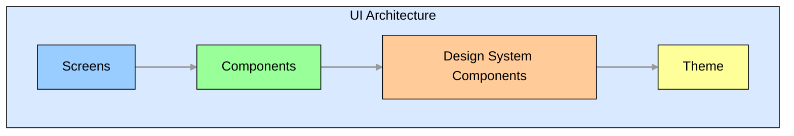
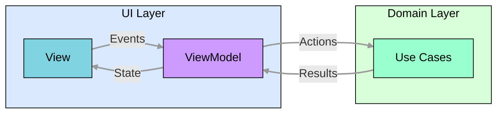

# 🎨 UI Architecture

The UI is built using Jetpack Compose with a component-based architecture following a modified Model-View-Intent (MVI) pattern. While we refer to it as MVI, our implementation uses "Events" instead of "Intents" for user interactions and "Actions" for use case calls. This architecture provides a unidirectional data flow, clear separation of concerns, and improved testability.

## 📱 Component Hierarchy

The UI components are organized in a hierarchical structure:



### 🖥️ Screens

- Top-level composables that represent a full screen in the application
- Typically associated with a specific route in the navigation graph
- Responsible for orchestrating components and managing screen-level state
- Connected to ViewModels that handle interaction logic and state management

Example:

```kotlin
@Composable
fun AccountSettingsScreen(
    viewModel: AccountSettingsViewModel = koinViewModel(),
    onNavigateNext: () -> Unit,
    onNavigateBack: () -> Unit,
) {
    val (state, dispatch) = viewModel.observe { effect ->
        when (effect) {
            AccountSettingsEffect.NavigateNext -> onNavigateNext()
            AccountSettingsEffect.NavigateBack -> onNavigateBack()
        }
    }

    AccountSettingsContent(
        state = state.value,
        onEvent = dispatch,
    )
}
```

### 🧩 Components

- Reusable UI elements that encapsulate specific functionality
- Can be composed of multiple smaller components
- Follow a clear input-output model with immutable state passed in and events emitted out
- Designed to be reusable across different screens

Example:

```kotlin
@Composable
fun AccountSettingsContent(
    state: AccountSettingsState,
    onEvent: (AccountSettingsEvent) -> Unit,
) {
    Scaffold(
        topBar = {
            TopAppBar(
                title = stringResource(R.string.account_settings_title),
                onNavigateBack = { onEvent(AccountSettingsEvent.BackClicked) },
            )
        },
    ) {
        when {
            state.isLoading -> LoadingIndicator()
            state.error != null -> ErrorView(
                message = state.error,
                onRetryClicked = { onEvent(AccountSettingsEvent.RetryClicked) }
            )
            state.settings != null -> AccountSettingsForm(
                settings = state.settings,
                onSettingChanged = { setting, value -> 
                    onEvent(AccountSettingsEvent.SettingChanged(setting, value))
                },
                onSaveClicked = { onEvent(AccountSettingsEvent.SaveClicked) }
            )
        }
    }
}
```

### 🎨 Design System Components

- Foundational UI elements that implement the design system
- Consistent visual language across the application
- Encapsulate styling, theming, and behavior from Material Design 3
- Located in the `core:ui:compose:designsystem` module for reuse across features

Example:

```kotlin
@Composable
fun PrimaryButton(
    text: String,
    onClick: () -> Unit,
    modifier: Modifier = Modifier,
    enabled: Boolean = true,
    buttonStyle: ButtonStyle = ButtonStyle.Primary,
) {
    Button(
        onClick = onClick,
        modifier = modifier,
        enabled = enabled,
        colors = buttonStyle.colors(),
        shape = MaterialTheme.shapes.medium,
    ) {
        Text(text = text)
    }
}
```

### 🎭 Theme

- Defines colors, typography, shapes, and other design tokens
- Supports light and dark modes
- Provides consistent visual appearance across the application
- Implemented using Material Design 3 theming system
- Located in the `core:ui:compose:theme` module for reuse across features
- Provides a `ThunderbirdTheme2` and a `K9MailTheme2` composable that wraps the MaterialTheme with custom color schemes, typography, and shapes.

## 🔄 MVI Implementation

The UI layer implements our modified Model-View-Intent (MVI) pattern for state management and user interactions. As mentioned earlier, we use "Events" instead of "Intents" and "Actions" for use case calls:



### 📋 State

- Immutable data classes representing the UI state
- Single source of truth for the UI
- Exposed as a StateFlow from the ViewModel
- Rendered by Compose UI components

Example:

```kotlin
data class AccountSettingsState(
    val isLoading: Boolean = false,
    val settings: AccountSettings? = null,
    val error: String? = null,
)
```

### 🎮 Events

- Represent user interactions or system events
- Passed from the UI to the ViewModel
- Trigger state updates or side effects

Example:

```kotlin
sealed interface AccountSettingsEvent {
    data class SettingChanged(val setting: Setting, val value: Any) : AccountSettingsEvent
    data object SaveClicked : AccountSettingsEvent
    data object RetryClicked : AccountSettingsEvent
    data object BackClicked : AccountSettingsEvent
}
```

### Effects

- Represent side effects or navigation actions
- Emitted by the ViewModel to trigger navigation or other actions
- Handled by the UI layer to perform navigation or show messages
  Example:

```kotlin
sealed interface AccountSettingsEffect {
    data object NavigateNext : AccountSettingsEffect
    data object NavigateBack : AccountSettingsEffect
}
```

### 🧠 ViewModel

- Processes events and updates state
- Coordinates with use cases for business logic
- Exposes state as a StateFlow
- Handles side effects through flows

Example:

```kotlin
class AccountSettingsViewModel(
    private val getAccountSettings: GetAccountSettingsUseCase,
    private val saveAccountSettings: SaveAccountSettingsUseCase,
) : BaseViewModel<AccountSettingsState, AccountSettingsEvent, AccountSettingsEffect>(
    initialState = AccountSettingsState()
) {

    private var currentSettings: AccountSettings? = null

    init {
        loadSettings()
    }

    override fun event(event: AccountSettingsEvent) {
        when (event) {
            is AccountSettingsEvent.SettingChanged -> updateSetting(event.setting, event.value)
            is AccountSettingsEvent.SaveClicked -> saveSettings()
            is AccountSettingsEvent.RetryClicked -> loadSettings()
            is AccountSettingsEvent.BackClicked -> emitEffect(AccountSettingsEffect.NavigateBack)
        }
    }

    private fun loadSettings() {
        viewModelScope.launch {
            updateState { it.copy(isLoading = true, error = null) }
            try {
                val settings = getAccountSettings()
                currentSettings = settings
                updateState { it.copy(isLoading = false, settings = settings) }
            } catch (e: Exception) {
                updateState { it.copy(isLoading = false, error = e.message ?: "Failed to load settings") }
            }
        }
    }

    private fun updateSetting(setting: Setting, value: Any) {
        currentSettings?.let { settings ->
            val updatedSettings = settings.copy(/* update specific setting */)
            currentSettings = updatedSettings
            updateState { it.copy(settings = updatedSettings) }
        }
    }

    private fun saveSettings() {
        currentSettings?.let { settings ->
            viewModelScope.launch {
                updateState { it.copy(isLoading = true, error = null) }
                try {
                    saveAccountSettings(settings)
                    emitEffect(AccountSettingsEffect.NavigateNext)
                } catch (e: Exception) {
                    updateState { it.copy(isLoading = false, error = e.message ?: "Failed to save settings") }
                }
            }
        }
    }
}
```

## 🧭 Navigation

The application uses the Jetpack Navigation Compose library for navigation between screens:

- **📱 Navigation Graph**: Defines the screens and their relationships
- **🔗 Navigation Arguments**: Type-safe arguments passed between destinations
- **🔙 Back Stack Management**: Handles the navigation back stack
- **↩️ Deep Linking**: Supports deep linking to specific screens

TODO: explain how to set up navigation in the app, including the navigation graph and how to navigate between screens.

## 🎭 Theming and Customization

The UI architecture supports comprehensive theming and customization:

- **✨ Material Design 3**: Based on Material Design 3 principles
- **🎨 Colors**: Custom color schemes with light and dark modes
  - **🌓 Dark Mode**: Full support for light and dark themes
  - **🌈 Dynamic Color**: Support for dynamic color based on system settings
- **🪜 Elevations**: Consistent elevation system for shadows
- **🖼️ Images**: Images and icons consistent with the theme
- **🔶 Shapes**: Customizable shape system for components
- **📐 Sizes**: Standardized sizes for components
- **📏 Spacings**: Consistent spacing system for layout
- **🅰️ Typography**: Consistent typography system

## ♿ Accessibility

The UI is designed with accessibility in mind:

- **🔍 Content Scaling**: Support for font scaling and dynamic text sizes
- **🎙️ Screen Readers**: Semantic properties for screen reader support
- **🎯 Touch Targets**: Appropriately sized touch targets
- **🎨 Color Contrast**: Sufficient color contrast for readability
- **⌨️ Keyboard Navigation**: Support for keyboard navigation

