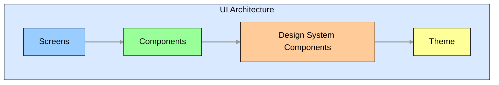
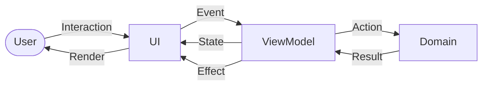
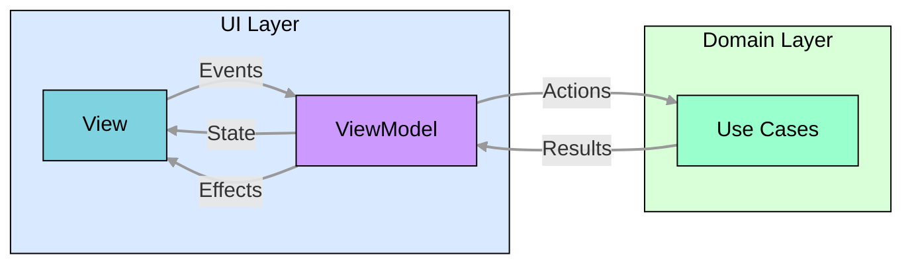
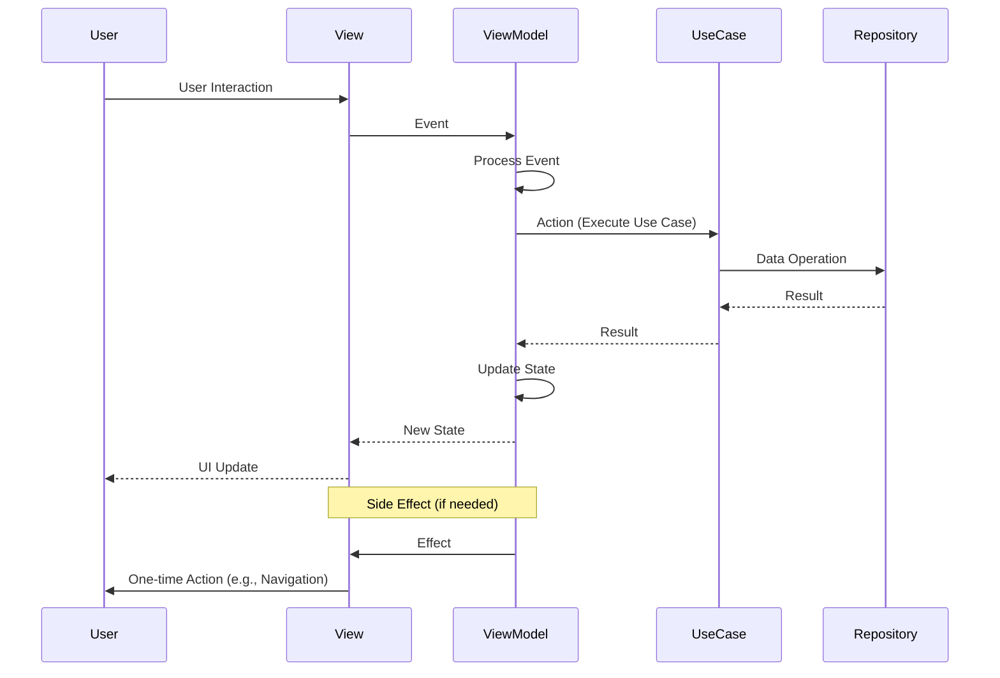

# 🎨 UI Architecture

The UI is built using Jetpack Compose with a component-based architecture following a modified Model-View-Intent (MVI) pattern. While we refer to it as MVI, our implementation uses "Events" instead of "Intents" for user interactions and "Actions" for use case calls. This architecture provides a unidirectional data flow, clear separation of concerns, and improved testability.

## 📱 Component Hierarchy

The UI components are organized in a hierarchical structure:



### 🖥️ Screens

- Top-level composables that represent a full screen in the application
- Typically associated with a specific route in the navigation graph
- Responsible for orchestrating components and managing screen-level state
- Connected to ViewModels that handle interaction logic and state management

Example:

```kotlin
@Composable
fun AccountSettingsScreen(
    viewModel: AccountSettingsViewModel = koinViewModel(),
    onNavigateNext: () -> Unit,
    onNavigateBack: () -> Unit,
) {
    val (state, dispatch) = viewModel.observe { effect ->
        when (effect) {
            AccountSettingsEffect.NavigateNext -> onNavigateNext()
            AccountSettingsEffect.NavigateBack -> onNavigateBack()
        }
    }

    AccountSettingsContent(
        state = state.value,
        onEvent = dispatch,
    )
}
```

### 🧩 Components

- Reusable UI elements that encapsulate specific functionality
- Can be composed of multiple smaller components
- Follow a clear input-output model with immutable state passed in and events emitted out
- Designed to be reusable across different screens

Example:

```kotlin
@Composable
fun AccountSettingsContent(
    state: AccountSettingsState,
    onEvent: (AccountSettingsEvent) -> Unit,
) {
    Scaffold(
        topBar = {
            TopAppBar(
                title = stringResource(R.string.account_settings_title),
                onNavigateBack = { onEvent(AccountSettingsEvent.BackClicked) },
            )
        },
    ) {
        when {
            state.isLoading -> LoadingIndicator()
            state.error != null -> ErrorView(
                message = state.error,
                onRetryClicked = { onEvent(AccountSettingsEvent.RetryClicked) }
            )
            state.settings != null -> AccountSettingsForm(
                settings = state.settings,
                onSettingChanged = { setting, value -> 
                    onEvent(AccountSettingsEvent.SettingChanged(setting, value))
                },
                onSaveClicked = { onEvent(AccountSettingsEvent.SaveClicked) }
            )
        }
    }
}
```

### 🎨 Design System Components

- Foundational UI elements that implement the design system
- Consistent visual language across the application
- Encapsulate styling, theming, and behavior from Material Design 3
- Located in the `core:ui:compose:designsystem` module for reuse across features
- Built using the [Atomic Design Methodology](design-system.md)

Example:

```kotlin
@Composable
fun PrimaryButton(
    text: String,
    onClick: () -> Unit,
    modifier: Modifier = Modifier,
    enabled: Boolean = true,
    buttonStyle: ButtonStyle = ButtonStyle.Primary,
) {
    Button(
        onClick = onClick,
        modifier = modifier,
        enabled = enabled,
        colors = buttonStyle.colors(),
        shape = MaterialTheme.shapes.medium,
    ) {
        Text(text = text)
    }
}
```

### 🎭 Theme

- Defines colors, typography, shapes, and other design tokens
- Supports light and dark modes
- Provides consistent visual appearance across the application
- Implemented using Material Design 3 theming system
- Located in the `core:ui:compose:theme2` module for reuse across features
- Provides a `ThunderbirdTheme2` and a `K9MailTheme2` composable that wraps the MaterialTheme with custom color schemes, typography, and shapes
- Uses Jetpack Compose's `CompositionLocalProvider` as a theme provider to make theme components available throughout the app

For a more detailed explanation of the theming system, including the theme provider implementation, see
[Theme System](theme-system.md).

## 📊 Unidirectional Data Flow

The UI architecture follows a unidirectional data flow pattern, which is a fundamental concept that ensures data moves
in a single, well-defined direction throughout the application. This architectural approach creates a predictable and
maintainable system by enforcing a strict flow of information.

### 🔄 What is Unidirectional Data Flow?

Unidirectional data flow is a design pattern where:

1. Data travels in one direction only
2. State changes are predictable and traceable
3. Components have clear, single responsibilities
4. The UI is a pure function of the application state

In our implementation, the flow follows this cycle:

1. **User Interaction**: The user interacts with the UI (e.g., clicks a button)
2. **Event Dispatch**: The UI captures this interaction as an Event and dispatches it to the ViewModel
3. **Event Processing**: The ViewModel processes the Event and determines what Action to take
4. **Action Execution**: The ViewModel executes an Action, typically by calling a Use Case
5. **Domain Logic**: The Use Case performs business logic, often involving repositories
6. **Result Return**: The Use Case returns a Result to the ViewModel
7. **State Update**: The ViewModel updates the State based on the Result
8. **UI Rendering**: The UI observes the State change and re-renders accordingly
9. **Effect Handling**: For one-time actions like navigation, the ViewModel emits an Effect that the UI handles

This cycle ensures that data flows in a single direction: UI → ViewModel → Domain → ViewModel → UI.



### 🌟 Benefits of Unidirectional Data Flow

Unidirectional data flow provides numerous advantages over bidirectional or unstructured data flow patterns:

1. **Predictability**: Since data flows in only one direction, the system behavior becomes more predictable and easier to reason about.

2. **Debugging**: Tracing issues becomes simpler because you can follow the data flow from source to destination without worrying about circular dependencies.

3. **State Management**: With a single source of truth (the ViewModel's state), there's no risk of inconsistent state across different parts of the application.

4. **Testability**: Each component in the flow can be tested in isolation with clear inputs and expected outputs.

5. **Separation of Concerns**: Each component has a well-defined responsibility:

   - UI: Render state and capture user interactions
   - ViewModel: Process events, update state, and emit effects
   - Domain: Execute business logic
6. **Scalability**: The pattern scales well as the application grows because new features can follow the same consistent pattern.
7. **Maintainability**: Code is easier to maintain because changes in one part of the flow don't unexpectedly affect other parts.
8. **Concurrency**: Reduces race conditions and timing issues since state updates happen in a controlled, sequential manner.

We leverage unidirectional data flow in our MVI implementation to ensure that the UI remains responsive, predictable,
and easy to test.

## 🔄 Model-View-Intent (MVI)

The UI layer follows the Model-View-Intent (MVI) pattern (with our Events/Effects/Actions adaptation as noted above), which
provides a unidirectional data flow and clear separation between UI state and UI logic.



**Key components**:
- **👁️ [View](ui-architecture.md#-view)**: Renders the UI based on the current state and sends user events to the ViewModel
- **🧠 [ViewModel](ui-architecture.md#-viewmodel)**: Processes user events, converting them into actions and sending them to the Domain Layer. It also maps the results to a state and sends state updates to the UI.
- **🧪 [Use Cases](ui-architecture.md#-use-cases)**: Encapsulate business logic and interact with repositories to perform data operations. They return results to the ViewModel, which updates the state.

**Unidirectional Data flow**:
- **📊 [State](ui-architecture.md#-state)**: Immutable representation of the UI state. States are the single source of truth for the UI and represent everything that can be displayed on the screen.
- **🎮 [Events](ui-architecture.md#-events)**: User interactions or system events that are passed to the ViewModel to be processed. Events trigger state changes or side effects.
- **🔔 [Effects](ui-architecture.md#-effects)**: One-time side effects that don't belong in the state, such as navigation actions, showing toasts, etc.
- **⚡ [Actions](ui-architecture.md#-actions)**: Operations triggered by the ViewModel to interact with the domain layer.
- **📊 [Results](ui-architecture.md#-results)**: Responses from the domain layer that are processed by the ViewModel to update the state.

### 🧩 Components

The MVI architecture is implemented using the following components:

#### 👁️ View

- Represents the UI layer in the MVI pattern
- Composed of Jetpack Compose components (Screens, Components, etc.)
- Responsible for rendering the UI state and capturing user interactions
- Sends events to the ViewModel and receives state updates
- Purely presentational with no business logic

In our architecture, the View is implemented using Jetpack Compose and consists of:

1. **Screen Composables**: Top-level composables that represent a full screen
2. **Content Composables**: Composables that render the UI based on the state
3. **Component Composables**: Reusable UI elements

Example of a View implementation:

```kotlin
// Screen Composable (part of the View)
@Composable
internal fun AccountSettingsScreen(
    onNavigateNext: () -> Unit,
    onNavigateBack: () -> Unit,
    viewModel: AccountSettingsViewModel = koinViewModel(),
) {
    // Observe state and handle effects
    val (state, dispatch) = viewModel.observe { effect ->
        when (effect) {
            AccountSettingsEffect.NavigateNext -> onNavigateNext()
            AccountSettingsEffect.NavigateBack -> onNavigateBack()
        }
    }

    // Content Composable (also part of the View)
    AccountSettingsContent(
        state = state.value,
        onEvent = dispatch,
    )
}

// Content Composable (part of the View)
@Composable
private fun AccountSettingsContent(
    state: AccountSettingsState,
    onEvent: (AccountSettingsEvent) -> Unit,
) {
    // Render UI based on state
    when {
        state.isLoading -> LoadingIndicator()
        state.error != null -> ErrorView(
            message = state.error,
            onRetryClicked = { onEvent(AccountSettingsEvent.RetryClicked) }
        )
        state.settings != null -> AccountSettingsForm(
            settings = state.settings,
            onSettingChanged = { setting, value -> 
                onEvent(AccountSettingsEvent.SettingChanged(setting, value))
            },
            onSaveClicked = { onEvent(AccountSettingsEvent.SaveClicked) }
        )
    }
}
```

The View is responsible for:
- Rendering the UI based on the current state
- Capturing user interactions and converting them to events
- Sending events to the ViewModel
- Handling side effects (like navigation)
- Maintaining a clear separation from business logic

#### 🧠 ViewModel

- Acts as the mediator between the View and the Domain layer
- Processes events from the View and updates state
- Coordinates with use cases for business logic
- Exposes state as a StateFlow for the View to observe
- Emits side effects for one-time actions like navigation

The ViewModel is implemented using the `BaseViewModel` class, which provides the core functionality for the MVI pattern:

```kotlin
abstract class BaseViewModel<STATE, EVENT, EFFECT>(
    initialState: STATE,
) : ViewModel(),
    UnidirectionalViewModel<STATE, EVENT, EFFECT> {

    private val _state = MutableStateFlow(initialState)
    override val state: StateFlow<STATE> = _state.asStateFlow()

    private val _effect = MutableSharedFlow<EFFECT>()
    override val effect: SharedFlow<EFFECT> = _effect.asSharedFlow()

    /**
     * Updates the [STATE] of the ViewModel.
     */
    protected fun updateState(update: (STATE) -> STATE) {
        _state.update(update)
    }

    /**
     * Emits a side effect.
     */
    protected fun emitEffect(effect: EFFECT) {
        viewModelScope.launch {
            _effect.emit(effect)
        }
    }
}
```

Example of a ViewModel implementation:

```kotlin
class AccountViewModel(
    private val getAccount: GetAccount,
    private val updateAccount: UpdateAccount,
) : BaseViewModel<AccountState, AccountEvent, AccountEffect>(
    initialState = AccountState()
) {
    // Handle events from the UI
    override fun event(event: AccountEvent) {
        when (event) {
            is AccountEvent.LoadAccount -> loadAccount(event.accountId)
            is AccountEvent.UpdateAccount -> saveAccount(event.account)
            is AccountEvent.BackClicked -> emitEffect(AccountEffect.NavigateBack)
        }
    }

    // Load account data
    private fun loadAccount(accountId: String) {
        viewModelScope.launch {
            // Update state to show loading
            updateState { it.copy(isLoading = true) }

            // Call use case to get account
            val account = getAccount(accountId)

            // Update state with account data
            updateState { 
                it.copy(
                    isLoading = false,
                    account = account
                )
            }
        }
    }

    // Save account changes
    private fun saveAccount(account: Account) {
        viewModelScope.launch {
            // Update state to show loading
            updateState { it.copy(isLoading = true) }

            // Call use case to update account
            val result = updateAccount(account)

            // Handle result
            if (result.isSuccess) {
                updateState { it.copy(isLoading = false) }
                emitEffect(AccountEffect.NavigateBack)
            } else {
                updateState { 
                    it.copy(
                        isLoading = false,
                        error = "Failed to save account"
                    )
                }
            }
        }
    }
}
```

#### 🧪 Use Cases

- Encapsulate business logic in the domain layer
- Follow the single responsibility principle
- Independent of UI and framework concerns
- Can be easily tested in isolation
- Invoked by ViewModels through Actions
- Implemented using the `operator fun invoke` pattern for cleaner, more concise code

Use Cases represent the business logic of the application and are part of the domain layer. They encapsulate specific operations that the application can perform, such as creating an account, fetching data, or updating settings. Use cases should be implemented using the `operator fun invoke` pattern, which allows them to be called like functions.

> [!NOTE]
> Use Cases are only required when there needs to be business logic (such as validation, transformation, or complex operations). For simple CRUD operations or direct data access with no additional logic, ViewModels can use repositories directly. This approach reduces unnecessary abstraction layers while still maintaining clean architecture principles.

Example of a Use Case:

```kotlin
// Use Case interface using operator fun invoke pattern
fun interface CreateAccount {
    suspend operator fun invoke(accountState: AccountState): AccountCreatorResult
}

// Use Case implementation
class CreateAccountImpl(
    private val accountCreator: AccountCreator,
    private val accountValidator: AccountValidator,
) : CreateAccount {

    override suspend operator fun invoke(accountState: AccountState): AccountCreatorResult {
        // Validate account data
        val validationResult = accountValidator.validate(accountState)
        if (validationResult is ValidationResult.Failure) {
            return AccountCreatorResult.Error.Validation(validationResult.errors)
        }

        // Create account
        return try {
            val accountUuid = accountCreator.createAccount(accountState)
            AccountCreatorResult.Success(accountUuid)
        } catch (e: Exception) {
            AccountCreatorResult.Error.Creation(e.message ?: "Unknown error")
        }
    }
}
```

Use Cases are typically:
- Injected into ViewModels
- Invoked in response to user events
- Responsible for orchestrating repositories and other domain services
- Returning results that the ViewModel can use to update the UI state

The separation of Use Cases from ViewModels allows for:
- Better testability of business logic
- Reuse of business logic across different features
- Clear separation of concerns
- Easier maintenance and evolution of the codebase

### Data Flow Components

#### 📊 State

- Immutable data classes representing the UI state
- Single source of truth for the UI
- Exposed as a StateFlow from the ViewModel
- Rendered by Compose UI components

**Example: State in Action**

Here's a complete example showing how state is defined, updated, and consumed:

```kotlin
// 1. Define the state
data class AccountSettingsState(
    val isLoading: Boolean = false,
    val settings: AccountSettings? = null,
    val error: String? = null,
)

// 2. Update state in ViewModel
class AccountSettingsViewModel(
    private val getSettings: GetAccountSettings,
) : BaseViewModel<AccountSettingsState, AccountSettingsEvent, AccountSettingsEffect>(
    initialState = AccountSettingsState(isLoading = true)
) {
    init {
        loadSettings()
    }

    private fun loadSettings() {
        viewModelScope.launch {
            try {
                val settings = getSettings()
                // Update state with loaded settings
                updateState { it.copy(isLoading = false, settings = settings, error = null) }
            } catch (e: Exception) {
                // Update state with error
                updateState { it.copy(isLoading = false, settings = null, error = e.message) }
            }
        }
    }

    override fun event(event: AccountSettingsEvent) {
        when (event) {
            is AccountSettingsEvent.RetryClicked -> {
                // Update state to show loading and retry
                updateState { it.copy(isLoading = true, error = null) }
                loadSettings()
            }
            // Handle other events...
        }
    }
}

// 3. Consume state in UI
@Composable
fun AccountSettingsContent(
    state: AccountSettingsState,
    onEvent: (AccountSettingsEvent) -> Unit,
) {
    when {
        state.isLoading -> {
            // Show loading UI
            CircularProgressIndicator(
                modifier = Modifier.align(Alignment.Center)
            )
        }
        state.error != null -> {
            // Show error UI
            ErrorView(
                message = state.error,
                onRetryClicked = { onEvent(AccountSettingsEvent.RetryClicked) }
            )
        }
        state.settings != null -> {
            // Show settings form
            AccountSettingsForm(
                settings = state.settings,
                onSettingChanged = { setting, value -> 
                    onEvent(AccountSettingsEvent.SettingChanged(setting, value))
                }
            )
        }
    }
}
```

#### 🎮 Events

- Represent user interactions or system events
- Passed from the UI to the ViewModel
- Trigger state updates or side effects

**Example: Events in Action**

Here's a complete example showing how events are defined, dispatched, and handled:

```kotlin
// 1. Define events
sealed interface AccountSettingsEvent {
    data class SettingChanged(val setting: Setting, val value: Any) : AccountSettingsEvent
    data object SaveClicked : AccountSettingsEvent
    data object RetryClicked : AccountSettingsEvent
    data object BackClicked : AccountSettingsEvent
}

// 2. Handle events in ViewModel
class AccountSettingsViewModel(
    private val saveSettings: SaveAccountSettings,
) : BaseViewModel<AccountSettingsState, AccountSettingsEvent, AccountSettingsEffect>(
    initialState = AccountSettingsState()
) {
    override fun event(event: AccountSettingsEvent) {
        when (event) {
            is AccountSettingsEvent.SettingChanged -> {
                // Update state with new setting value
                updateState { state ->
                    val updatedSettings = state.settings?.copy() ?: return@updateState state
                    updatedSettings.updateSetting(event.setting, event.value)
                    state.copy(settings = updatedSettings)
                }
            }
            is AccountSettingsEvent.SaveClicked -> saveAccountSettings()
            is AccountSettingsEvent.RetryClicked -> loadSettings()
            is AccountSettingsEvent.BackClicked -> 
                emitEffect(AccountSettingsEffect.NavigateBack)
        }
    }

    private fun saveAccountSettings() {
        viewModelScope.launch {
            updateState { it.copy(isLoading = true) }

            val result = saveSettings(state.value.settings!!)

            if (result.isSuccess) {
                emitEffect(AccountSettingsEffect.ShowMessage("Settings saved"))
                emitEffect(AccountSettingsEffect.NavigateBack)
            } else {
                updateState { it.copy(
                    isLoading = false,
                    error = "Failed to save settings"
                )}
            }
        }
    }

    // Other methods...
}

// 3. Dispatch events from UI
@Composable
fun AccountSettingsContent(
    state: AccountSettingsState,
    onEvent: (AccountSettingsEvent) -> Unit,
) {
    Column(modifier = Modifier.padding(16.dp)) {
        if (state.settings != null) {
            // Setting fields
            for (setting in state.settings.items) {
                SettingItem(
                    setting = setting,
                    onValueChanged = { newValue ->
                        // Dispatch SettingChanged event
                        onEvent(AccountSettingsEvent.SettingChanged(setting, newValue))
                    }
                )
            }

            // Save button
            Button(
                onClick = { 
                    // Dispatch SaveClicked event
                    onEvent(AccountSettingsEvent.SaveClicked) 
                },
                modifier = Modifier.align(Alignment.End)
            ) {
                Text("Save")
            }
        }

        // Back button
        TextButton(
            onClick = { 
                // Dispatch BackClicked event
                onEvent(AccountSettingsEvent.BackClicked) 
            }
        ) {
            Text("Back")
        }
    }
}
```

#### 🔔 Effects

- Represent one-time side effects that don't belong in the state
- Emitted by the ViewModel to trigger navigation, show messages, or perform other one-time actions
- Handled by the UI layer (Screen composables) to execute the appropriate action
- Implemented using Kotlin's `SharedFlow` for asynchronous, non-blocking delivery

Effects are essential for handling actions that should happen only once and shouldn't be part of the UI state. Common use cases for effects include:

- Navigation (e.g., navigating to another screen)
- Showing transient UI elements (e.g., snackbars, toasts)
- Playing sounds or haptic feedback
- Triggering system actions (e.g., sharing content, opening URLs)

**Example: Effects in Action**

Here's a simplified example showing how effects are defined, emitted, and handled:

```kotlin
// 1. Define effects
sealed interface AccountSettingsEffect {
    data object NavigateBack : AccountSettingsEffect
    data class ShowMessage(val message: String) : AccountSettingsEffect
}

// 2. Emit effects from ViewModel
class AccountSettingsViewModel : BaseViewModel<AccountSettingsState, AccountSettingsEvent, AccountSettingsEffect>(
    initialState = AccountSettingsState()
) {
    override fun event(event: AccountSettingsEvent) {
        when (event) {
            is AccountSettingsEvent.SaveClicked -> {
                // Save settings and show success message
                emitEffect(AccountSettingsEffect.ShowMessage("Settings saved"))
                emitEffect(AccountSettingsEffect.NavigateBack)
            }
            is AccountSettingsEvent.BackClicked -> 
                emitEffect(AccountSettingsEffect.NavigateBack)
        }
    }
}

// 3. Handle effects in UI
@Composable
fun AccountSettingsScreen(
    onNavigateBack: () -> Unit,
    viewModel: AccountSettingsViewModel = koinViewModel(),
) {
    val snackbarHostState = remember { SnackbarHostState() }

    val (state, dispatch) = viewModel.observe { effect ->
        when (effect) {
            AccountSettingsEffect.NavigateBack -> onNavigateBack()
            is AccountSettingsEffect.ShowMessage -> {
                CoroutineScope(Dispatchers.Main).launch {
                    snackbarHostState.showSnackbar(effect.message)
                }
            }
        }
    }

    // Screen content with snackbar host...
}
```

#### ⚡ Actions

- Represent calls to domain layer use cases
- Triggered by the ViewModel in response to events
- Bridge between UI and domain layers
- Execute business logic and return results to the ViewModel

Example:

```kotlin
// In a domain layer repository interface
interface AccountRepository {
    suspend fun getAccount(accountId: String): Account
    suspend fun updateAccount(account: Account): Result<Unit>
    suspend fun deleteAccount(accountId: String): Result<Unit>
}

// Use case with operator fun invoke pattern (recommended approach)
// In a domain layer use case interface
fun interface UpdateAccount {
    suspend operator fun invoke(account: Account): Result<Unit>
}

// Use case implementation
class UpdateAccountImpl(
    private val accountRepository: AccountRepository
) : UpdateAccount {
    override suspend operator fun invoke(account: Account): Result<Unit> {
        return accountRepository.updateAccount(account)
    }
}

// In the ViewModel
class AccountSettingsViewModel(
    private val updateAccount: UpdateAccount,
) : BaseViewModel<AccountSettingsState, AccountSettingsEvent, AccountSettingsEffect>(
    initialState = AccountSettingsState()
) {
    // Event handler
    override fun event(event: AccountSettingsEvent) {
        when (event) {
            is AccountSettingsEvent.SaveClicked -> saveAccount() // Triggers an action
        }
    }

    // Action
    private fun saveAccount() {
        viewModelScope.launch {
            updateState { it.copy(isLoading = true) }

            // Call to domain layer use case (the action) using invoke operator
            val result = updateAccount(currentAccount)

            when (result) {
                is Result.Success -> {
                    updateState { it.copy(isLoading = false) }
                    emitEffect(AccountSettingsEffect.NavigateBack)
                }
                is Result.Error -> {
                    updateState { 
                        it.copy(
                            isLoading = false,
                            error = result.message
                        )
                    }
                }
            }
        }
    }
}
```

#### 📊 Results (Outcomes)

- Represent the outcome of actions executed by use cases
- Can be success or error
- Used by the ViewModel to update the state or emit effects

**Example:**

```kotlin
// Result types for account creation
sealed interface AccountCreatorResult {
    data class Success(val accountUuid: String) : AccountCreatorResult

    sealed interface Error : AccountCreatorResult {
        data class Validation(val errors: List<ValidationError>) : Error
        data class Creation(val message: String) : Error
        data class Network(val exception: NetworkException) : Error
    }
}

// In ViewModel
private fun handleResult(result: AccountCreatorResult) {
    when (result) {
        is AccountCreatorResult.Success -> {
            // Update state with success
            updateState { it.copy(isLoading = false, error = null) }
            // Emit navigation effect
            emitEffect(Effect.NavigateNext(AccountUuid(result.accountUuid)))
        }
        is AccountCreatorResult.Error -> {
            // Update state with error
            updateState { it.copy(isLoading = false, error = result) }
            // Optionally emit effect for error handling
            when (result) {
                is AccountCreatorResult.Error.Network -> 
                    emitEffect(Effect.ShowNetworkError(result.exception))
                else -> { /* Handle other errors */ }
            }
        }
    }
}
```

## 🧭 Navigation

The application uses the Jetpack Navigation Compose library for navigation between screens:

- **📱 Navigation Graph**: Defines the screens and their relationships
- **🔗 Navigation Arguments**: Type-safe arguments passed between destinations
- **🔙 Back Stack Management**: Handles the navigation back stack
- **↩️ Deep Linking**: Supports deep linking to specific screens

### Navigation Setup

To set up navigation in the app, you need to:

1. Define route constants
2. Create a NavHost with composable destinations
3. Handle navigation callbacks in screens
4. Use ViewModels to emit navigation effects

Example:

```kotlin
// Define route constants
private const val ROUTE_HOME = "home"
private const val ROUTE_SETTINGS = "settings"
private const val ROUTE_DETAILS = "details/{itemId}"

@Composable
fun AppNavHost(
    onFinish: () -> Unit,
) {
    val navController = rememberNavController()

    NavHost(
        navController = navController,
        startDestination = ROUTE_HOME,
    ) {
        composable(route = ROUTE_HOME) {
            HomeScreen(
                onNavigateToSettings = { navController.navigate(ROUTE_SETTINGS) },
                onNavigateToDetails = { itemId -> 
                    navController.navigate("details/$itemId") 
                },
                viewModel = koinViewModel(),
            )
        }

        composable(route = ROUTE_SETTINGS) {
            SettingsScreen(
                onBack = { navController.popBackStack() },
                onFinish = onFinish,
                viewModel = koinViewModel(),
            )
        }

        composable(
            route = ROUTE_DETAILS,
            arguments = listOf(
                navArgument("itemId") { type = NavType.StringType }
            )
        ) { backStackEntry ->
            val itemId = backStackEntry.arguments?.getString("itemId") ?: ""
            DetailsScreen(
                itemId = itemId,
                onBack = { navController.popBackStack() },
                viewModel = koinViewModel(),
            )
        }
    }
}
```

### Navigation in Screens

In your screen composables, you handle navigation by observing effects from the ViewModel:

```kotlin
@Composable
fun HomeScreen(
    onNavigateToSettings: () -> Unit,
    onNavigateToDetails: (String) -> Unit,
    viewModel: HomeViewModel,
) {
    val (state, dispatch) = viewModel.observe { effect ->
        when (effect) {
            is HomeEffect.NavigateToSettings -> onNavigateToSettings()
            is HomeEffect.NavigateToDetails -> onNavigateToDetails(effect.itemId)
        }
    }

    // Screen content
}
```

### Navigation in ViewModels

In your ViewModels, you emit navigation effects:

```kotlin
class HomeViewModel : BaseViewModel<HomeState, HomeEvent, HomeEffect>(
    initialState = HomeState()
) {
    override fun event(event: HomeEvent) {
        when (event) {
            is HomeEvent.SettingsClicked -> emitEffect(HomeEffect.NavigateToSettings)
            is HomeEvent.ItemClicked -> emitEffect(HomeEffect.NavigateToDetails(event.itemId))
        }
    }
}
```

## 🔄 Complete End-to-End Example

Here's a complete example of how all the components work together in a real-world scenario, using the CreateAccount feature:

### 1. Define the Contract

First, define the contract that specifies the State, Events, and Effects:

```kotlin
interface CreateAccountContract {

    interface ViewModel : UnidirectionalViewModel<State, Event, Effect>

    data class State(
        override val isLoading: Boolean = true,
        override val error: Error? = null,
    ) : LoadingErrorState<Error>

    sealed interface Event {
        data object CreateAccount : Event
        data object OnBackClicked : Event
    }

    sealed interface Effect {
        data class NavigateNext(val accountUuid: AccountUuid) : Effect
        data object NavigateBack : Effect
    }
}
```

### 2. Implement the ViewModel

Next, implement the ViewModel that handles events, updates state, and emits effects:

```kotlin
class CreateAccountViewModel(
    private val createAccount: CreateAccount,
    private val accountStateRepository: AccountStateRepository,
    initialState: State = State(),
) : BaseViewModel<State, Event, Effect>(initialState),
    CreateAccountContract.ViewModel {

    override fun event(event: Event) {
        when (event) {
            Event.CreateAccount -> createAccount()
            Event.OnBackClicked -> maybeNavigateBack()
        }
    }

    private fun createAccount() {
        val accountState = accountStateRepository.getState()

        viewModelScope.launch {
            updateState { it.copy(isLoading = true, error = null) }

            when (val result = createAccount(accountState)) {
                is AccountCreatorResult.Success -> showSuccess(AccountUuid(result.accountUuid))
                is AccountCreatorResult.Error -> showError(result)
            }
        }
    }

    private fun showSuccess(accountUuid: AccountUuid) {
        updateState {
            it.copy(
                isLoading = false,
                error = null,
            )
        }

        viewModelScope.launch {
            delay(WizardConstants.CONTINUE_NEXT_DELAY)
            navigateNext(accountUuid)
        }
    }

    private fun showError(error: AccountCreatorResult.Error) {
        updateState {
            it.copy(
                isLoading = false,
                error = error,
            )
        }
    }

    private fun maybeNavigateBack() {
        if (!state.value.isLoading) {
            navigateBack()
        }
    }

    private fun navigateBack() {
        viewModelScope.coroutineContext.cancelChildren()
        emitEffect(Effect.NavigateBack)
    }

    private fun navigateNext(accountUuid: AccountUuid) {
        viewModelScope.coroutineContext.cancelChildren()
        emitEffect(Effect.NavigateNext(accountUuid))
    }
}
```

### 3. Create the Screen Composable

Then, create the screen composable that observes the ViewModel and handles effects:

```kotlin
@Composable
internal fun CreateAccountScreen(
    onNext: (AccountUuid) -> Unit,
    onBack: () -> Unit,
    viewModel: ViewModel,
    brandNameProvider: BrandNameProvider,
    modifier: Modifier = Modifier,
) {
    val (state, dispatch) = viewModel.observe { effect ->
        when (effect) {
            Effect.NavigateBack -> onBack()
            is Effect.NavigateNext -> onNext(effect.accountUuid)
        }
    }

    LaunchedEffect(key1 = Unit) {
        dispatch(Event.CreateAccount)
    }

    BackHandler {
        dispatch(Event.OnBackClicked)
    }

    Scaffold(
        topBar = {
            AppTitleTopHeader(
                title = brandNameProvider.brandName,
            )
        },
        bottomBar = {
            WizardNavigationBar(
                onNextClick = {},
                onBackClick = {
                    dispatch(Event.OnBackClicked)
                },
                state = WizardNavigationBarState(
                    showNext = false,
                    isBackEnabled = state.value.error != null,
                ),
            )
        },
        modifier = modifier,
    ) { innerPadding ->
        CreateAccountContent(
            state = state.value,
            contentPadding = innerPadding,
        )
    }
}
```

### 4. Create the Content Composable

Finally, create the content composable that renders the UI based on the state:

```kotlin
@Composable
private fun CreateAccountContent(
    state: State,
    contentPadding: PaddingValues,
    modifier: Modifier = Modifier,
) {
    Box(
        modifier = modifier
            .fillMaxSize()
            .padding(contentPadding),
    ) {
        when {
            state.isLoading -> {
                CircularProgressIndicator(
                    modifier = Modifier.align(Alignment.Center),
                )
            }
            state.error != null -> {
                ErrorView(
                    error = state.error,
                    modifier = Modifier.align(Alignment.Center),
                )
            }
        }
    }
}
```

### 5. Add to Navigation

Add the screen to the navigation graph:

```kotlin
NavHost(
    navController = navController,
    startDestination = ROUTE_HOME,
) {
    // Other composables...

    composable(route = NESTED_NAVIGATION_CREATE_ACCOUNT) {
        CreateAccountScreen(
            onNext = { accountUuid -> onFinish(AccountSetupRoute.AccountSetup(accountUuid.value)) },
            onBack = { navController.popBackStack() },
            viewModel = koinViewModel<CreateAccountViewModel>(),
            brandNameProvider = koinInject(),
        )
    }
}
```

This example demonstrates the complete flow from UI to ViewModel to Domain and back, showing how all the components work together in a real-world scenario.

## 🔄 Component Interactions and State Changes

Understanding how components interact and how state changes flow through the system is crucial for working with our MVI architecture. Here's a detailed explanation of the interaction flow:



### Interaction Flow

1. **User Interaction**: The user interacts with the UI (e.g., clicks a button, enters text)
2. **Event Dispatch**: The View captures this interaction and dispatches an Event to the ViewModel
3. **Event Processing**: The ViewModel processes the Event and determines what action to take
4. **Action Execution**: The ViewModel executes an Action, typically by calling a Use Case
5. **Domain Logic**: The Use Case executes business logic, often involving repositories or other domain services
6. **Result Handling**: The Use Case returns a result to the ViewModel
7. **State Update**: The ViewModel updates its State based on the result
8. **UI Update**: The View observes the State change and updates the UI accordingly
9. **Side Effects (if needed)**: For one-time actions like navigation, the ViewModel emits an Effect that the View handles

### State Changes

State changes follow a unidirectional flow:

1. **State Immutability**: The State is an immutable data class that represents the entire UI state
2. **Single Source of Truth**: The ViewModel is the single source of truth for the State
3. **State Updates**: Only the ViewModel can update the State, using the `updateState` method
4. **State Observation**: The View observes the State using `collectAsStateWithLifecycle()` and recomposes when it changes
5. **State Rendering**: The View renders the UI based on the current State

Example of state changes in the ViewModel:

```kotlin
// Initial state
val initialState = AccountSettingsState(isLoading = false, settings = null, error = null)

// Update state to show loading
updateState { it.copy(isLoading = true, error = null) }

// Update state with loaded settings
updateState { it.copy(isLoading = false, settings = loadedSettings, error = null) }

// Update state to show error
updateState { it.copy(isLoading = false, error = "Failed to load settings") }
```

### Component Responsibilities

Each component has specific responsibilities in the interaction flow:

1. **View**:
   - Render UI based on State
   - Capture user interactions
   - Dispatch Events to ViewModel
   - Handle Effects (e.g., navigation)
2. **ViewModel**:
   - Process Events
   - Execute Actions (Use Cases)
   - Update State
   - Emit Effects
3. **Use Cases**:
   - Execute business logic
   - Coordinate with repositories and domain services
   - Return results to ViewModel
4. **Repositories**:
   - Provide data access
   - Handle data operations
   - Return data to Use Cases

This clear separation of responsibilities ensures that each component focuses on its specific role, making the codebase more maintainable, testable, and scalable.

## ♿ Accessibility

The UI is designed with accessibility in mind:

- **🔍 Content Scaling**: Support for font scaling and dynamic text sizes
- **🎙️ Screen Readers**: Semantic properties for screen reader support
- **🎯 Touch Targets**: Appropriately sized touch targets
- **🎨 Color Contrast**: Sufficient color contrast for readability
- **⌨️ Keyboard Navigation**: Support for keyboard navigation

