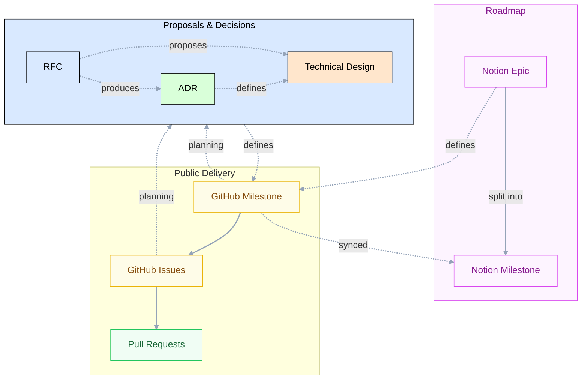
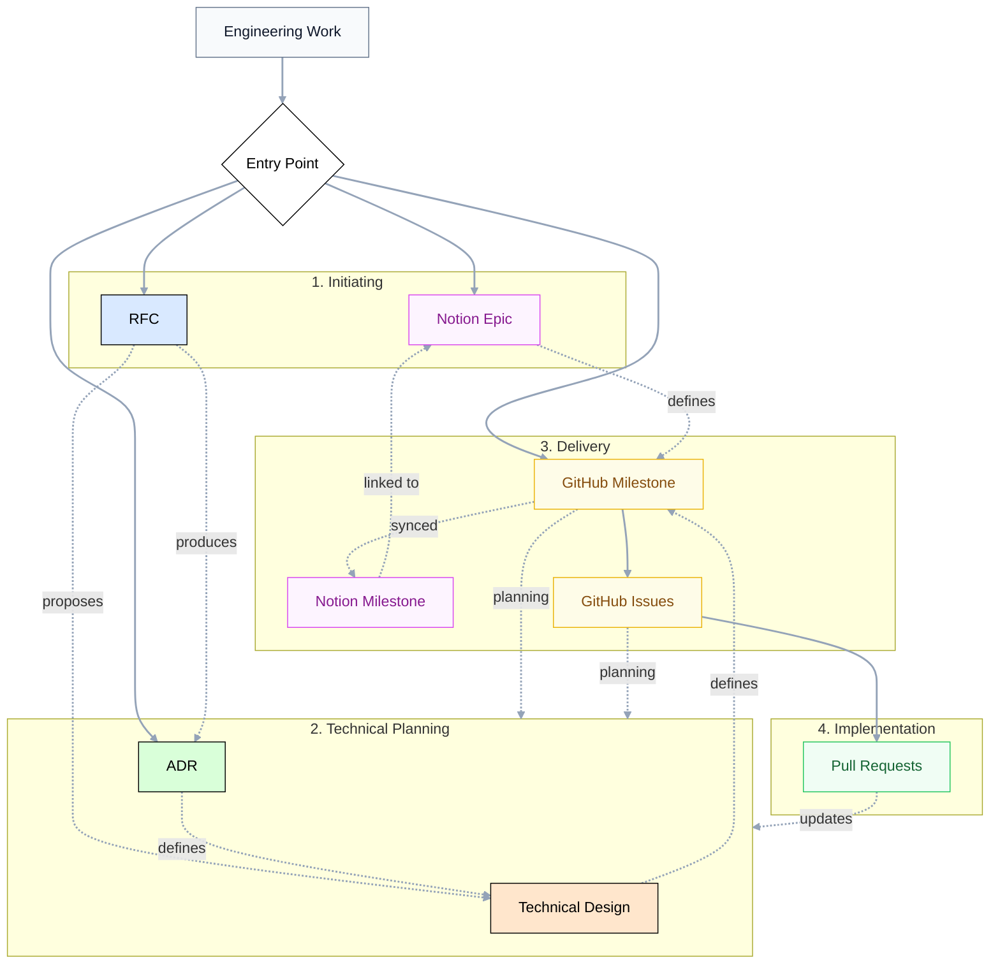

# Engineering

The Engineering section defines the processes and artifacts used to propose, decide, and deliver technical changes. It connects high-level roadmap planning with public delivery work through RFCs, Technical Designs, and Architecture Decision Records (ADRs).

Use the smallest set of documents and issues that makes the work clear, reviewable, and maintainable.

## Overview

Our engineering process connects high-level technical decisions with public delivery work and internal roadmap planning.

### The Three Pillars

The process is built on three pillars that serve different purposes and audiences:

1. **Roadmap**: The high-level layer managed through **Notion Epics** and **Notion Milestones**. The roadmap is the leading influence for Thunderbird maintainers. This is used for high-level reporting and resource planning.
2. **Public Delivery**: The public project management layer. We use **GitHub Milestones**, **features**, and **tasks** to track *what* is being delivered and *when*. This is the source of truth for all delivery work, including milestone creation and technical planning, and the layer visible to external contributors.
3. **Proposals & Decisions**: Technical documentation (RFCs, ADRs, Technical Designs) stored in the repository. These define *why* and *how* we build things. They are the durable technical record for all contributors and maintainers.

### Continuous Synchronization

We maintain a strict relationship between public delivery and the roadmap:

- **Milestone Sync**: Every **GitHub Milestone** is automatically synced to Notion as a **Notion Milestone**. This ensures that roadmap progress reflects actual delivery status.
- **Public First**: Public GitHub artifacts must always be understandable on their own. We never reference internal Notion artifacts as the only source of requirements or technical detail.
- **Durable Records**: While discussions happen in Pull Requests and Issues, the final decisions and Technical Designs must be captured in the durable artifacts (ADRs, RFCs, or Technical Designs) to remain discoverable for future contributors.

## Artifacts

### Roadmap

Roadmap artifacts are used to track work against the project's long-term goals. We use two types of artifacts:

#### Notion Epic

A Notion epic is an internal roadmap artifact and the leading influence for Thunderbird maintainers.

A Notion epic is typically split into multiple **Milestones**. Each milestone is created in GitHub, synced to Notion as a **Notion Milestone**, and then linked back to the epic to track progress against the roadmap goal.

Notion epics are internal. Public GitHub artifacts (Milestones and Issues) should not require access to Notion to be understood.

#### Notion Milestone

A Notion milestone is the internal Notion representation of a synced GitHub milestone issue.

It may stand on its own or be manually linked to a Notion epic.

The GitHub milestone issue remains the source of truth for delivery scope, creation, and progress.

### Public Delivery

GitHub artifacts are used to track and deliver work.

#### GitHub Milestone

A GitHub Milestone defines a public delivery outcome and is the primary driver for technical planning. Defining the milestone is a critical first step of the delivery phase.

Use a GitHub Milestone to describe the objective, scope, out-of-scope work, relevant requirements, and links to related
work.

A GitHub Milestone may stand on its own. It does not need to belong to a Notion epic.

RFCs, ADRs, and Technical Designs may link to a GitHub Milestone when they define the direction for a delivery outcome. A milestone is often the primary driver for these artifacts; it can include specific tasks to define and review the required technical documentation before implementation starts.

#### GitHub Feature or Task

These issues describe the specific work needed for a milestone.
- **Feature**: User-facing or product-visible work.
- **Task**: Supporting engineering work (refactoring, tooling, etc.).

Engineers use these issues to break milestone work into reviewable and assignable pieces. When a milestone requires a new technical direction, specific **Task Issues** are often created to track the delivery of the required RFC, ADR, or Technical Design.

### Proposals & Decisions

Technical documentation helps us reach consensus and record why decisions were made. All proposals and designs are reviewed and approved by **maintainers**.

### RFC

An RFC proposes a technical direction before implementation starts.

Use an RFC when the team needs to agree on direction before implementation, especially when there are multiple reasonable
approaches, broad impact, or unclear scope.

RFCs are stored in the repository and reviewed through [pull requests](../contributing/contribution-workflow.md).

### ADR

An ADR records a durable architectural decision.

Use an ADR when future contributors need to understand what decision was made, why it was made, and what consequences
it has.

An ADR may come from an RFC, technical design, implementation PR, or stand on its own.

ADRs are stored in the [**`docs/engineering/adr`**](adr/README.md) directory.

### Technical Design

A technical design describes how an accepted direction will be implemented.

Use a technical design when implementation details are too large for an RFC, such as schemas, API contracts, migration
plans, runtime behavior, build tooling, or multi-PR implementation plans.

## Process

The engineering process is flexible and scales with the complexity of the change. Work can start from a proposal,
a milestone, a roadmap item, or a small implementation need.

### 1. Initiating Work

Work enters the process through different channels depending on its nature:
-   **Roadmap**: High-level goals start as a **Notion Epic**. These are split into multiple outcomes, each requiring the **Definition of a GitHub Milestone**.
-   **Public Delivery**: Specific product requirements start with the **Definition of a GitHub Milestone**. For external contributors, this is the primary entry point.
-   **Proposals**: New technical ideas or significant changes start as an **RFC**.
-   **Direct Decisions**: Architectural changes that don't require a broad RFC discussion start as an **ADR**.

### 2. Technical Planning

For non-trivial changes, we use durable artifacts to reach consensus before writing production code. All planning artifacts are reviewed by **maintainers**:
-   **RFC to ADR**: If an RFC results in a significant architectural change, it should produce an ADR to record the decision.
-   **RFC to Technical Design**: If the implementation details are complex, an RFC leads to a **Technical Design**.
-   **Direct to Milestone**: If the direction is clear and the impact is contained, a proposal can go directly to a **GitHub Milestone**.

### 3. Transitioning to Delivery

Work is organized for delivery through milestones. This phase transitions high-level goals or technical designs into a concrete delivery plan.

- **Defining the Milestone**: Every non-trivial delivery outcome must be defined as a **GitHub Milestone**. This is the source of truth where we establish the objective, scope, out-of-scope items, and success criteria.
- **Technical Planning**: Every non-trivial milestone requires technical planning. If the technical direction is not yet fully defined, the milestone includes **Task Issues** to create and review the necessary RFC, ADR, or Technical Design.
- **Synchronization**: The GitHub Milestone is synced to a **Notion Milestone**, which is then linked to a **Notion Epic** for roadmap tracking.
- **Decomposition**: The milestone is broken down into **GitHub Feature Issues** (user-facing) and **GitHub Task Issues** (supporting work) for implementation.

### 4. Implementation & Feedback

Implementation happens in **Pull Requests** (PRs):
-   **Small Changes**: Tiny fixes or refactorings can skip the planning artifacts and go directly to a PR or a task issue.
-   **Durable Updates**: If a code review reveals that the original Technical Design or decision was flawed, the corresponding RFC, ADR, or Technical Design must be updated. This ensures the repository remains an accurate record of our technical state.
-   **Atomic Delivery**: PRs should be small and focused on a single feature or task issue.

## Common Scenarios

The following scenarios help you choose the right path for your work.

### 1. Small Fix or Improvement

**Examples**: Minor refactorings, documentation typos, or small UI tweaks.
- **Artifacts**: GitHub Task Issue (optional) + Pull Request.
- **Flow**: Go straight to code. Use a task issue if the work needs to be tracked or assigned before the PR is ready.

### 2. Standard Feature or Scoped Change

**Examples**: A new user-facing setting, a small feature, or a well-defined library update.
- **Artifacts**: GitHub Milestone + GitHub Feature/Task Issues + Pull Requests.
- **Flow**: Define the outcome in a **GitHub Milestone**, break it down into issues, and implement.

### 3. Complex Feature or Significant Change

**Examples**: Implementing a new protocol, a major UI overhaul, or a multi-PR feature.
- **Artifacts**: GitHub Milestone + Technical Design + Issues + PRs.
- **Flow**: Start with a **GitHub Milestone** to define the goal. Use a **Task Issue** within the milestone to create a **Technical Design**, get feedback, and then proceed to implementation.

### 4. New Technical Direction or Broad Impact

**Examples**: Proposing a new library for dependency injection, changing the module structure, or a new concurrency model.
- **Artifacts**: RFC (+ Technical Design) + GitHub Milestone + Issues + PRs.
- **Flow**: Use an **RFC** to reach consensus on the direction. If the implementation is complex, follow up with a **Technical Design**.

### 5. Fundamental Architectural Decision

**Examples**: Decisions that must be recorded for future contributors (e.g., "Why we use Koin").
- **Artifacts**: ADR (+ RFC) + PR.
- **Flow**: Use an **ADR** to record the decision and its consequences. ADRs are often produced by RFCs or Technical Designs but can also stand alone for clear architectural rules.

### 6. Roadmap-Driven Work

**Examples**: Large internal projects or cross-team goals.
- **Artifacts**: Notion Epic + Notion Milestone (synced) + GitHub Milestone + Issues + PRs.
- **Flow**: Start with a **Notion Epic** to align with internal goals. Link it to a **GitHub Milestone** (which syncs back to a **Notion Milestone**) to track public delivery.
