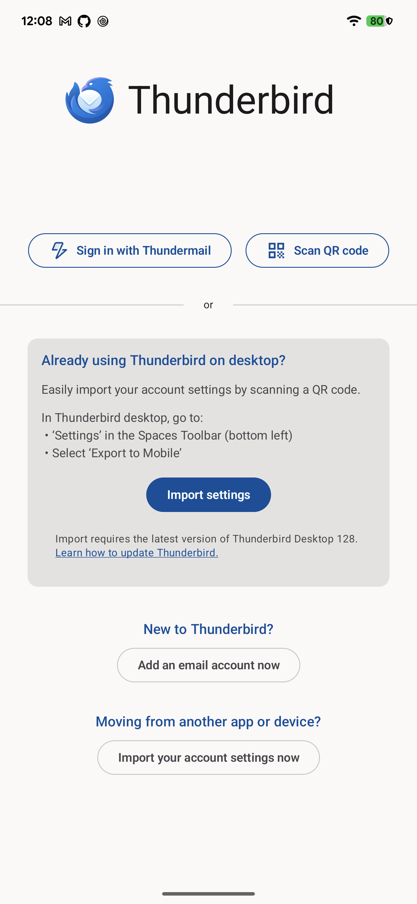
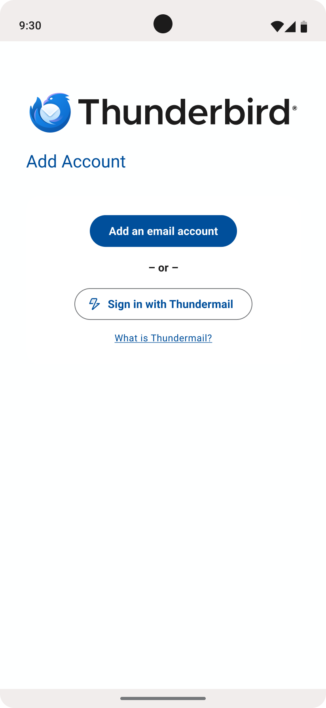

# RFC 0002: Thundermail – Add an Account interim screen

- Issue: [#11102](https://github.com/thunderbird/thunderbird-android/issues/11102)
- Status: **Accepted**

## Summary

Replace the TfA migration screen with a prioritized add account and sign in to Thundermail for a lean MVP.

## Motivation

With the introduction of the Thundermail onboarding flow, the `TbOnboardingMigrationScreen` is now too cluttered and
confusing for users. Additionally, we currently don't have a similar screen on K9-Mail

## Proposal

Create a new "Add Account" screen, under the `:feature:thundermail:internal` that will serve as a screen with 3 CTAs: "
Add an email account", "Sign in with Thundermail", and "What is Thundermail?"

The navigation flow should:

- When users tap on the "Add an email account" button, navigate to the "Add email account" screen to start the
  authentication process
- When users tap on the "Sign in with Thundermail" button, start the Thundermail OAuth flow
- When users tap on the "What is Thundermail?" button, open
  the [https://www.tb.pro/thundermail/](https://www.tb.pro/thundermail/) url in an external browser

Additionally, we need to change the navigation of the K9-Mail to, when the user taps on the "Get started" button on the
Welcome Screen, we first redirect them to the new "Add Account" screen.

## Alternatives Considered

- Modify the `TbOnboardingMigrationScreen` to the new layout
  - Reject: It would be the same effort as creating a new screen

## Risks & Drawbacks

- TfA users won't be able to import data from K9-Mail through the FTU. However, they will still be able to do that after
  adding an account first.

## UI Screenshots

|            Current Thunderbird Migration Screen             |       Suggestion Add Account with Thundermail lean version        |
|-------------------------------------------------------------|-------------------------------------------------------------------|
|  |  |

## Open Questions

- Should we delete the `TbOnboardingMigrationScreen` and its dependencies from the codebase?

## Outcome

The team decided to implement the suggested screen. We might have a follow-up task for deleting the
`TbOnboardingMigrationScreen` and/or include the `Import settings` button in another screen.
