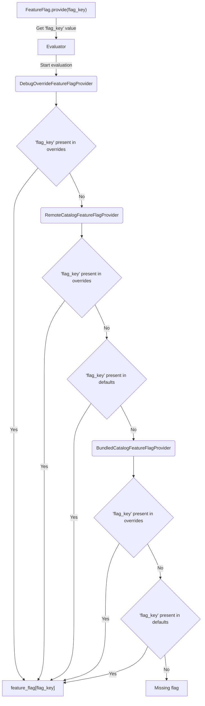

# Technical Design 0002: Declarative Feature Flag Catalog

- Issue: [#11252](https://github.com/thunderbird/thunderbird-android/issues/11252)
- RFC: [RFC 0004: Add a Declarative Feature Flag Catalog](../rfcs/0004-feature-flag-new-architecture.md)
- Status: **Proposed**

## Summary

This design implements RFC 0004's local, bundled feature-flag catalog. It replaces the six per-app/per-build-type
`FeatureFlagFactory` implementations with:

- One JSON catalog (`config/featureflag/thunderbird_mobile_featureflag.catalog.json`) and JSON Schema (
  `config/featureflag/thunderbird_mobile_featureflag.schema.json`), validated at build time.
- A Gradle plugin (`:build-plugin:plugin`'s `net.thunderbird.gradle.plugin.featureflag`) that validates the catalog
  against the schema and generates a typed `FeatureFlagKey` enum from it.
- A `core:featureflag` (Kotlin Multiplatform) runtime that loads the bundled catalog, resolves per-app/per-build-type
  overrides, and layers the existing runtime debug-override mechanism on top, all behind the unchanged
  `FeatureFlagProvider.provide(key): FeatureFlagResult` facade.

Per RFC 0004, remote catalogs, rollout targeting, and managed vendors are out of scope. This design also does **not**
cover `RemoteCatalogFeatureFlagProvider`, `RemoteFeatureFlagDataSource`, or `TargetingKeyConfigStore` — those exist in
the reference implementation as spikes for a follow-up remote-catalog phase and must not ship as part of this change.

## Current State

### Feature Flag catalog configuration

Feature flags are declared per app/build-type combination:

```text
app-thunderbird/src/debug/kotlin/net/thunderbird/android/featureflag/TbFeatureFlagFactory.kt
app-thunderbird/src/daily/kotlin/net/thunderbird/android/featureflag/TbFeatureFlagFactory.kt
app-thunderbird/src/beta/kotlin/net/thunderbird/android/featureflag/TbFeatureFlagFactory.kt
app-thunderbird/src/release/kotlin/net/thunderbird/android/featureflag/TbFeatureFlagFactory.kt
app-k9mail/src/debug/kotlin/app/k9mail/featureflag/K9FeatureFlagFactory.kt
app-k9mail/src/release/kotlin/app/k9mail/featureflag/K9FeatureFlagFactory.kt
```

Each `FeatureFlagFactory.getCatalog(): Flow<List<FeatureFlag>>` hardcodes the full flag list and its enabled state for
that variant, so a single flag's default is duplicated across up to six files.

Keys are declared in three different ways:

- A few keys live in `FeatureFlagKey.Keys` in `core/featureflag`, explicitly marked "DO NOT ADD NEW FEATURE FLAGS HERE".
- Most keys live in per-feature `object ...FeatureFlags` singletons inside each feature's `:api` module (e.g.
  `MessageListFeatureFlags`, `MessageReaderFeatureFlags`, `AccountSettingsFeatureFlags`, `ThundermailFeatureFlags`).
- Some keys are still raw strings passed through `String.toFeatureFlagKey()` with no compile-time registry entry at
  all (e.g. `"archive_marks_as_read"`).

### Feature Flag value Resolution

Resolution is `InMemoryFeatureFlagProvider`, which combines the active `FeatureFlagFactory.getCatalog()` with a
`FeatureFlagOverrides` `StateFlow` and returns `FeatureFlagResult.Enabled` / `Disabled` / `Unavailable`. Debug
overrides come from `DefaultFeatureFlagOverrides` (in-memory only, wired for `debug`/`daily`); `beta`/`release` wire
`NoOpFeatureFlagOverrides`, which always returns no override and effectively disables the debug flag menu for those
variants. The app-facing contract is:

```kotlin
fun interface FeatureFlagProvider {
    fun provide(key: FeatureFlagKey): FeatureFlagResult
}

sealed interface FeatureFlagResult {
    data object Enabled : FeatureFlagResult
    data object Disabled : FeatureFlagResult
    data object Unavailable : FeatureFlagResult
}
```

This design keeps that contract and its ~30 call sites unchanged.

## Proposed Design

### Catalog file and schema

The catalog and schema live at the repository root, outside any single module, since they are consumed by both a Gradle
plugin (configuration time) and the `core:featureflag` runtime (packaged resource):

```text
config/featureflag/thunderbird_mobile_featureflag.catalog.json
config/featureflag/thunderbird_mobile_featureflag.schema.json
```

#### Schema shape

Catalog shape (JSON Schema draft-07, `additionalProperties: false` throughout):

```json
{
    "$schema": "thunderbird_mobile_featureflag.schema.json",
    "version": "2026-06-18.1",
    "flags": [
        {
            "key": "use_compose_for_message_list_items",
            "default": false,
            "target_feature": ":feature:mail:message:list:api",
            "description": "Renders message-list items with Compose."
        }
    ],
    "overrides": {
        "thunderbird": {
            "debug": {
                "use_compose_for_message_list_items": true
            },
            "daily": {},
            "beta": {},
            "release": {}
        },
        "k9": {
            "debug": {},
            "release": {}
        }
    }
}
```

#### Fields explanation > The `flags` field

**Required per `flags[]` entry:**

- `key` (pattern `^[a-z0-9_]+$`)
- `default` (boolean).

**Optional:**

- `description`
- `target_feature` (the Gradle module path that owns the flag, for documentation/lint purposes — no behaviour depends on
  it in this phase)
- `time_to_promote` (a target date for lifecycle hygiene, informational only in this phase).

> [!NOTE]
> The `type` field is fixed to `"boolean"`; multivariate flags are out of scope per the RFC.

#### Fields explanation > The `overrides` field

`overrides` is keyed by `app` (`thunderbird`, `k9`) and, within each app, by `build_type` (`debug`, `daily`, `beta`,
`release` for Thunderbird; `debug`, `release` for K-9 Mail — matching each app's actual build types).

Only keys that differ from `flags[].default` need to appear; an absent key or an absent/empty build-type block inherits
the default.

The schema enforces that `overrides` only references the two known apps and their known build types, and that every
override map only contains booleans (key existence against `flags[]` is enforced by the codegen/validation tool, not the
schema, since JSON Schema cannot express a set-membership check).

### Build-time validation and code generation

`net.thunderbird.gradle.plugin.featureflag.FeatureFlagPlugin` is applied at the root project and exposes a
`featureFlag { }` extension:

```kotlin
// root build.gradle.kts
featureFlag {
    val dir = project.layout.projectDirectory
    schema.set(dir.file("config/featureflag/thunderbird_mobile_featureflag.schema.json"))
    catalog.set(dir.file("config/featureflag/thunderbird_mobile_featureflag.catalog.json"))
}
```

On the root project, the plugin runs `FeatureFlagCatalogValidator` (backed by `networknt/json-schema-validator`) against
the catalog in `afterEvaluate`, and fails the build with a `GradleException` listing every violation if validation
fails.

On success, it registers `GenerateFeatureFlagKeyEnumsTask` on the owning module (`:core:featureflag`), which parses the
catalog and uses KotlinPoet (`FeatureFlagKeyWriter`) to emit one typed key enum implementing `FeatureFlagKey`:

```kotlin
// !! GENERATED FILE - DO NOT CHANGE! CHANGES ARE GOING TO BE OVERWRITTEN. !!
public enum class GeneratedFeatureFlagKey(
    override val key: String,
    override val description: String?,
) : FeatureFlagKey {
    USE_COMPOSE_FOR_MESSAGE_LIST_ITEMS(
        "use_compose_for_message_list_items",
        "Renders message-list items with Compose."
    ),
    // ...
}
```

> [!IMPORTANT]
> The intention to use an enum instead of the current approach (value class) is to enable Java code to also use the
> feature flag keys, without needing compatibility methods to parse a String to the value class type.

The enum is generated exactly once, into `:core:featureflag`'s `commonMain` source set (default package
`net.thunderbird.core.featureflag.keys`, default name `GeneratedFeatureFlagKey`), because every consumer already depends
on that module; generating it anywhere else risks duplicate-class failures at dex merge. This answers the RFC's open
question on typed keys: **generate**, do not hand-validate the existing scattered `object ...FeatureFlags` declarations.

The per-feature `:api` module objects (`MessageListFeatureFlags`, etc.) and the `FeatureFlagKey.Keys` companion are
first marked as `@Deprecated` and then removed once call sites move to `GeneratedFeatureFlagKey`; `target_feature` in
the catalog is the forward-looking place to note which module "owns" a flag without needing a real per-module object.

Later, the `GeneratedFeatureFlagKey` can be renamed to `FeatureFlagKey` once the legacy is no more used in the app.

A second task, `GenerateFeatureFlagRawResTask`, copies the catalog JSON into a generated Android `res/raw` directory so
it ships as `R.raw.thunderbird_mobile_featureflag_catalog` on Android targets. This is wired per-module (not by the root
plugin) because the output directory is module-specific:

```kotlin
// core/featureflag/build.gradle.kts
val generateFeatureFlagRawRes = tasks.register<GenerateFeatureFlagRawResTask>(...) {
    catalog.set(rootProject.layout.projectDirectory.file("config/featureflag/thunderbird_mobile_featureflag.catalog.json"))
    resourceName.set("thunderbird_mobile_featureflag_catalog")
    outputResDir.set(layout.buildDirectory.dir("generated/featureflags/res"))
}
```

`GenerateFeatureFlagProvidersTask` exists in the plugin as an empty skeleton (it only logs). It duplicates no current
behaviour and should either be implemented for a concrete need or removed; see Open Technical Questions.

### Runtime catalog model

`core:featureflag` (`commonMain`) declares the deserialized catalog shape:

```kotlin
data class FeatureFlagCatalog<TFlagOverride : FlagRegistryOverride>(
    val version: String,
    val context: FeatureFlagContext,
    val flags: List<FlagRegistry>,
    val overrides: Map<String, TFlagOverride>,
)

data class FlagRegistry(
    val key: String,
    val default: Boolean,
    val description: String? = null,
    val targetFeature: String? = null,
    val timeToPromote: String? = null,
)

interface FlagRegistryOverride {
    fun forBuildType(buildType: String): FlagOverrides // FlagOverrides = Map<String, Boolean>
}
```

`TFlagOverride` is app-specific, so each app supplies its own `FlagRegistryOverride` implementation matching its own
build types:

```kotlin
// app-thunderbird
data class ThunderbirdOverrides(
    val debug: FlagOverrides = emptyMap(),
    val daily: FlagOverrides = emptyMap(),
    val beta: FlagOverrides = emptyMap(),
    val release: FlagOverrides = emptyMap(),
) : FlagRegistryOverride { /* forBuildType(...) */ }

// app-k9mail
data class K9Overrides(
    val debug: FlagOverrides = emptyMap(),
    val release: FlagOverrides = emptyMap(),
) : FlagRegistryOverride { /* forBuildType(...) */ }
```

`FeatureFlagDataSource<TFlagOverride>` is the loading abstraction (
`suspend fun load(): FeatureFlagCatalog<TFlagOverride>`), with one bundled implementation,`LocalFeatureFlagDataSource` (
`expect`/`actual`):

- Android `actual`: reads `R.raw.thunderbird_mobile_featureflag_catalog` via `Context.resources.openRawResource`.
- JVM `actual`: reads the `thunderbird_mobile_featureflag.catalog.json` classpath resource (the same catalog file is
  added as a `jvmMain` resource in `core/featureflag/build.gradle.kts`), which is what makes the catalog loadable and
  testable from plain JVM unit tests without an Android runtime.

### Resolution order

`BundledCatalogFeatureFlagProvider<TFlagOverride>` loads the catalog once through its `FeatureFlagDataSource` and
resolves, for a given `app`/`build_type`, `catalog.flags.associate { it.key to it.default }` merged with
`overrides[app]?.forBuildType(buildType)` — i.e. bundled default, overridden by the matching app/build-type entry,
exactly as RFC 0004 specifies. It also implements `BundledFeatureFlagDefaults` (`fun defaults(): Map<String, Boolean>`)
so the debug settings UI can list every flag's variant-resolved baseline without going through the debug-override layer.

`RuntimeDebugOverrideFeatureFlagProvider` owns the developer-facing overrides. Unlike the current
`DefaultFeatureFlagOverrides` (in-memory `StateFlow`, lost on process death), it persists the override map through a
`ConfigStore<Map<String, Boolean>>` (`FeatureFlagOverridesConfigStore`, backed by the existing config-store/DataStore
infrastructure), exposing `overrides: StateFlow<Map<String, Boolean>>` plus `setOverride`/`clearOverride`/
`clearAllOverrides`. It is wired only where the current `DefaultFeatureFlagOverrides` is wired today (`debug` and`daily`
dev-module additions); `beta`/`release` do not register it, matching today's `NoOpFeatureFlagOverrides`behaviour of
disabling the debug flag menu on those variants.

The effective per-key resolution order is:

1. `RuntimeDebugOverrideFeatureFlagProvider` — persisted local debug override, if any and if wired for this variant.
2. `BundledCatalogFeatureFlagProvider` — the app/build-type override, or the flag's bundled `default`, from the catalog.
3. `FeatureFlagResult.Unavailable` — only when the key is not present in the bundled catalog at all.

This matches RFC 0004's resolution order exactly, minus step 2 ("bundled overrides for remote catalogs"), which does not
apply here since remote catalogs are out of scope.

### Facade preservation and the composition mechanism

`FeatureFlagProvider`/`FeatureFlagResult` are unchanged. Instead of depending on the OpenFeature Kotlin SDK for provider
composition, a small bespoke evaluator chains an ordered list of `FeatureFlagProvider`s and returns the first one that
has an opinion about the key, falling through to the next provider only when the current one has no value for it at all:



The "present in overrides" / "present in defaults" branches inside each provider box are that provider's own internal
resolution (e.g. `BundledCatalogFeatureFlagProvider` already merges `flags[].default` with the matching
`overrides[app][build_type]` before answering). From the evaluator's point of view, each provider is a black box that
either has a concrete answer (`Enabled`/`Disabled` — i.e. "present") or doesn't (`Unavailable` — i.e. "not present"), so
the evaluator itself only needs to check for `Unavailable`:

```kotlin
class MultiFeatureFlagProviderEvaluator(
    private val providers: List<FeatureFlagProvider>,
    private val logger: Logger,
) : FeatureFlagProvider {
    override fun provide(key: FeatureFlagKey): FeatureFlagResult {
        for (provider in providers) {
            val result = provider.provide(key)
            logger.debug { "[feature-flag] '${key.key}' via $provider -> $result" }
            if (result != FeatureFlagResult.Unavailable) {
                return result
            }
        }
        return FeatureFlagResult.Unavailable
    }
}
```

- **Order is significant, so the providers are a `List`, not a `Set`.** A `Set` does not guarantee iteration order; the
  evaluator's correctness depends on `DebugOverrideFeatureFlagProvider` being checked before
  `RemoteCatalogFeatureFlagProvider`, which in turn is checked before `BundledCatalogFeatureFlagProvider`.

  Additionally, as we have a small list of providers, we could inject each of them directly; however, we need to
  consider that this could create detekt issues later as other injections could be required later.

- **`Disabled` must short-circuit exactly like `Enabled`.** A provider returning `Disabled` means the key *is* present
  for that provider (with value `false`); that ends evaluation just like `Enabled` does.

  Only `Unavailable` ("not present in this provider") continues to the next one. Treating `Disabled` the same as
  `Unavailable` would let a lower-priority provider silently override an explicit `false` from a higher-priority one.

> [!NOTE]
> `RemoteCatalogFeatureFlagProvider` is shown because it is part of the general evaluation chain this evaluator is
> designed for, but **it is out of scope for this phase** (see Summary): this phase wires the evaluator with only
> `[RuntimeDebugOverrideFeatureFlagProvider, BundledCatalogFeatureFlagProvider]`, in that order.
>
> The remote slot is reserved for the follow-up remote-catalog phase, which only needs to insert its provider into this
> same ordered list — no evaluator change required.

### Wiring and debug settings UI

Each app's Koin module provides its own `FeatureFlagDataSource<TOverride>` /
`BundledCatalogFeatureFlagProvider<TOverride>` pair and composes the provider chain, e.g. (Thunderbird):

```kotlin
single<FeatureFlagDataSource<ThunderbirdOverrides>> {
    LocalFeatureFlagDataSource(
        androidContext(),
        ThunderbirdOverrides.serializer()
    )
}
single {
    BundledCatalogFeatureFlagProvider(
        dataSource = get<FeatureFlagDataSource<ThunderbirdOverrides>>(),
        logger = get()
    )
}
single<BundledFeatureFlagDefaults> { get<BundledCatalogFeatureFlagProvider<ThunderbirdOverrides>>() }
```

`DebugFeatureFlagSectionViewModel` (`feature:debug-settings`) is updated to read the full flag registry from
`GeneratedFeatureFlagKey.entries`, the variant-resolved baseline from `BundledFeatureFlagDefaults.defaults()`, and the
active overrides from `RuntimeDebugOverrideFeatureFlagProvider.overrides`, applying pending changes through
`setOverride`/`clearAllOverrides`. This preserves the existing debug settings UI and its "apply and restart" flow; the
only change is where the flag list and baseline values come from.

## Migration and Rollout

1. Add the catalog and schema under `config/featureflag/`, seeded from the union of the six existing`FeatureFlagFactory`
   implementations (one `flags[]` entry per distinct key, `default` set to each key's most common enabled state,
   per-variant deviations captured under `overrides`).
2. Add the Gradle plugin (`FeatureFlagPlugin`, `SchemaValidator`, `GenerateFeatureFlagKeyEnumsTask`,
   `GenerateFeatureFlagRawResTask`) and wire it at the root project and in `core/featureflag/build.gradle.kts`
   Verify the generated `GeneratedFeatureFlagKey` enum contains every key from the six factories.
3. Add `FeatureFlagCatalog`/`FlagRegistry`/`FlagRegistryOverride`/`FeatureFlagDataSource`/`LocalFeatureFlagDataSource`to
   `core:featureflag`, plus `ThunderbirdOverrides` and `K9Overrides` in their respective apps.
4. Add `BundledCatalogFeatureFlagProvider`, `BundledFeatureFlagDefaults`, and`RuntimeDebugOverrideFeatureFlagProvider` (
   with `FeatureFlagOverridesConfigStore`), and wire the resolution chain behind the existing `FeatureFlagProvider`
   facade in each app's Koin module.
5. Update `DebugFeatureFlagSectionViewModel` and its Koin wiring to use the generated keys and the new providers.
6. Migrate call sites from per-feature `object ...FeatureFlags` constants and raw string keys to
   `GeneratedFeatureFlagKey`. Call sites keep using `FeatureFlagProvider.provide(key)` — only the key's origin changes.
7. Delete the six `FeatureFlagFactory` implementations, `FeatureFlagFactory`, `FeatureFlagOverrides`,
   `DefaultFeatureFlagOverrides`, `NoOpFeatureFlagOverrides`, `InMemoryFeatureFlagProvider`, and the per-feature
   `object ...FeatureFlags` declarations once every reference has moved to the catalog-backed path.
8. Confirm every override key in the catalog exists in `flags[]` and every `overrides` entry only references
   `thunderbird`/`k9` and their real build types (enforced by the plugin; a red build blocks the migration from
   drifting).

Steps 1-6 can land as reviewable, additive slices while the old factories still exist and are still wired (both paths
resolve the same keys to the same values, since the catalog is seeded from the factories). Step 7 is a single cleanup
slice once nothing references the old types.

## Testing and Verification

Schema and catalog:

- Valid catalog fixtures pass `SchemaValidator`; fixtures with an unknown top-level field, a malformed `key` pattern, an
  override for an unknown app, or an override for an unknown build type all fail.
- `GenerateFeatureFlagKeyEnumsTask` (or its underlying `FeatureFlagKeyWriter`) produces one enum constant per `flags[]`
  entry, using the flag's `key` (uppercased) and `description`.
- A validation step (plugin-time or a dedicated test) confirms every key referenced under `overrides.*.*` exists in
  `flags[]`, per RFC 0004.

Runtime (`core:featureflag`):

- `LocalFeatureFlagDataSourceTest` (JVM): loading the real bundled catalog resource parses the expected flag count and
  that both `thunderbird` and `k9` override entries deserialize with a non-empty `debug` override map.
- `RuntimeDebugOverrideFeatureFlagProviderTest`: overridden keys resolve to the override value; keys with no override
  fall through (`ErrorCode.FLAG_NOT_FOUND`); `setOverride` is reflected in the next evaluation; `clearAllOverrides`
  removes all overrides.
- `FeatureFlagResultTest`: the three-state facade's helper functions (`whenEnabledOrNot`, `onEnabled`, etc.) are
  unaffected by the resolution-path change.
- Add a `BundledCatalogFeatureFlagProvider` test (not present in the reference implementation) covering: default value
  when no override applies, override value when app/build-type matches, and fall-through (`FLAG_NOT_FOUND`) for a key
  absent from the catalog.

Manual verification:

- Build each app/build-type combination and confirm `GeneratedFeatureFlagKey` and the packaged
  `R.raw.thunderbird_mobile_featureflag_catalog` (Android) / classpath resource (JVM tests) resolve the same effective flags as the
  factory they replace, for every existing flag.
- Exercise the debug settings screen on a debug build: toggle a flag, confirm it persists across an app restart (an
  improvement over today's in-memory-only override), and confirm "restore defaults" reverts to the
  catalog-resolved baseline.
- Confirm `beta`/`release` builds do not expose the debug override menu, matching current `NoOpFeatureFlagOverrides`
  behaviour.

## Open Technical Questions

- `MultiFeatureFlagProviderEvaluator` is bespoke rather than built on the OpenFeature Kotlin SDK's `FeatureProvider`/
  `MultiProvider`. Confirm this holds once a follow-up RFC evaluates OpenFeature adoption — if accepted, this evaluator
  would need to either be replaced by `MultiProvider(FirstMatchStrategy())` or kept as the facade-side composition in
  front of an OpenFeature-backed provider.
- When the remote-catalog phase lands, does `RemoteCatalogFeatureFlagProvider` simply get inserted into
  `MultiFeatureFlagProviderEvaluator`'s provider list between the debug-override and bundled-catalog providers, or does
  the remote phase require its own change to the evaluator (e.g. staleness/timeout handling around the network call)?
- Should catalog validation also lint `time_to_promote` (e.g. warn or fail once a flag's target date has passed) in this
  phase, or is that deferred until the field has a consumer?
- Final home for `config/featureflag/`: this design keeps it at the repository root (matching the reference
  implementation) since it is consumed by both a Gradle plugin and a KMP module's packaged resources; confirm no
  module-local location is preferred before this ships.

