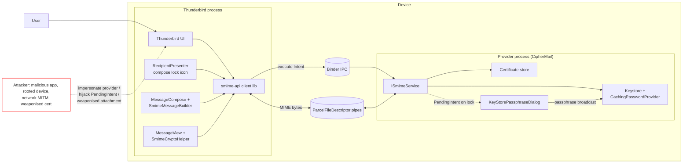

# Threat Model — S/MIME via Companion App

Applies the [STRIDE workflow](threat-modeling-guide.md) to Thunderbird's
S/MIME integration, which delegates all cryptographic operations to a
separate companion app (the reference provider is **CipherMail**) over an
AIDL bound service. Architectural rationale is in
[ADR 0009](../architecture/adr/0009-smime-companion-app-architecture.md);
the wire protocol is documented in
[`plugins/smime-api/README.md`](../../plugins/smime-api/README.md).

## 1. Project Overview

* **Project Name**: Thunderbird for Android — S/MIME companion integration.
* **Description**: Thunderbird binds at runtime to an installed S/MIME
  provider app and delegates sign / encrypt / decrypt / verify / certificate
  lookup over an AIDL service. The provider owns all private key material,
  the certificate store, and the passphrase UX. MIME bytes stream over
  ParcelFileDescriptor pipes rather than Binder transactions.
* **Key Features**: Per-account provider selection, recipient-certificate
  lookup driving the compose lock icon, cross-process passphrase unlock via
  `PendingIntent`, support for multiple coexisting providers via intent
  filter discovery.

## 2. Scope

The IPC trust boundary between Thunderbird and any S/MIME provider, the
passphrase unlock dance, and the compose-screen recipient/cert state. Out of
scope: the cryptographic correctness of the provider's S/MIME implementation
(CMS, OCSP, CRL, certificate-chain validation) — that lives inside the
provider and has its own threat model.

## 3. System Diagram

## 4. Assets

* **Data**: Recipients' public certificates, the user's private signing /
  decryption key, decrypted message plaintext in transit through the pipes,
  the keystore passphrase, the per-account `smimeProvider` package name.
* **Functionality**: Ability to read encrypted mail and to send
  authentically signed and encrypted mail.
* **Reputation**: A cryptographic feature failing open (sending in
  plaintext when the user expected encryption, or accepting a forged
  signature as valid) is far more damaging than a feature simply being
  unavailable.
* **Availability**: Provider reachable, keystore unlockable, send path
  uninterrupted by repeated passphrase prompts.

## 5. Threats

|              Component / Flow              |             Spoofing              |             Tampering              |        Repudiation         |     Information Disclosure      |                 DoS                  |    Elevation of Privilege    |
|--------------------------------------------|-----------------------------------|------------------------------------|----------------------------|---------------------------------|--------------------------------------|------------------------------|
| Provider discovery (intent filter scan)    | Malicious app declares filter     | Manifest queries metadata altered  | —                          | Provider list leaks installed apps | Hundreds of fake providers shown     | App promoted to crypto role  |
| Binding to `ISmimeService`                 | Wrong package gets bound          | Binder transaction altered         | User denies which app bound | Package list visible to user    | Provider refuses connections         | Caller UID not verified      |
| `execute(Intent, PFD, pipeId)` request     | Caller masquerades as Thunderbird | Intent extras / action modified    | Service denies request     | EXTRA_USER_IDS leaks recipient list | Oversized intent crashes provider    | Caller bypasses consent gate |
| Input pipe (MIME → service)                | —                                 | Bytes mutated mid-stream           | —                          | Other process reads pipe         | Slowloris-style infinite writer      | —                            |
| Output pipe (service → client)             | —                                 | Bytes mutated mid-stream           | —                          | Other process reads pipe         | Provider never closes pipe           | —                            |
| Passphrase dialog (`PendingIntent`)        | Forged passphrase activity        | PendingIntent mutated mid-flight   | User denies entering pass  | Passphrase shoulder-surfed       | PendingIntent never fires            | Mutable PI → privilege uplift |
| Passphrase broadcast (provider-internal)   | Other app sends fake broadcast    | Broadcast contents altered         | —                          | Broadcast leaks passphrase       | Broadcast flood                      | Receiver runs in wrong context |
| Certificate lookup (`GET_CERTIFICATES`)    | Provider lies about cert presence | Wrong cert returned for address    | —                          | Recipient list leaks to provider | Slow lookup blocks compose UI        | —                            |
| Send result interpretation (lock icon)     | Provider reports green falsely    | RESULT_CODE altered                | —                          | —                               | UI never settles                     | User assumes encrypted when not |
| Decrypt result (signature trust)           | Forged signer identity            | SmimeSignatureResult tampered      | Signer denies signing      | Signer email leaks via UI cache  | Slow verify stalls message-view      | —                            |
| Per-account `smimeProvider` setting        | Settings restore points to evil   | Pref file modified on rooted device | —                         | Pref readable in backups         | Repeated provider switches           | Account silently rebound     |
| Reinstall / `DeviceKeyLostException` path  | —                                 | Pref state inconsistent            | —                          | Stale cached pass remains in RAM | Loops on "wrong passphrase"          | User induced to lower passphrase strength |

## 6. Mitigations

|                       Threat                       |                                                                              Mitigation                                                                              |
|----------------------------------------------------|----------------------------------------------------------------------------------------------------------------------------------------------------------------------|
| Malicious app declares S/MIME intent filter        | Show the user's selected provider's package + signature in account settings; warn when the chosen provider changes signature; require explicit user re-confirmation when the previously bound provider is uninstalled |
| Binding to the wrong package                       | Always `setPackage(account.smimeProvider)` before bind; never resolve by intent alone. Verify caller UID inside the service (provider side) using `Binder.getCallingUid()` for any privileged action |
| Caller masquerades as Thunderbird (provider side)  | Provider validates caller signature against an allowlist for any operation that exposes private keys; CipherMail's manifest declares `BIND` permission with `signature`-level protection where feasible |
| EXTRA_USER_IDS leaks recipient list                | Recipient list is intentionally shared with the provider — that's the contract for cert lookup. Document this in user-facing docs so users understand the trust placed in the provider |
| Oversized intent / pipe DoS                        | Provider enforces hard upper bound on Intent extras and on bytes read from input pipe; client uses a timeout on `executeApiAsync`; report explicit `SmimeError` rather than hang |
| Pipe contents readable by other processes          | Pipes created via `ParcelFileDescriptor.createPipe()` are anonymous and only the file-descriptor holders can read/write; never expose pipe fds to other components |
| Forged passphrase activity                         | Provider's manifest must mark `KeyStorePassphraseDialog` as `exported=false` for components not invoked via the API; Thunderbird launches **only** the `PendingIntent` returned by the bound service in the current session — never a hand-built Intent |
| PendingIntent mutation                             | Provider must construct passphrase PendingIntents with `FLAG_IMMUTABLE`; never `FLAG_MUTABLE`; target an explicit `ComponentName` not just an action |
| Passphrase broadcast hijack                        | Provider registers receiver with `RECEIVER_NOT_EXPORTED` on Android 13+; broadcast Intent restricted to `setPackage(getPackageName())`; on older Android, restrict by signature permission |
| Provider reports green/red falsely                 | Threat resides entirely in the provider — Thunderbird cannot independently verify cert presence without itself owning a cert store. Document this in user-facing docs and surface the provider's identity prominently in compose-screen status |
| RESULT_CODE / SmimeSignatureResult tampering       | Bind is to a specific package + caller-verified service; in-process tampering of result Parcelables is not part of the IPC threat model. Re-check `PARCELABLE_VERSION` on read and fail closed on mismatch |
| Pref restored from backup points to evil provider  | Validate `smimeProvider` package against the installed-providers list on every account-load; if missing, surface `account_settings_smime_missing` and refuse send |
| Stale cached pass on `DeviceKeyLostException`      | `CachingPasswordProvider` clears the cached pass and forces NEW-mode passphrase entry; never silently downgrade or reuse a previous pass after a device-key loss event |
| User assumes encrypted-but-actually-not            | Fail closed: when `GET_CERTIFICATES` reports any missing recipient, the lock icon is red and the message is not auto-encrypted to a partial set. Sending in cleartext requires an explicit user-initiated override |
| Slow lookup blocks compose UI                      | `RecipientPresenter.asyncUpdateSmimeCertStatus` runs off the UI thread; status is displayed as "Configuring…" while in flight |

## 7. Risk Ranking

* **High**:
  * Forged passphrase activity / mutable PendingIntent (passphrase capture).
  * Pref restored from backup points to a malicious provider (silent rebind).
  * Failing open: silently sending plaintext when the user expected encryption.
* **Medium**:
  * Malicious app declares the intent filter and appears in provider picker.
  * Provider lies about certificate presence (mitigated only by trusting the provider).
  * `EXTRA_USER_IDS` recipient list disclosure to the provider (inherent to the design; documented).
* **Low**:
  * Output-pipe DoS (bounded by provider-side timeouts; recoverable).
  * Repudiation of which provider bound (the user picked it; the picked package is in settings).

## 8. Notes on residual risk

Two risks are inherent to the companion-app model and cannot be fully
eliminated in Thunderbird:

1. **The provider is in the TCB.** Once the user selects a provider,
   Thunderbird trusts everything that provider reports about signatures and
   certificate presence. Mitigation is bounded to choosing the provider
   carefully and surfacing its identity in the UI.
2. **Recipient identity leaks to the provider.** Cert lookup necessarily
   shares the recipient list across the IPC boundary. This is documented
   trade-off for the architecture; a privacy-preserving lookup would
   require a different protocol (e.g. PIR) not present in S/MIME today.

These are accepted with rationale rather than mitigated.
