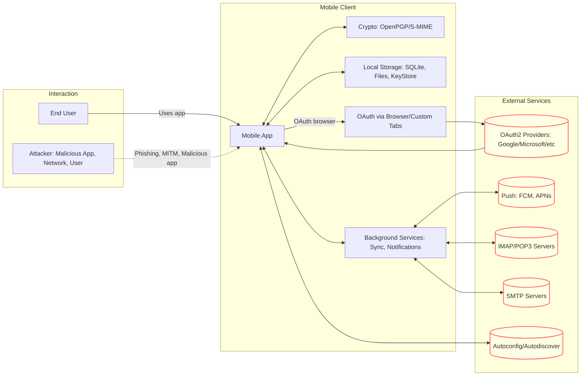
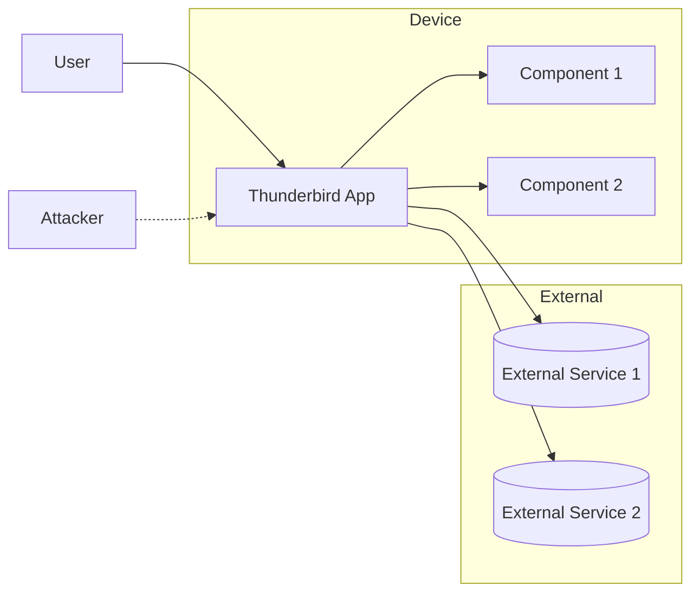
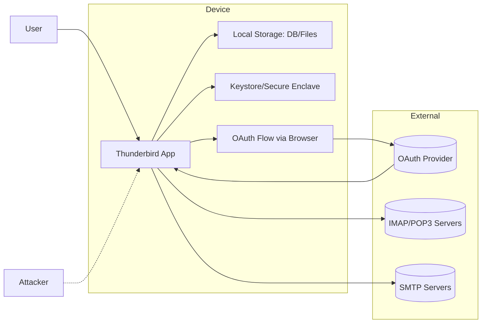
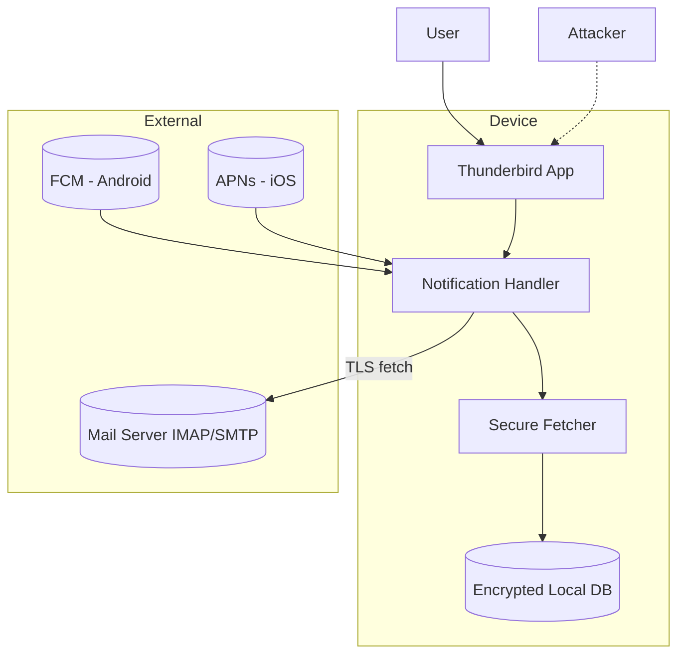

# 📖 Threat Modeling Guide

This guide walks you through how to apply the **STRIDE** methodology for identifying and addressing security risks in
Thunderbird’s mobile clients. Each step includes **examples** specific to Android/iOS email handling. Use it during
design, feature work, and release planning. Keep sessions short and focused.

> [!NOTE]
> Start small. Pick a single feature or flow. The goal is to surface and mitigate risks early, not to produce perfect
> documentation.

## STRIDE Quick Reference

We’ll use the STRIDE framework to help identify common types of threats:

- **S**poofing: Impersonating someone or something else (e.g., faking identity, app, servers).
- **T**ampering: Unauthorized modification of data, code or configuration (e.g., altering a file, changing network packets).
- **R**epudiation: Denying actions that occurred without reliable attribution/logging
- **I**nformation Disclosure: Revealing sensitive data to unauthorized individuals (e.g., leaking PII, credentials).
- **D**enial of Service: Preventing legitimate users from accessing a service or resource (e.g., crashing a server, exhausting resources).
- **E**levation of Privilege: Gaining unauthorized access to higher-level permissions (e.g., a regular user becoming an administrator).

## How to use this guide

Below is a simple, repeatable workflow. Each section provides prompts and examples. Capture notes in your feature’s
issue/PR or a short doc.

---

## Threat Modeling Workflow

### 1. Project Overview

**What to do:**

Write down what Thunderbird Mobile is, what it does, and its major features. This frames the context of your threat
model.

**Example:**

* **Project Name**: Thunderbird for Android
* **Description**: A mobile email client providing access to IMAP/POP3/SMTP accounts with support for OAuth, local message storage, PGP/SMIME, and notifications.
* **Key Features**: Account setup, secure login, message sync, local storage, notifications, attachments, encryption support.

### 2. Define Scope

**What to do:**

Pick one area to model at a time. Define clear boundaries. Don’t try to cover the entire app in one go.

**Examples:**

- Account authentication and credential storage
- OAuth2 login for Gmail/Outlook providers
- Message synchronization with mail servers: connection management, IDLE, message fetch
- Local message storage and full‑text index
- Attachment handling: view/save/share flow
- Background services and notifications (Android)
- OpenPGP signing/encryption/decryption (Android)

### 3. Draw a System Diagram

**What to do:**

Draw a simple diagram (use Mermaid) of the project within your chosen scope. Identify:

* **Key Components**: UI, storage, crypto, background jobs, network services
* **Data Flows**: How information moves between components.
* **Trust Boundaries**: Where different levels of trust exist (e.g., separating user input from backend processing, public network vs. internal network).
* **Actors**: User, external systems, third-party services, Attackers
* **Data Stores**: Local database (messages, headers, metadata), file storage (attachments, cache), Android Keystore (tokens/keys),
  logs/metrics (if enabled), cryptographic keyrings

**Example (Account Authentication):**

* **Actors**: User, Thunderbird app, IMAP/SMTP server, OAuth provider, Attacker, Push providers, OS keychain, other apps via Intents/Shares
* **Data Flows**:
  * User enters credentials or OAuth flow
  * App exchanges tokens with server
  * Tokens stored locally in Keystore/Secure Enclave
* **Trust Boundaries**:
  * User input (untrusted) → App UI
  * App → Mail server (TLS required)
  * App → Local storage (protected by OS sandbox & keystore)

Use this Mermaid diagram as a starting point; copy it into your notes and adjust for your scope.

### 4. Identify Assets

**What to do:**

List what you want to protect for your scope.

* **Data**: Credentials, tokens, email content, attachments, keys, contacts
* **Functionality**: Ability to send/receive email, sync, notifications
* **Reputation**: User trust, brand image, compliance with store policies
* **Availability**: Access to email, notifications working, sync reliability

### 5. Identify Threats (Using STRIDE)

**What to do:**

For each component, data flow, and interaction identified in your diagram, ask STRIDE questions:

**Example:**

| Component / Data Flow / Interaction |                  Spoofing                  |             Tampering              |        Repudiation        |         Information Disclosure          |             DoS             |      Elevation of Privilege       |
|-------------------------------------|--------------------------------------------|------------------------------------|---------------------------|-----------------------------------------|-----------------------------|-----------------------------------|
| OAuth2 Login (App ↔ OAuth Provider) | Fake OAuth page via phishing/intent hijack | Intercept/alter redirect URI       | User denies consent later | Tokens/PII leaked in logs/URLs          | Provider rate limits        | App requests excessive scopes     |
| Password Auth (App ↔ Mail/SMTP)     | MITM captures creds / server spoof         | Modify TLS session                 | Deny failed logins        | Credentials in memory/backups           | Brute-force lockouts        | App uses elevated IMAP/SMTP roles |
| IMAP/SMTP TLS                       | Spoof certs without pinning                | Downgrade protocol/cipher          | —                         | Metadata leaks in traffic               | Connection exhaustion       | Protocol quirks abused            |
| Local Storage                       | Malicious app pretends to be Thunderbird   | DB/file tampering on rooted device | User denies local action  | Leaks via backups/cache                 | Storage exhaustion          | Sandbox escape                    |
| Keystore / Keychain                 | Fake app tries to use alias                | Key misuse                         | —                         | Extraction on rooted/jailbroken devices | Keystore unavailable        | Hardware bypass                   |
| OpenPGP / S-MIME                    | Key ownership spoofing                     | Keyring/signature tampering        | Dispute sent signatures   | Decrypted data in RAM/tmp               | Expensive crypto stalls UI  | Access other apps’ keys           |
| Attachments & Sharing               | Malicious target app intercepts            | Temp file tampering                | —                         | World-readable URIs                     | Huge file upload stalls     | Excess file access                |
| Notifications                       | Fake notification spoof                    | Alter PendingIntents               | —                         | Sensitive lockscreen previews           | Spam storms                 | Privileged actions triggered      |
| Background Sync                     | Fake wakeups/intents                       | Job params altered                 | —                         | Logs leak PII                           | Endless sync drains battery | Privileged execution              |
| Autodiscovery                       | Malicious config host                      | Alter SRV/HTTP response            | —                         | Domain/email leaked to third parties    | Slow setup blocks           | Elevated server access            |
| Inter-app Intents                   | Other app claims TB filters                | Extras modified                    | —                         | Data leaked to unintended receivers     | Intent floods               | Bypass auth gates                 |
| Logging / Telemetry                 | —                                          | Log modification                   | User denies actions       | PII in logs                             | Disk filled                 | Logs help attacker                |
| iOS Keychain & APIs                 | Phishing ASWebAuthSession                  | Keychain tamper                    | —                         | Keys/files leak to iCloud               | Background fetch abused     | App Group misuse                  |

### 6. Add Mitigations

**What to do:**

For each threat, describe what you’ll do about it.

**Example:**

|                Threat Identified                 |                                                                                     Proposed Mitigation                                                                                     |
|--------------------------------------------------|---------------------------------------------------------------------------------------------------------------------------------------------------------------------------------------------|
| OAuth redirect interception / fake OAuth page    | Use system browser (Custom Tabs / ASWebAuthSession); claimed HTTPS redirect URIs; verify state/nonce; PKCE; minimize scopes; store tokens in Keystore/Secure Enclave; rotate refresh tokens |
| Redirect URI tampering                           | Enforce exact redirect match; strict validation                                                                                                                                             |
| Excessive OAuth scopes                           | Scope minimization; review/limit permissions                                                                                                                                                |
| MITM during password authentication              | TLS 1.2+ (prefer 1.3); strict hostname verification; consider pinning for known providers; prefer implicit TLS over STARTTLS                                                                |
| Credential leakage (memory, logs, backups)       | Encrypt at rest with Keystore-derived keys; zeroize memory; redact logs; protect screenshots; mark sensitive dirs as no-backup                                                              |
| IMAP/SMTP STARTTLS downgrade                     | Prefer implicit TLS; reject weak suites; enforce hostname checks                                                                                                                            |
| Local DB tampering                               | Encrypt per-account DB keys (wrapped by Keystore); integrity checks                                                                                                                         |
| Local DB leakage via backups/cache               | Internal app storage only; opt-out sensitive paths from auto backup; FileProvider URIs with time-limited grants                                                                             |
| Spoofed notifications                            | Only accept OS push channels (FCM/APNs); verify app identity                                                                                                                                |
| Sensitive lock-screen previews                   | Redact by default; user toggle for previews; use immutable PendingIntents and explicit components                                                                                           |
| PendingIntent tampering                          | Use `FLAG_IMMUTABLE`; explicit component declarations                                                                                                                                       |
| Attachment exfiltration via world-readable files | SAF/DocumentFile APIs; FileProvider URIs; no world-readable files; enforce MIME checks and size limits                                                                                      |
| Sync loops draining battery/data                 | Backoff with jitter; network/battery constraints; circuit breakers; validate job inputs                                                                                                     |
| Malicious autodiscovery configs                  | Prefer HTTPS; validate domains; ship trusted provider directory; warn on insecure configs                                                                                                   |
| OpenPGP/S-MIME plaintext residue                 | Isolate decrypted buffers; wipe temp files; constant-time crypto; disable remote content by default; clear trust UX                                                                         |
| Token theft from logs                            | Structured logging with allowlist fields; redact headers/URLs                                                                                                                               |
| Intent spoofing / inter-app abuse                | Minimize exported components; explicit intents; verify caller UID; require permissions                                                                                                      |
| Logging/Telemetry leaks                          | Opt-in; redact PII; bounded retention; local-first storage                                                                                                                                  |
| iOS Keychain/data leakage                        | Use `kSecAttrAccessibleAfterFirstUnlockThisDeviceOnly`; careful App Groups; minimize iCloud backup; strong ATS/TLS                                                                          |

### 7. Risk Ranking (Optional, but recommended)

**What to do:**

Label each threat High/Medium/Low based on likelihood and impact.

- **High**: likely and/or severe impact → prioritize now
- **Medium**: plausible and moderate → schedule soon
- **Low**: unlikely or low impact → backlog/accept with rationale

**Example:**

* **High**: Credential theft, insecure storage, MITM, data leakage
* **Medium**: DoS via login brute force, excessive sync, notification spam
* **Low**: Repudiation of sent messages, log tampering

---

Perfect 🚀 — here’s a **ready-to-use Markdown template file** your team can copy for any new feature or flow in Thunderbird Mobile. It includes placeholders for each section, an empty system diagram stub, and separate **Threats** and **Mitigations** tables.

---

# 📖 Threat Modeling Template

Use this template when modeling a new feature or flow.

---

# Title

## 1. Project Overview

* **Project Name**:
* **Description**:
* **Key Features**:

## 2. Scope

* **Scope for this session**

## 3. System Diagram

## 4. Assets

* **Data**:
* **Functionality**:
* **Reputation**:
* **Availability**:

## 5. Threats

| Component / Flow | Spoofing | Tampering | Repudiation | Information Disclosure | DoS | Elevation of Privilege |
|------------------|----------|-----------|-------------|------------------------|-----|------------------------|
| Example Flow A   |          |           |             |                        |     |                        |
| Example Flow B   |          |           |             |                        |     |                        |
| Example Flow C   |          |           |             |                        |     |                        |

## 6. Mitigations

| Threat Identified | Proposed Mitigation |
|-------------------|---------------------|
| Threat 1          | Mitigation 1        |
| Threat 2          | Mitigation 2        |
| Threat 3          | Mitigation 3        |

## 7. Risk Ranking

* **High**: Likely and/or severe → prioritize now.
* **Medium**: Plausible and moderate → schedule soon.
* **Low**: Unlikely or low impact → backlog or accept with rationale.

--- 

## 🛡️ Example 1: Account Authentication

### 1. Project Overview

* **Project Name**: Thunderbird for Android/iOS – Account Authentication
* **Description**: Handling account setup, login, and credential storage for IMAP/SMTP or OAuth2 providers.
* **Key Features**: Password auth, OAuth2 flows (Google/Microsoft), token storage, secure connections.

### 2. Scope

* Account authentication and credential storage.

### 3. System Diagram

### 4. Assets

* **Data**: User credentials, OAuth tokens, session cookies.
* **Functionality**: Secure login, ability to sync and send mail.
* **Reputation**: Privacy-first branding.
* **Availability**: Reliable authentication, minimal lockouts.

### 5. Threats

| Component / Flow |                 Spoofing                 |         Tampering         |       Repudiation        |      Information Disclosure      |          DoS          | Elevation of Privilege |
|------------------|------------------------------------------|---------------------------|--------------------------|----------------------------------|-----------------------|------------------------|
| OAuth2 Login     | Fake OAuth page via phishing             | Redirect URI manipulation | User denies consent      | Tokens leaked in logs/URLs       | Provider rate limits  | Excessive scopes       |
| Password Auth    | MITM server spoof                        | Modify TLS session        | User denies failed login | Credentials in memory/backups    | Brute-force lockouts  | Use of admin roles     |
| IMAP/SMTP TLS    | Spoofed certificates                     | Downgrade attack          | —                        | Metadata leakage                 | Connection exhaustion | Protocol quirks abused |
| Local Storage    | Malicious app pretends to be Thunderbird | DB/file tampering         | User denies local action | Backups/cache leaks              | Storage exhaustion    | Sandbox escape         |
| Keystore         | Fake app tries to access alias           | Misuse of key             | —                        | Key extraction on rooted devices | Keystore unavailable  | Hardware bypass        |

### 6. Mitigations

|   Threat Identified    |                                          Proposed Mitigation                                           |
|------------------------|--------------------------------------------------------------------------------------------------------|
| Fake OAuth login       | System browser (Custom Tabs/ASWebAuthSession); claimed HTTPS redirect URIs; PKCE; validate state/nonce |
| Redirect tampering     | Strict URI validation; reject mismatches                                                               |
| Excessive scopes       | Scope minimization; permission reviews                                                                 |
| MITM on password login | TLS 1.2+ (prefer 1.3); strict hostname verification; pin known providers                               |
| Credential leakage     | Keystore/Keychain storage; redact logs; disable backups; zeroize memory; protect screenshots           |
| TLS downgrade          | Prefer implicit TLS; reject weak suites; enforce hostname checks                                       |
| DB tampering           | Encrypt per-account DB; integrity seals                                                                |
| Backup/cache leaks     | Internal storage only; opt-out backups; FileProvider URIs                                              |
| Keystore misuse        | Use StrongBox/TEE; require user auth for sensitive ops; handle key invalidation                        |

### 7. Risk Ranking

* **High**: Credential theft, token leakage, MITM, TLS downgrade.
* **Medium**: Brute-force lockouts, storage exhaustion.
* **Low**: Repudiation of login attempts.

---

## 🔔 Example 2: Push Notifications

### 1. Project Overview

* **Project Name**: Thunderbird for Android/iOS – Push Notifications
* **Description**: Handling push notifications via FCM (Android) or APNs (iOS) to wake the app for secure fetch.
* **Key Features**: Receive push, show notifications, fetch mail securely.

### 2. Scope

* Push notification handling (end-to-end from server push to user notification).

### 3. System Diagram

### 4. Assets

* **Data**: Notification payloads, message IDs, device tokens.
* **Functionality**: Timely, trustworthy notifications.
* **Reputation**: No privacy leaks in lock-screen banners.
* **Availability**: Notifications work without spam or battery drain.

### 5. Threats

|    Component / Flow     |        Spoofing         |         Tampering          |      Repudiation      |    Information Disclosure    |              DoS               |    Elevation of Privilege     |
|-------------------------|-------------------------|----------------------------|-----------------------|------------------------------|--------------------------------|-------------------------------|
| Push Channel (FCM/APNs) | Fake/local notification | Payload altered            | User disputes receipt | Payload leaks sender/subject | Notification flood             | Malicious PendingIntent abuse |
| Post-Push Fetch         | MITM fetch request      | Inject mailbox updates     | —                     | Token leakage in logs        | Retry storms                   | Fetcher over-privileged       |
| Notification UI         | —                       | Modify notification action | —                     | Lockscreen preview leaks     | Notification spam wakes device | Privileged screen opened      |

### 6. Mitigations

|     Threat Identified     |                                Proposed Mitigation                                |
|---------------------------|-----------------------------------------------------------------------------------|
| Fake/local notification   | Only accept OS push channels; verify channel IDs                                  |
| Payload tampering         | Opaque IDs in payloads; fetch details securely                                    |
| Metadata leakage          | Redact payloads; fetch details after wake; redact lock-screen previews by default |
| Notification spam         | Rate limits; quotas; quiet hours; batching                                        |
| PendingIntent abuse       | Use `FLAG_IMMUTABLE`; explicit component targets                                  |
| MITM fetch                | TLS 1.3; strict cert validation; pinning                                          |
| Token leakage in logs     | Redact tokens/headers; structured logging                                         |
| Notification action abuse | Require unlock/biometric for sensitive actions                                    |

### 7. Risk Ranking

* **High**: Metadata leaks in push payloads, MITM on fetch, PendingIntent abuse.
* **Medium**: Notification spam floods, retry storms.
* **Low**: Repudiation of notification receipt.

