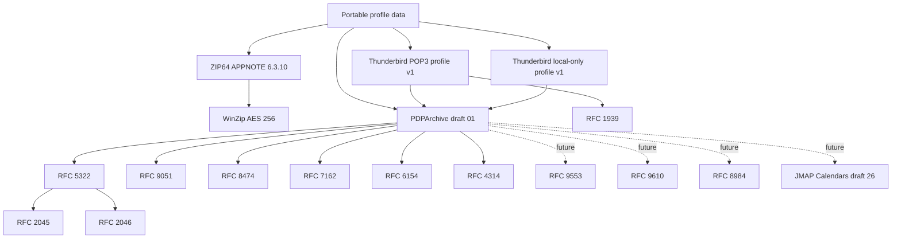

# Standards Profile: Portable Profile Data

- Status: Adopted for full mail-account export and encrypted ZIP64
- Decision: [RFC 0008](../engineering/rfcs/0008-portable-profile-data-format.md)
- Architecture: [Portable Profile Data Format](../architecture/portable-profile-data-format.md)
- Technical design: [Technical Design 0004](../engineering/technical-designs/0004-portable-profile-data-format.md)
- Implementation: TBD

This profile records the external specifications and local profiles that define portable profile-data interoperability.
Support claims apply to full mail-account archives only. Partial and incremental archives are outside the current scope.

## Standards index

|         ID          |                 Specification                 |  Revision or status   |               Adoption               |             Used by             |                                                Authoritative link                                                |                                                Notes                                                |
|---------------------|-----------------------------------------------|-----------------------|--------------------------------------|---------------------------------|------------------------------------------------------------------------------------------------------------------|-----------------------------------------------------------------------------------------------------|
| `pdpa-01`           | Personal Data Portability Archive             | Internet-Draft `-01`  | Adopted                              | Raw account archives            | [Draft `-01`](https://datatracker.ietf.org/doc/html/draft-ietf-mailmaint-pdparchive-01)                          | Work in progress with no selected container, encryption mechanism, or formal conformance definition |
| `winzip-aes`        | WinZip AES Encryption Specification           | AE-1 and AE-2         | Adopted with AES-256                 | ZIP entry encryption            | [WinZip AES](https://www.winzip.com/en/support/aes-encryption/)                                                  | Legacy ZipCrypto is not allowed                                                                     |
| `zip-6310`          | ZIP File Format Specification                 | APPNOTE 6.3.10        | Adopted temporary convention         | Decrypted container             | [APPNOTE 6.3.10](https://pkware.cachefly.net/webdocs/casestudies/APPNOTE.TXT)                                    | ZIP64 is replaced or adapted if PDPArchive selects a container                                      |
| `imf`               | Internet Message Format                       | RFC 5322              | Adopted                              | EML message representation      | [RFC 5322](https://www.rfc-editor.org/rfc/rfc5322.html)                                                          | Governs message syntax                                                                              |
| `mime-format`       | MIME Part One and Part Two                    | RFC 2045 and RFC 2046 | Adopted                              | EML body and multipart fidelity | [RFC 2045](https://www.rfc-editor.org/rfc/rfc2045.html), [RFC 2046](https://www.rfc-editor.org/rfc/rfc2046.html) | Governs MIME structure and transfer encoding                                                        |
| `imap4rev2`         | IMAP4rev2                                     | RFC 9051              | Adopted for IMAP archives            | Folder and message metadata     | [RFC 9051](https://www.rfc-editor.org/rfc/rfc9051.html)                                                          | PDPArchive also refers informatively to obsolete IMAP4rev1 terminology                              |
| `objectid`          | IMAP Object Identifiers                       | RFC 8474              | Adopted when supported by the source | Stable mailbox identity         | [RFC 8474](https://www.rfc-editor.org/rfc/rfc8474.html)                                                          | PDPArchive recommends `OBJECTID` for folder `uid`                                                   |
| `condstore`         | IMAP QRESYNC and CONDSTORE                    | RFC 7162              | Adopted when supplied by the source  | IMAP modification sequences     | [RFC 7162](https://www.rfc-editor.org/rfc/rfc7162.html)                                                          | Full export preserves truthful metadata but does not enable incremental export                      |
| `special-use`       | IMAP LIST Extension for Special-Use Mailboxes | RFC 6154              | Adopted                              | Special-use metadata            | [RFC 6154](https://www.rfc-editor.org/rfc/rfc6154.html)                                                          | Invoked by PDPArchive `folder.json`                                                                 |
| `imap-acl`          | IMAP ACL Extension                            | RFC 4314              | Adopted when supplied by the source  | Folder rights                   | [RFC 4314](https://www.rfc-editor.org/rfc/rfc4314.html)                                                          | Invoked by PDPArchive `myrights`                                                                    |
| `pop3`              | Post Office Protocol Version 3                | RFC 1939              | Adopted source protocol              | Thunderbird POP3 profile        | [RFC 1939](https://www.rfc-editor.org/rfc/rfc1939.html)                                                          | POP3 does not provide the IMAP folder metadata required by PDPArchive prose                         |
| `jscontact`         | JSContact                                     | RFC 9553              | Exploratory                          | Future contacts                 | [RFC 9553](https://www.rfc-editor.org/rfc/rfc9553.html)                                                          | Implementation TBD                                                                                  |
| `jmap-contacts`     | JMAP for Contacts                             | RFC 9610              | Exploratory                          | Future address books            | [RFC 9610](https://www.rfc-editor.org/rfc/rfc9610.html)                                                          | Implementation TBD                                                                                  |
| `jscalendar`        | JSCalendar                                    | RFC 8984              | Exploratory                          | Future events and tasks         | [RFC 8984](https://www.rfc-editor.org/rfc/rfc8984.html)                                                          | PDPArchive excludes JSCalendar groups                                                               |
| `jmap-calendars-26` | JMAP for Calendars                            | Internet-Draft `-26`  | Exploratory                          | Future calendar collections     | [Draft `-26`](https://datatracker.ietf.org/doc/html/draft-ietf-jmap-calendars-26)                                | Revision independently pinned by PDPArchive `-01`                                                   |

The `$schema` URI used by PDPArchive `archive.json` currently returns HTTP 404. Until an authoritative schema resource
is published there, validation fixtures pin the schema embedded in PDPArchive `-01`
[section 6.1](https://datatracker.ietf.org/doc/html/draft-ietf-mailmaint-pdparchive-01#section-6.1) and track the upstream
availability issue. The `$schema` value remains unchanged in exported metadata.

## Capability dependency graph

## Profiles and conventions

### Full mail-account profile

Every included account archive uses PDPArchive `-01`
[section 6](https://datatracker.ietf.org/doc/html/draft-ietf-mailmaint-pdparchive-01#section-6), sets
`dataset.extent` to `FULL`, and contains all complete messages available for the source account. Thunderbird does not
emit partial, filtered, or incremental account archives. PDPArchive
[section 4.2](https://datatracker.ietf.org/doc/html/draft-ietf-mailmaint-pdparchive-01#section-4.2) is informative input
to the future synchronization project, not an adopted update contract.

### Thunderbird PDPArchive POP3 profile version 1

POP3 accounts use the PDPArchive raw layout and schema-compatible fields. They identify the source service as `pop3`,
omit IMAP-only values that have no truthful source, use portable identifiers distinct from POP3 UIDLs, and declare
`net.thunderbird.pdpa.pop3-v1`.

### Thunderbird PDPArchive local-only profile version 1

Local-only accounts have no remote source server. They use the PDPArchive raw layout and schema-compatible fields,
identify the source service as `local`, allocate stable opaque folder and message identifiers, omit IMAP-only and
POP3-only values, and declare `net.thunderbird.pdpa.local-v1`.

Both are implementation-specific profiles necessitated by the mismatch between the IMAP prose and general JSON Schema
in PDPArchive
[section 6.3.1](https://datatracker.ietf.org/doc/html/draft-ietf-mailmaint-pdparchive-01#section-6.3.1). Neither is
unqualified PDPArchive conformance, and neither relies on standardized unknown-member handling.

### Container and encryption

Encrypted ZIP64 is Thunderbird's container convention because PDPArchive
[section 7.1](https://datatracker.ietf.org/doc/html/draft-ietf-mailmaint-pdparchive-01#section-7.1) and
[section 7.2](https://datatracker.ietf.org/doc/html/draft-ietf-mailmaint-pdparchive-01#section-7.2) leave the container
and encryption mechanisms open. Encryption uses AES-256 from the
[WinZip AES specification](https://www.winzip.com/en/support/aes-encryption/). Legacy ZipCrypto is not supported.

## Conformance disposition

| Governing specification |                                                 Section                                                 |          Requirement or boundary          |                              Disposition                              |                    Verification                    |
|-------------------------|---------------------------------------------------------------------------------------------------------|-------------------------------------------|-----------------------------------------------------------------------|----------------------------------------------------|
| PDPArchive `-01`        | [Section 6.1](https://datatracker.ietf.org/doc/html/draft-ietf-mailmaint-pdparchive-01#section-6.1)     | Required archive metadata                 | Adopted with exact draft revision recorded                            | Schema fixture and field validation                |
| PDPArchive `-01`        | [Section 6.2](https://datatracker.ietf.org/doc/html/draft-ietf-mailmaint-pdparchive-01#section-6.2)     | Raw datatype and collection layout        | Adopted per account                                                   | Independent extraction and import fixture          |
| PDPArchive `-01`        | [Section 6.3.1](https://datatracker.ietf.org/doc/html/draft-ietf-mailmaint-pdparchive-01#section-6.3.1) | Mail folders, items, flags, and EML files | Adopted for IMAP and separately profiled for POP3 and local-only mail | IMAP, POP3, and local-only fixtures                |
| PDPArchive `-01`        | [Section 4.2](https://datatracker.ietf.org/doc/html/draft-ietf-mailmaint-pdparchive-01#section-4.2)     | Partial updates                           | Unsupported                                                           | Reject partial or incremental input as unsupported |
| WinZip AES              | [AES encryption specification](https://www.winzip.com/en/support/aes-encryption/)                       | AES-256 encrypted ZIP entries             | Adopted                                                               | Cross-target and independent ZIP-tool fixtures     |
| ZIP APPNOTE 6.3.10      | Section 4.5.3                                                                                           | ZIP64 extended information                | Temporary convention                                                  | ZIP64 boundary and malformed-container fixtures    |

## Implementation and verification status

The format has maintained implementation candidates for every required target. [Zip4j supports AES, ZIP64, JVM, and
Android](https://github.com/srikanth-lingala/zip4j#features). [ZipArchive supports AES archive creation and extraction on
iOS](https://github.com/ZipArchive/ZipArchive#ssziparchive). [minizip-ng supports ZIP64 and WinZip
AES](https://github.com/zlib-ng/minizip-ng#features). [zip.js supports ZIP64, encryption, streaming,
and web browsers](https://github.com/gildas-lormeau/zip.js#introduction). These are candidates, not selected project
dependencies. Cross-target fixtures must confirm the exact AES variant and options.

|               Capability                | Implementation |                  Fixtures                   |   Status    |
|-----------------------------------------|----------------|---------------------------------------------|-------------|
| Full IMAP account archive               | TBD            | PDPArchive `-01` fixtures TBD               | Unsupported |
| Full POP3 account archive               | TBD            | Thunderbird POP3 profile fixtures TBD       | Unsupported |
| Full local-only account archive         | TBD            | Thunderbird local-only profile fixtures TBD | Unsupported |
| AES-256 ZIP encryption on JVM           | TBD            | Cross-target and ZIP-tool fixtures TBD      | Unsupported |
| AES-256 ZIP encryption on Android       | TBD            | Cross-target and ZIP-tool fixtures TBD      | Unsupported |
| AES-256 ZIP encryption on iOS           | TBD            | Cross-target and ZIP-tool fixtures TBD      | Unsupported |
| AES-256 ZIP encryption on web           | TBD            | Cross-target and ZIP-tool fixtures TBD      | Unsupported |
| Contacts and address books              | TBD            | TBD                                         | Deferred    |
| Events, tasks, and calendar collections | TBD            | TBD                                         | Deferred    |

## Open questions

- Which maintained AES ZIP implementations satisfy security, licensing, and bounded-memory requirements on Android,
  JVM, iOS, and web?
- Which PDPArchive `-01` importer combinations define the first interoperability test set?
- Which future PDPArchive revision provides standard POP3 and local-only mappings that replace the Thunderbird profiles?
- Which future synchronization design, if any, introduces partial archives or additional record metadata?

The adopted format remains unsupported until the implementation and interoperability gates above pass.
