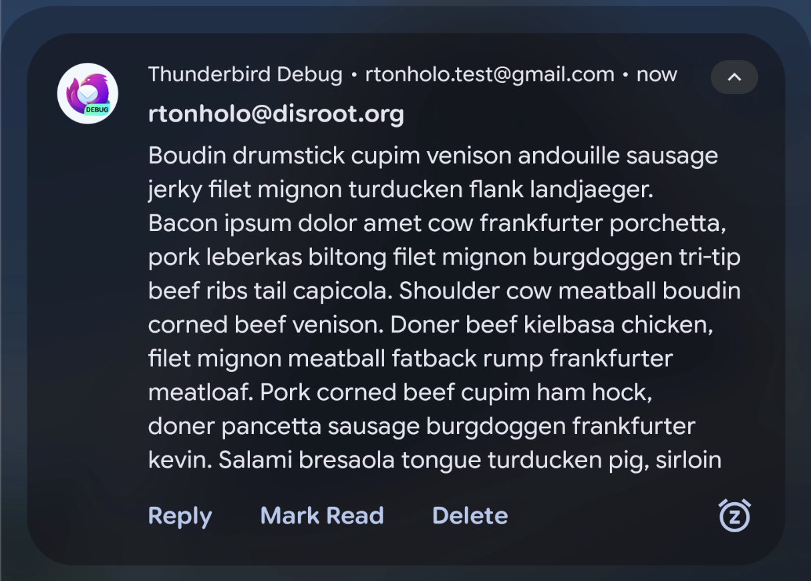
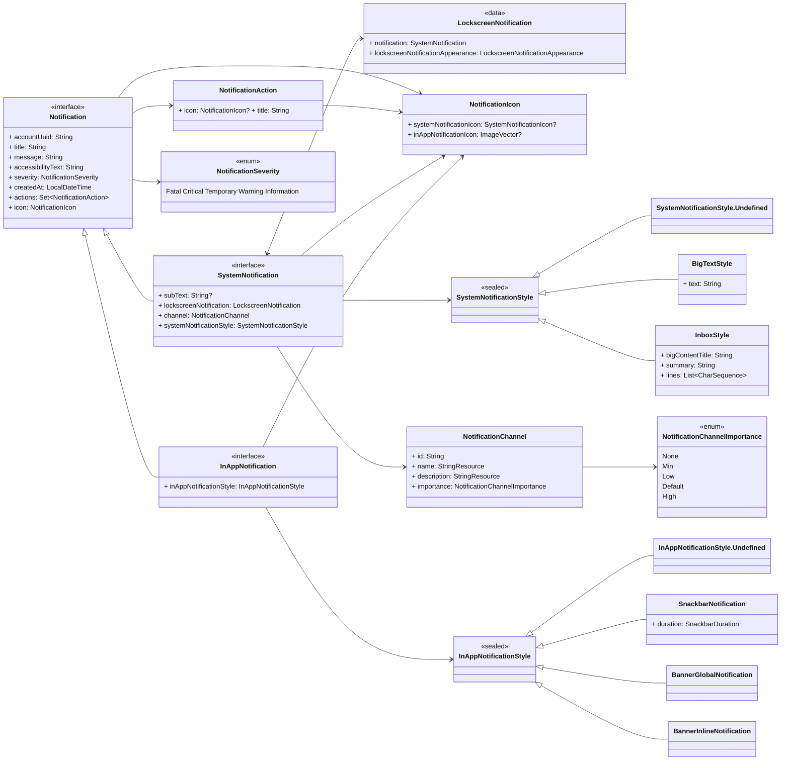

# Thunderbird for Android Notification System

A flexible, extensible way to deliver notifications in **Thunderbird for Android**, across multiple providers (system
tray and in‑app) with a consistent API and a decoupled architecture.

---

## Quickstart — Create & Send a Notification

This section gets you from zero to a delivered notification.

### Step 1: Inject the `NotificationSender`

```kotlin
// MyViewModel.kt
class MyViewModel(
    private val notificationSender: NotificationSender,
) : ViewModel() {
    // ...
}

// KoinModule.kt
val myFeatureModule = module {
    // ...
    viewModel {
        MyViewModel(
            notificationSender = get(),
        )
    }
}
```

### Step 2: Create a Notification instance

Create a concrete type that implements `SystemNotification`, `InAppNotification`, or both (see next section). You can
build it directly or via a factory (recommended for localized text).

```kotlin
// Example: Authentication error shown as both system and in‑app
val notification = AuthenticationErrorNotification(
    accountNumber = accountNumber,
    accountUuid = accountUuid,
    accountDisplayName = accountDisplayName,
)
```

### Step 3: Send and handle the outcome

```kotlin
viewModelScope.launch {
    notificationSender
        .send(notification)
        .collect { outcome ->
            outcome.handle(
                onSuccess = { commandOutcome ->
                    // Optional: update UI/log
                },
                onFailure = { error ->
                    // Optional: show an error message/log
                },
            )
        }
}
```

---

## Notification Types & When to Use Them

Thunderbird uses a common `Notification` model with two specialized types:

* **`SystemNotification`** — Standard Android OS notifications (require permission; UI is determined by the OS).
* **`InAppNotification`** — Messages displayed only within the app's UI (no permission; fully app‑controlled).

### Choosing the correct type

Answer **when** the notification must trigger:

1. **Background?** Use `SystemNotification`.
2. **Foreground?** Use `InAppNotification`.
3. **Both?** Implement both interfaces in your type (single payload, two render targets).

### Type Comparison Matrix

| Capability                         | SystemNotification          | InAppNotification                           |
|------------------------------------|-----------------------------|---------------------------------------------|
| Appears when app in **background** | ✅                           | ❌                                           |
| Appears when app in **foreground** | ✅                           | ✅                                           |
| Requires runtime permission        | ✅ (`POST_NOTIFICATIONS`)    | ❌                                           |
| UI control lives in                | Android OS                  | App (Compose)                               |
| Typical uses                       | New mail, background errors | Guidance, inline errors, transient feedback |

> [!TIP]
> For critical issues that also need persistent, global visibility while the app is open, implement **both** and select
> appropriate in‑app style(s) below.

For a more deep information about the notification types, see
the [Notification Data Model](docs/notification-architecture.md#the-notification-data-model) documentation.

---

## Severity Levels & Behavioral Differences

Every notification **must** define a `NotificationSeverity` to drive user intrusiveness and styling.

| Severity        | When to use                | Expected user action     | SystemNotification behavior | InApp (BannerGlobal) color cue                                                                                                                                                                          |
|-----------------|----------------------------|--------------------------|-----------------------------|---------------------------------------------------------------------------------------------------------------------------------------------------------------------------------------------------------|
| **Fatal**       | Blocks essential tasks     | Immediate resolution     | Not dismissable             | [Error colours](https://github.com/thunderbird/thunderbird-android/blob/main/core/ui/compose/theme2/thunderbird/src/main/kotlin/app/k9mail/core/ui/compose/theme2/thunderbird/ThemeColors.kt#L22)       |
| **Critical**    | Disrupts core flows        | Usually requires action  | Not dismissable             | [Error colours](https://github.com/thunderbird/thunderbird-android/blob/main/core/ui/compose/theme2/thunderbird/src/main/kotlin/app/k9mail/core/ui/compose/theme2/thunderbird/ThemeColors.kt#L22)       |
| **Warning**     | Potential issue/limitation | Often recommended        | Dismissable                 | [Warning colours](https://github.com/thunderbird/thunderbird-android/blob/main/core/ui/compose/theme2/thunderbird/src/main/kotlin/app/k9mail/core/ui/compose/theme2/thunderbird/ThemeColors.kt#L58)     |
| **Temporary**   | Temporary disruption/delay | May self‑resolve; inform | Dismissable                 | [Information colours](https://github.com/thunderbird/thunderbird-android/blob/main/core/ui/compose/theme2/thunderbird/src/main/kotlin/app/k9mail/core/ui/compose/theme2/thunderbird/ThemeColors.kt#L48) |
| **Information** | Status/context only        | None required            | Dismissable                 | [Information colours](https://github.com/thunderbird/thunderbird-android/blob/main/core/ui/compose/theme2/thunderbird/src/main/kotlin/app/k9mail/core/ui/compose/theme2/thunderbird/ThemeColors.kt#L48) |

Examples:

* **Fatal** — Authentication error; actions: *Retry*, *Provide other credentials*.
* **Critical** — "Sending message failed"; action: *Retry*.
* **Warning** — "Mailbox is 90% full"; action: *Manage Storage*.
* **Temporary** — "Offline; message will be sent later".
* **Information** — "Last synchronization succeeded".

---

## Styling Options

### 1. System Notification Styles

By default, a System notification shows **icon + title + content text** (style `Undefined`). Supported styles:

* `Undefined` (basic)
* `BigTextStyle` — Expanded large text block.
* `InboxStyle` — Multiple short lines (e.g., message previews).

**`BigTextStyle` example**

```kotlin
data class NewMailSingleMail(
    override val accountUuid: String,
    val accountName: String,
    val summary: String,
    val sender: String,
    val subject: String,
    val preview: String,
    override val icon: NotificationIcon = NotificationIcons.NewMailSingleMail,
) : MailNotification() {
    override val title: String = sender
    override val contentText: String = subject
    override val systemNotificationStyle: SystemNotificationStyle = systemNotificationStyle {
        bigText(preview)
    }
}
```

**System Notification with BigTextStyle collapsed:**


**System Notification with BigTextStyle expanded:**


**`InboxStyle` example** (digest of multiple items)

```kotlin
@ConsistentCopyVisibility
data class NewMailSummaries private constructor(
    override val accountUuid: String,
    override val title: String,           // collapsed title
    override val contentText: String,     // collapsed content
    val expandedTitle: String,
    val summary: String,
    val lines: List<CharSequence>,
    override val icon: NotificationIcon = NotificationIcons.NewMailSummaries,
) : MailNotification() {
    override val systemNotificationStyle: SystemNotificationStyle = systemNotificationStyle {
        inbox {
            title(expandedTitle)
            summary(summary)
            lines(lines = lines.toTypedArray())
        }
    }

    companion object {
        suspend operator fun invoke(
            accountUuid: String,
            accountDisplayName: String,
            previews: List<CharSequence>,
        ): NewMailSummaries = NewMailSummaries(
            accountUuid = accountUuid,
            title = getPluralString(
                resource = Res.strings.new_mail_summaries_collapsed_title,
                quantity = previews.size,
                previews.size,
                accountDisplayName,
            ),
            contentText = getString(Res.strings.new_mail_summaries_content_text),
            expandedTitle = getPluralString(
                resource = Res.strings.new_mail_summaries_expanded_title,
                quantity = previews.size,
                previews.size,
            ),
            summary = getString(
                resource = Res.strings.new_mail_summaries_additional_messages,
                previews.size,
                accountDisplayName,
            ),
            lines = previews,
        )
    }
}
```

> [!IMPORTANT]
> The System Notification UI may vary between Android OS versions and OEMs, but in general, they will always have the 
> same look and feel, with some differences.
>
> The above screenshots were taken using Android 16 and a Pixel 7 Pro.

---

### 2. In‑App Notification Styles

Choose one based on UX intent. Additional styles may be added in the future.

#### Banner Global

Persistent, non‑blocking global state cues.

**Use for:**

* Global warnings (e.g., offline, encryption key unavailable)
* Account configuration flows: errors/success/info needing constant indicator

**Do not use for:**

* Non‑configuration messages (prefer Banner Inline or Snackbar)
* Flow‑blocking cases (prefer Dialog)

#### Banner Inline

Inline blocking/near‑blocking feedback scoped to the screen.

**Use for:**

* Critical issues affecting the screen's primary function
* Errors requiring attention before the user can effectively proceed

**Do not use for:**

* Truly blocking flows (use Dialog)
* Global states (use Banner Global)
* Secondary/symptom messages when a deeper root cause exists

#### Snackbar

Transient, non‑interrupting feedback; may include an action.

**Use for:**

* Action feedback and quick corrective options

**Do not use for:**

* Errors that must interrupt or block (use Dialog)
* Unified Inbox sync errors (prefer Banner types)

#### Dialog

Short, interrupting prompt for permissions or must‑act items.

**Use for:**

* Requesting notification permission with clear rationale

**Do not use for:**

* General errors or non‑critical permissions (e.g., Contacts)
* Background activity permission tied to battery saver

---

## Localization & String Handling

Because `:feature:notification:api` is a **KMP** module, prefer Compose Resources in **suspending factory** functions
when building text.

### KMP friendly (suspending factory) — recommended

You can create the suspending factory by using a `companion object` + `suspend operator fun invoke()`:

```kotlin
@ConsistentCopyVisibility
data class AuthenticationErrorNotification private constructor(
    override val title: String,
    override val contentText: String,
    override val channel: NotificationChannel,
    override val icon: NotificationIcon = NotificationIcons.AuthenticationError,
) : AppNotification(), SystemNotification, InAppNotification {

    companion object {
        suspend operator fun invoke(
            accountUuid: String,
            accountDisplayName: String,
        ): AuthenticationErrorNotification = AuthenticationErrorNotification(
            title = getString(
                resource = Res.string.notification_authentication_error_title,
                accountDisplayName,
            ),
            contentText = getString(resource = Res.string.notification_authentication_error_text),
            channel = NotificationChannel.Miscellaneous(accountUuid = accountUuid),
        )
    }
}
```

Or by using a suspending factory function named with the same name as the type:

```kotlin
@ConsistentCopyVisibility
data class AuthenticationErrorNotification internal constructor(
    override val title: String,
    override val contentText: String,
    override val channel: NotificationChannel,
    override val icon: NotificationIcon = NotificationIcons.AuthenticationError,
) : AppNotification(), SystemNotification, InAppNotification

suspend fun AuthenticationErrorNotification(): AuthenticationErrorNotification = AuthenticationErrorNotification(
    title = getString(
        resource = Res.string.notification_authentication_error_title,
        accountDisplayName,
    ),
    contentText = getString(resource = Res.string.notification_authentication_error_text),
    channel = NotificationChannel.Miscellaneous(accountUuid = accountUuid),
)
```

### Android‑only modules — use a factory class with Android Resources

As Android modules require a context, we need to retrieve the resources in a factory class. You can inject the 
`*ResourceManager` you need to use in the constructor:

```kotlin
class AuthenticationErrorNotificationFactory(
    private val strings: StringsResourceManager,
) {
    fun create(
        accountUuid: String,
        accountDisplayName: String,
    ): AuthenticationErrorNotification = AuthenticationErrorNotification(
        title = strings.stringResource(
            resourceId = R.string.notification_authentication_error_title,
            accountDisplayName,
        ),
        contentText = strings.stringResource(
            resourceId = R.string.notification_authentication_error_text
        ),
        channel = NotificationChannel.Miscellaneous(accountUuid = accountUuid),
    )
}
```

---

## Displaying Notifications to the User

### System Notifications — permission handling

System notifications require `android.permission.POST_NOTIFICATIONS`. The module doesn't auto‑check; call a 
`PermissionChecker` first and react accordingly.

Example:

```kotlin
class CheckPermission(
    private val permissionChecker: PermissionChecker,
) : UseCase.CheckPermission {
    override fun invoke(permission: Permission): PermissionState {
        return permissionChecker.checkPermission(permission)
    }
}

class ViewModel(checkPermission: UseCase.CheckPermission) : BaseViewModel(initialState = State()) {
    init {
        updateState {
            it.copy(
                permissionState = when (checkPermission(Permission.Notifications)) {
                    PermissionState.GrantedImplicitly -> UiPermissionState.Unknown
                    PermissionState.Granted -> UiPermissionState.Granted
                    PermissionState.Denied -> UiPermissionState.Unknown
                },
            )
        }
    }
}
```

Once permission is granted, the OS renders the notification using the style you defined.

### In‑App Notifications — `InAppNotificationScaffold`

Wrap screens that need in‑app notifications with `InAppNotificationScaffold`, a superset of `Scaffold` with
notification‑aware layout.

```kotlin
@Composable
fun InAppNotificationScaffold(
    modifier: Modifier = Modifier,
    // 1.
    enabled: ImmutableSet<DisplayInAppNotificationFlag> = DisplayInAppNotificationFlag.AllNotifications,
    // 2
    topBar: @Composable () -> Unit = {},
    bottomBar: @Composable () -> Unit = {},
    // 3
    snackbarHostState: SnackbarHostState = rememberSnackbarHostState(),
    // 4
    floatingActionButton: @Composable () -> Unit = {},
    floatingActionButtonPosition: ScaffoldFabPosition = ScaffoldFabPosition.End,
    // 5
    onNotificationActionClick: (NotificationAction) -> Unit = {},
    // 6
    content: @Composable (PaddingValues) -> Unit,
) { /* ... */ }
```

**Parameter notes**

1. Limit which styles this screen will show via `enabled` flags.
2. The `topBar`/`bottomBar` slot parameters work as in `Scaffold`.
3. Provide a `SnackbarHostState`; it is used for `SnackbarNotification` styles and any custom snackbars you display.
4. FAB params work as in `Scaffold`.
5. `onNotificationActionClick` is called when the user taps a in-app notification action.
6. **Consume the `PaddingValues`** in `content`; otherwise layout won't adapt correctly while the notifications are
   shown.

---

## Architecture — How it Works (Command Pattern)

If you want to deep-dive into the Notification System Architecture, please refer to the 
[Notification Architecture](docs/notification-architecture.md) documentation. This section summarizes the architecture.

### Architecture - Summary
The system is split into logical groups:

* **Client** — builds a `Notification` payload and calls the Invoker. Typically a `ViewModel`.
* **Invoker** — `NotificationSender`/`DefaultNotificationSender`; uses a factory to create commands and executes them.
* **Command** — encapsulates a `Notification` + `NotificationNotifier`, exposes `execute()`.
* **Receiver** — platform code that shows the notification (`SystemNotificationNotifier` uses `NotificationManager`;
  `InAppNotificationNotifier` uses `BroadcastReceiver`).

### Architecture - Why this design?

* Decouples request from platform rendering.
* Enables unit testing and fake implementations.
* Makes adding new providers/styles straightforward.

---

## Summary & Best Practices

* Always pick the **right type** (System/In‑App) based on **foreground/background** timing; implement **both** when
  needed.
* Always set **severity** to control intrusiveness and visual cues.
* Prefer **factories** for localized text; use **suspending** factory functions in KMP code.
* In app screens, wrap content in **`InAppNotificationScaffold`** and **consume padding**.
* For system notifications, check **`POST_NOTIFICATIONS`** permission first.
* Use styles deliberately: 
  * `BigText` for rich single updates; 
  * `Inbox` for digests; 
  * *Banner Global* for persistent global warnings; 
  * *Banner Inline* for contextual blockers; 
  * *Snackbar* for transient feedback; 
  * *Dialog* for must‑act prompts.

---

## Appendix — Data Model (Reference)


