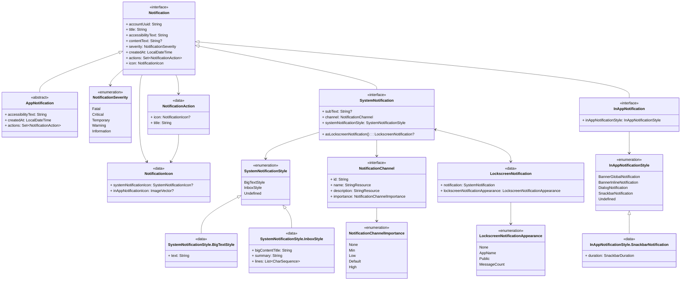

# Thunderbird for Android Notification System - Architecture deep-dive

This system is responsible for creating and dispatching all user-facing notifications, including system tray
notifications and in-app messages.

At its core, this system uses the **Command Design Pattern**. The primary goal of this architecture is to **decouple**
the request for a notification from the underlying platform-specific code that displays it. This makes the system more
flexible, testable, and easier to extend.

## Modules

The notification system is organized in the following modules:

- **api**: Core interfaces and classes
- **impl**: The implementation module
- **testing**: The testing helper module that provides common fake implementation.

## Core Components

The architecture is divided into four main logical groups: **Client**, **Invoker**, **Command**, and **Receiver** as
shown in the diagram:

### The Client

In the classic Command Pattern, the Client is often responsible for creating the command and setting its receiver.
However, in our implementation, the Client's role is simplified.

- **Implementation:** Any `ViewModel` (e.g., `ProfileViewModel`, `SettingsViewModel`).
- **Responsibilities:**
    - Constructs a concrete `Notification` data object based on user action or business logic.
    - Holds a reference to the `NotificationSender` (the [Invoker](#the-invoker)).
    - Calls `notificationSender.send()` to initiate the request.
    - Consumes the `Flow<Outcome>` to react to the result.

### The Invoker

The **Invoker** holds a command and asks it to be executed. It is completely decoupled from the action itself.

- **Implementation:** `NotificationSender` (Interface) and `DefaultNotificationSender` (Concrete Class).
- **Responsibilities:**
    - The `DefaultNotificationSender` implements the `NotificationSender` interface.
    - It uses the `NotificationCommandFactory` to get the correct command instances.
    - It calls the `execute()` method on the command list it receives from the factory.

### The Command

The **Command** object encapsulates all the information required to act.

- **Implementation:** `NotificationCommand` (abstract base), with concrete classes like `SystemNotificationCommand` and
  `InAppNotificationCommand`.
- **Responsibilities:**
    - Binds together a `Notification` (the payload) and a `NotificationNotifier` (the Receiver).
    - Provides a common `execute()` interface that the Invoker can call without knowing the specific details of the
      command.

### The Receiver

The **Receiver** knows how to perform the work required to carry out the request. It's where the business logic lives.

- **Implementation:** `NotificationNotifier` (interface), with concrete classes like `SystemNotificationNotifier` and
  `InAppNotificationNotifier`.
- **Responsibilities:**
    - Contains the platform-specific implementation for displaying a notification.
    - `SystemNotificationNotifier` uses the Android `NotificationManager`.
    - `InAppNotificationNotifier` uses the `InAppNotificationEventBus` to tell the app that a notification is available
      to be displayed. The `InAppNotificationScaffold` listens for this event and shows the notification.

## The Notification Data Model

The notification data model is represented by the `Notification` data model, which acts as the central payload for all
operations. Following, we will breakdown the notification model for better clarity.

### Breakdown - The Notification model

The notification model is composed by the following components:

* The `Notification` interface, which defines the common properties that all notifications must have. This is a sealed
  interface and can't be implemented outside it's package/module.
* The `SystemNotification` is a subtype of `Notification` that represents a notification displayed by the system, adding
  it's own set of properties which is described in the SystemNotification model section.
* The `InAppNotification` is a subtype of `Notification` that represents a notification displayed within the
  application, adding it's own set of properties which is described in the SystemNotification model section.
* The `AppNotification` is an abstract class that provides default properties implementation to easy the app
  notification. **This is the class you should extend** whenever creating a new Notification type.

The below diagram describes these components more detailed:

The properties of the `Notification` interface are:

* `accountUuid`: The UUID of the account that owns the notification. This can be used to filter notifications when
  deciding to display them.
* `title`: The title of the notification.
* `accessibilityText`: The text to be used for accessibility purposes.
* `contentText`: The main content text of the notification, can be null.
* `severity`: The severity level of the notification.
* `createdAt`: The date and time when the notification was created.
* `actions`: A set of actions that can be performed on the notification.
* `icon`: The notification icon.

### Breakdown - The System Notification model

System notifications have their own particularities, which are described in this section. Aside from all the properties
included in the `Notification` interface, the `SystemNotification` also includes:

* `subText`: An optional secondary text that appears below the title, can be null.
* `channel`: The notification channel which the notification belongs to.
* `systemNotificationStyle`: The style of the notification which will explain to Android OS how to display the
  notification. Defaults to `SystemNotificationStyle.Undefined`. For more information about the styles, see
  the [notification styles' documentation](notification-styles.md)
* `asLockscreenNotification()`: A method to convert the `SystemNotification` to a `LockscreenNotification`. You should
  only override this if you need to display a different notification when displaying in the lockscreen, e.g. hiding the
  sender's mail, notification content, etc.

### Breakdown - The In-App Notification model

In-app notifications have their own particularities, which are described in this section. Aside from all the properties
included in the `Notification` interface, the `InAppNotification` also includes:

* `inAppNotificationStyle`: The style of the in-app notification. This will explain to the UI how to display the
  notification. For more information about the styles, see the [notification styles' documentation](notification-styles.md).

## Summary and Diagram

* **Core `Notification` Interface**: At the top level is the `Notification` interface, which contains properties common
  to all notification types, such as `title`, `text`, `severity`, and a list of `NotificationAction`s. The
  `Notification` interface should never be directly implemented.
* **Abstract `AppNotification` Class**: This is an abstract class that provides default properties implementation to
  easy the app notification creation.
* **Specialized Notification Types**: To handle platform differences, the base interface is extended by two specialized
  interfaces:
    * **`SystemNotification`**: Represents a standard Android OS notification. It includes properties for
      Android-specific features like the `NotificationChannel` and `NotificationChannelImportance`. Additionally it also
      let you change how to display the notification via `SystemNotificationStyle`.
    * **`InAppNotification`**: Represents a message shown inside the app's UI. It includes its own
      `InAppNotificationStyle`.
* **Flexible Styling and Actions**: A key feature of the model is its use of polymorphism for styling. This allows the
  UI to be defined by data, not hard-coded logic.
    * `SystemNotificationStyle` can be a `BigTextStyle` or `InboxStyle`, mapping to native Android features.
    * `InAppNotificationStyle` can be `BannerGlobalNotification`, `BannerInlineNotification`, `DialogNotification`, and
      `SnackbarNotification`.

The whole notification model is represented by the following diagram:

