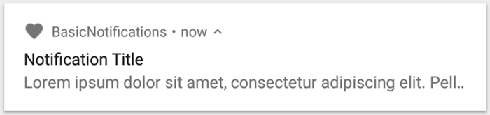
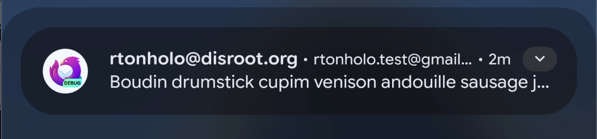
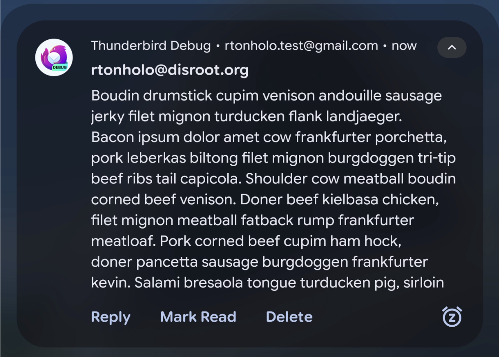
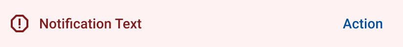
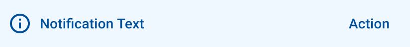
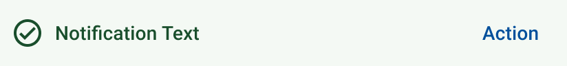
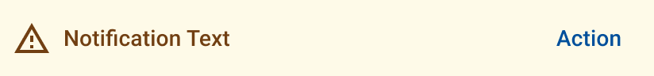
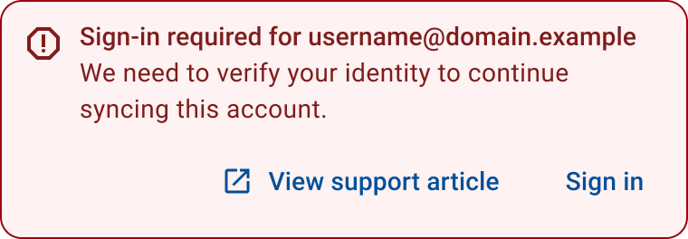
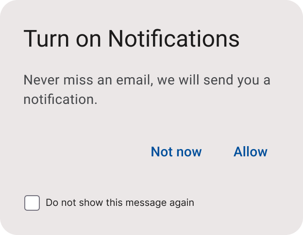

# Thunderbird for Android Notification System - Notification Styles deep-dive

## System Notifications Styles

During the creation of a `SystemNotification` implementation, you can decide if you want to have a custom look by
overriding the `systemNotificationStyle` property.

By default, all System notifications are displayed by showing:

- An Icon
- A title
- A content text.



Meaning that its style is always `Undefined` (Basic notification), unless specified.

We currently support the following styles:

- `Undefined` (default)
- `BigTextStyle`
- `InboxStyle`

Next, we will show how to define each of the custom styles with examples.

**BigTextStyle:**
The `BigTextStyle` allows the app to display a larger block of text in the expanded content area of the notification.

The following code is how to define the System Notification with the `BigTextStyle` as its style:

```kotlin
data class NewMailSingleMail(
    // 1.
    override val accountUuid: String,
    val accountName: String,
    val summary: String,
    val sender: String,
    val subject: String,
    val preview: String,
    // 2.
    override val icon: NotificationIcon = NotificationIcons.NewMailSingleMail,
) : MailNotification() {
    // 3.
    override val title: String = sender

    // 4.
    override val contentText: String = subject

    // 5.
    override val systemNotificationStyle: SystemNotificationStyle =
        systemNotificationStyle {
            bigText(preview)
        }
}
```

1. We first define all the data we need to create our system notification
2. We set our icon, which will be shown in the system tray bar (Android 16+ will display only in the system tray if not
   expanded)
3. The `title` property is used to display the first text line in the notification, which we choose to be the `sender`
   this time
4. The `contentText` property is used to display the notification's content text when the notification is in the
   collapsed mode
5. Finally, we define that this System Notification will have the BigTextStyle, passing the `preview` String as a
   parameter, which is used to display the notification's content text when the notification is in the expanded mode

**System Notification with BigTextStyle collapsed:**


**System Notification with BigTextStyle expanded:**


> [!IMPORTANT]
> The System Notification UI may vary between Android OS versions and OEMs, but in general, they will always have the
> same look and feel, with some differences.
>
> The above screenshots were taken using Android 16 and a Pixel 7 Pro.

**InboxStyle:**
The `InboxStyle` is designed to be used when we need to display multiple short summary lines, such as snippets from
incoming emails, grouping them all into one notification.

The following code is how to define the System Notification with the `InboxStyle` as its style:

```kotlin
@ConsistentCopyVisibility
data class NewMailSummaries private constructor(
    override val accountUuid: String,
    // 1.1.
    override val title: String,
    // 1.2.
    override val contentText: String,
    // 2.1
    val expandedTitle: String,
    // 2.2
    val summary: String,
    // 2.3
    val lines: List<String>,
    // 3.
    override val icon: NotificationIcon = NotificationIcons.NewMailSummaries,
) : MailNotification() {
    // 4.
    override val systemNotificationStyle: SystemNotificationStyle = systemNotificationStyle {
        inbox {
            title(expandedTitle)
            summary(summary)
            lines(lines = lines.toTypedArray())
        }
    }

    // 5.
    companion object {
        suspend operator fun invoke(
            accountUuid: String,
            accountDisplayName: String,
            previews: List<String>,
        ): NewMailSummaries = NewMailSummaries(
            accountUuid = accountUuid,
            title = getPluralString(
                resource = Res.strings.new_mail_summaries_collapsed_title,
                quantity = messageSummaries.size,
                messageSummaries.size,
                accountDisplayName,
            ),
            contentText = getString(Res.strings.new_mail_summaries_content_text),
            expandedTitle = getPluralString(
                resource = Res.strings.new_mail_summaries_expanded_title,
                quantity = messageSummaries.size,
                messageSummaries.size,
            ),
            summary = getString(
                resource = Res.strings.new_mail_summaries_additional_messages,
                messageSummaries.size,
                accountDisplayName,
            ),
            lines = previews,
        )
    }
}
```

```xml

<resources>
    <plurals name="new_mail_summaries_collapsed_title">
        <item quantity="one">You've received %1$d new message on %2$s</item>
        <item quantity="other">You've received %1$d new messages on %2$s</item>
    </plurals>
    <string name="new_mail_summaries_content_text">Expand to preview</string>
    <plurals name="new_mail_summaries_expanded_title">
        <item quantity="one">%1$d new message</item>
        <item quantity="other">%1$d new messages</item>
    </plurals>
    <string name="new_mail_summaries_additional_messages">+ %1$d more on %2$s</string>
</resources>
```

1. We first define all the default data we need to create our system notification:
    1. The `title` property is used to display the first text line in the notification when the notification is
       collapsed
    2. The `contentText` property is used to display the notification's content text when the notification is in the
       collapsed mode
2. Now we define the data used to fill our custom style, `InboxStyle`:
    1. The `expandedTitle` property is used to display the first text line in the notification when the notification is
       expanded
    2. The `summary` property is used to display the notification's first line of text after the detail section in the
       big form of the template.
    3. The `lines` property is used to display the previews in the digest section of the Inbox notification.
3. We set our icon, which will be shown in the system tray bar (Android 16+ will display only in the system tray if not
   expanded)
4. We now define that this System Notification will have the `InboxStyle`, via the `systemNotificationStyle` DSL
   function, consuming all the data we received via the constructor.
5. As some of the content from this notification is composed by a string/plural resource, we need to use a factory
   function. See more information
   in [Using String/Plural Resources to compose the notification](#using-string-plural-resources-to-compose-the-notification).

## In-app Notifications Styles

During the creation of an `InAppNotification` implementation, you need to choose how the notification will appear to the
user. Currently, we support the following in-app notification styles:

- Banner Global
- Banner Inline
- Snackbar
- Dialog

More In-App notification styles might be introduced in the future. If that happens, we will update this section.

### Banner Global Notification

|                                                   Error                                                    |                                                 Warning                                                  |                                                    Success                                                     |                                                      Info                                                      |
|:----------------------------------------------------------------------------------------------------------:|:--------------------------------------------------------------------------------------------------------:|:--------------------------------------------------------------------------------------------------------------:|:--------------------------------------------------------------------------------------------------------------:|
|  |  |  |  |

Used to maintain user awareness of a persistent, irregular state of the application without interrupting the primary
flow. This component is appropriate for warnings that apply globally across the app.  
If the warning is caused by a critical error, a [Banner Inline Notification](#banner-inline-notification) should also be
shown in the relevant context (e.g., the message list) to guide direct resolution.

#### Usage Guidelines

**Use for:**

- Persistent application states that affect the current screen
- In account configuration flows, to display:
- Errors, success, or informational messages that require a constant on-screen indicator
- Outside of account configuration, for global warnings such as:
- Being offline
- Encryption being unavailable

**Do not use for:**

- Errors, success, or informational messages outside the account configuration flow
  (use [Banner Inline Notification](#banner-inline-notification) or other transient messaging components instead)
- Warnings that must interrupt the user’s flow or require immediate action (consider using
  a [Dialog Notification](#dialog-notification) in these cases)

### Banner Inline Notification



Use inline error banners to surface issues that must be resolved before the user can continue with the main task or
content on the screen.

#### Usage Guidelines

**Use for:**

- Critical errors that disrupt a function of the screen’s functionality
- Errors that require user attention but do not completely block their ability to continue interacting with the app

**Do not use for:**

- Blocking errors that must halt the user’s flow until resolved (consider using
  a [Dialog Notification](#dialog-notification) instead)
- Global or persistent application states that should be shown across all screens (consider using
  a [Banner Global In-app Notification](#banner-global-notification))
- Secondary or surface-level errors caused by a deeper issue (e.g., inability to encrypt is a warning, while the missing
  encryption key is the actual error)
- Non-error messages, such as warnings, success confirmations, or informational notices these will use a different
  component and are not part of the in-app error banner pattern.

### Snackbar Notification


Snackbars are used to inform the user of an error or process outcome, and may optionally offer  
a related action. They appear temporarily without interrupting the user's current task.

#### Usage Guidelines

**Use for:**

- Providing feedback when an action fails, with the option for the user to take corrective action  
  **Do not use for:**
- Errors that must interrupt the user’s flow or block further interaction (use
  a [Dialog Notification](#dialog-notification) in these cases)
- Account sync error feedback in the Unified Inbox (use a [Banner Inline Notification](#banner-inline-notification)
  or [Banner Global In-app Notification](#banner-global-notification) for that context)

### Dialog Notification



Used to inform the user about a required permission needed to enable or complete a key feature of the app.  
The dialog provides a concise explanation of the need for the permission and prompts the user to grant it.

#### Usage Guidelines

**Use for:**

- Requesting notification permission from the user
- Clearly and succinctly explaining why the permission is needed and how it impacts the app experience

**Do not use for:**

- Displaying errors
- Requesting contacts permission, as missing access does not critically affect app functionality
- Requesting background activity permission related to battery saver, since the app cannot reliably detect the current
  permission state

## Severity Levels & In-app Notification Style Differences

Depending on the Notification Severity, the behaviour of the notification will be different. That could also affect how
the notification is displayed to the user. In this section we explain each style change based in the severity of the
notification.

> [!IMPORTANT]
>
> Currently, the Notification severity only impacts the style of in-app notifications.

### Notification Severity: Fatal

| Notification Style | Can use style | Changes                                      | Screenshot                                                                                                 |
|--------------------|:-------------:|----------------------------------------------|------------------------------------------------------------------------------------------------------------|
| Banner Global      |       ✅       | The banner will use the error color scheme   |  |
| Banner Inline      |       ✅       | No style changes are expected for this style |                                                                                                            |
| Snackbar           |       ❌       |                                              |                                                                                                            |
| Dialog             |       ✅       | No style changes are expected for this style |                                                                                                            |

### Notification Severity: Critical

| Notification Style | Can use style | Changes                                      | Screenshot                                                                                                 |
|--------------------|:-------------:|----------------------------------------------|------------------------------------------------------------------------------------------------------------|
| Banner Global      |       ✅       | The banner will use the error color scheme   |  |
| Banner Inline      |       ✅       | No style changes are expected for this style |                                                                                                            |
| Snackbar           |       ❌       |                                              |                                                                                                            |
| Dialog             |       ✅       | No style changes are expected for this style |                                                                                                            |

### Notification Severity: Warning

| Notification Style | Can use style | Changes                                      | Screenshot                                                                                                     |
|--------------------|:-------------:|----------------------------------------------|----------------------------------------------------------------------------------------------------------------|
| Banner Global      |       ✅       | The banner will use the warning color scheme |  |
| Banner Inline      |       ❌       |                                              |                                                                                                                |
| Snackbar           |       ✅       | No style changes are expected for this style |                                                                                                                |
| Dialog             |       ❌       |                                              |                                                                                                                |

### Notification Severity: Temporary

| Notification Style | Can use style | Changes                                          | Screenshot                                                                                               |
|--------------------|:-------------:|--------------------------------------------------|----------------------------------------------------------------------------------------------------------|
| Banner Global      |       ✅       | The banner will use the information color scheme |  |
| Banner Inline      |       ❌       |                                                  |                                                                                                          |
| Snackbar           |       ✅       | No style changes are expected for this style     |                                                                                                          |
| Dialog             |       ❌       |                                                  |                                                                                                          |

### Notification Severity: Information

| Notification Style | Can use style | Changes                                          | Screenshot                                                                                               |
|--------------------|:-------------:|--------------------------------------------------|----------------------------------------------------------------------------------------------------------|
| Banner Global      |       ✅       | The banner will use the information color scheme |  |
| Banner Inline      |       ❌       |                                                  |                                                                                                          |
| Snackbar           |       ✅       | No style changes are expected for this style     |                                                                                                          |
| Dialog             |       ❌       |                                                  |                                                                                                          |
