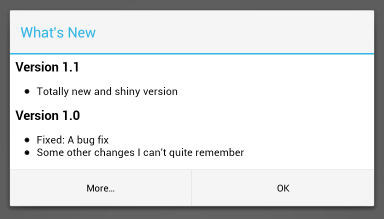
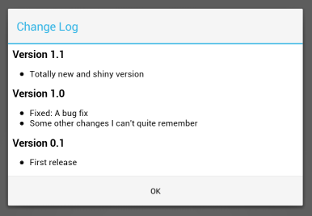

# ckChangeLog - An Android Library to display a Change Log




This library provides an easy way to display a change log in your app.

## Features

 * Uses a simple XML file as source
 * Supports partial translations

Repository at <https://github.com/cketti/ckChangeLog>.


## Usage

1. Create the master change log in `res/xml/changelog_master.xml`. Formatted like this:

  ```xml
  <?xml version="1.0" encoding="utf-8"?>
  <changelog>
      <release version="1.1" versioncode="11" >
          <change>Totally new and shiny version</change>
      </release>
      <release version="1.0" versioncode="10" >
          <change>Fixed: A bug fix</change>
          <change>Some other changes I can't quite remember</change>
      </release>
      <release version="0.1" versioncode="1">
          <change>First release</change>
      </release>
  </changelog>
  ```

2. Create translations of this `changelog_master.xml` file in files named `changelog.xml` under
language-specific versions of `res/xml/`, e.g. `res/xml-de/changelog.xml`.

3. Display the change log dialog by putting the following code in your activity's `onCreate()` method:

  ```java
  ChangeLog cl = new ChangeLog(this);
  if (cl.isFirstRun()) {
      cl.getLogDialog().show();
  }
  ```

## Changelog

### Version 1.0.0
* **Breaking change!** Moved master translation from `res/raw/changelog.xml` to `res/xml/changelog_master.xml`
* Added German translation of the sample app

### Version 0.1
* Initial release


## Acknowledgments

This library is based on:
* [android-change-log](http://code.google.com/p/android-change-log/) by Karsten Priegnitz
* [Inscription](https://github.com/MartinvanZ/Inscription/) by [Martin van Zuilekom](https://github.com/MartinvanZ/)

Other contributors:
* [Andrew Chen](https://github.com/andrewachen)
* [Artur Dryomov](https://github.com/ming13)
* [zjw](https://github.com/zjw)
* You? Pull requests welcome!


## License

    Copyright (C) 2012 Christian Ketterer (cketti)

    Licensed under the Apache License, Version 2.0 (the "License");
    you may not use this file except in compliance with the License.
    You may obtain a copy of the License at

       http://www.apache.org/licenses/LICENSE-2.0

    Unless required by applicable law or agreed to in writing, software
    distributed under the License is distributed on an "AS IS" BASIS,
    WITHOUT WARRANTIES OR CONDITIONS OF ANY KIND, either express or implied.
    See the License for the specific language governing permissions and
    limitations under the License.
